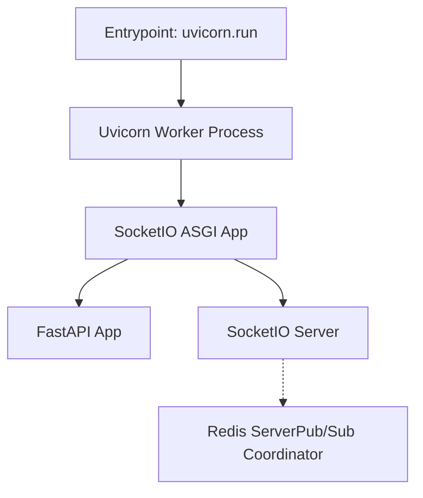
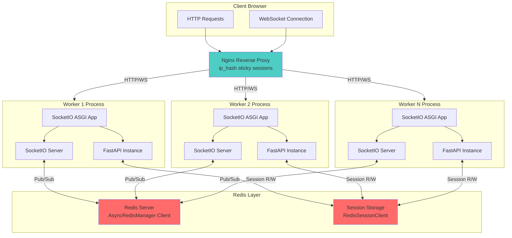

`ULTRA TRACE MASCOPE - DEVELOPER DOCS - LAST MAJOR REVISION APRIL 2026`

# Mascope

This monorepo contains the Mascope backend and frontend as well auxiliary services, libraries and tooling.

This README - along with the [autogenerated docs](#autogenerated-docs) - serve as the primary developer documentation resource. It should be kept up-to-date.

This document is structured as follows:

- 🚀 **[Getting started](#-getting-started)** - install and running
  - [CLI commands](#cli)
  - [Dev commands](#dev-commands)
  - [Prod commands](#prod-commands)
  - [Env commands](#env-commands)
- 🚂 **[Runtime](#-runtime)** - devops tooling
  - [Runtime modes](#runtime-modes)
    - [Dev mode](#dev-mode)
    - [Prod mode](#prod-mode)
  - [Runtime modules](#runtime-modules)
  - [Runtime envs](#runtime-envs)
  - [Database isolation across envs and modes](#database-isolation-across-envs-and-modes)
  - [Runtime config](#runtime-config)
  - [Runtime logging](#runtime-logging)
  - [CLI development](#cli-development)
- 🤖 **[Agents](#-agents)** - Python instrument agents
- 📡 **[Backend](#-backend)** - Python API server
  - [Backend tech](#backend-tech)
  - [Multi-worker architecture](#multi-worker-architecture)
  - [Backend API](#backend-api)
  - [Backend auth](#backend-auth)
  - [Backend app](#backend-app)
  - [Backend file converter](#backend-file-converter)
- 💾 **[Database](#-database)** - PostgreSQL setup, migrations and operations
  - [Schema migrations](#schema-migrations)
  - [Database management commands](#database-management-commands)
  - [PostgreSQL tuning reference](#postgresql-tuning-reference)
  - [Automated backups (cron + restic)](#automated-backups-cron--restic)
- 🖥️ **[Frontend](#️-frontend)** - VueJS user interface
- 📚 **[Libraries](#-libraries)** - shared Python libraries
- 🚚 **[Deploying](#-deploying)** - prod operations guide
- 📒 **[Notebooks](#-notebooks)** - Jupyter lab environment
- 📝 **[Git conventions](#-git-conventions)** - Git conventions for developers

The monorepo is structured as follows:

```sh
mascope/           # Monorepo root directory
  agents/            # Instrument machine agents
  libraries/         # Shared libraries
    chem/              # LEGACY: Chemical calculations
    file/              # Sample file loading, names & paths
    match/             # Matching (targeted analysis) module
    runtime/           # Config, logging, state and data
    sdk/               # Public client API library
    signal/            # Signal & peak processing
    thermo/            # ThermoFisher Orbitrap hardware API
    tofwerk/           # Tofwerk TOF hardware API
    tools/             # Formula parsing, isotope prediction, peak alignment etc.
  server/            # Mascope app server
    backend/           # API server (Python, FastAPI, PostgreSQL)
      alembic/           # Alembic migration environment
        versions/          # Migration scripts (YYYYMMDD_<rev>_<slug>.py)
    frontend/          # Web client (Javascript, Vue, PrimeVue)
  tooling/           # Development tools
    cli/               # The `mascope` runtime CLI
    notebooks/         # Jupyter lab data science notebooks
  .runtime/          # Runtime data (.gitignored)
    env/               # Runtime data environments
    database/          # PostgreSQL data and backups
    secrets/           # Secret keys & tokens
```

---

## 🚀 Getting Started

The Mascope runtime includes setup scripts and a comprehensive `mascope` command line tool. This section explains how to setup this environment.

### Installation

Our setup scripts - found in the `tooling` folder - provide an `install` command to setup low-level prerequisites (_Python 3.12_, _Node 22_, _uv_, _Docker_ and _.NET Runtime_), package dependencies (via `uv`) and the `mascope` cli.

> **.NET Runtime** is only needed for the optional Thermo RawFileReader backend (see [Reader backend](#reader-backend-opentfraw--thermo)). Mascope reads `.raw` files with the open-source OpenTFRaw backend by default and has no Thermo dependency.

#### Windows

The only prerequisite is [Powershell 7](https://learn.microsoft.com/en-us/powershell/scripting/install/installing-powershell-on-windows), which should be available on Windows 11 by default.

To `install` your Mascope runtime, run:

```
git clone git@github.com:ultra-trace-systems/mascope.git && cd mascope && .\tooling\windows.ps1 install
```

#### Ubuntu

The only prerequisite is [Bash](https://www.gnu.org/software/bash/), which is available on Ubuntu. The script has been developed against Ubuntu 22.04 LTS, but should work on later versions as well.

To `install` your Mascope runtime, run:

```
git clone git@github.com:ultra-trace-systems/mascope.git && cd mascope && ./tooling/ubuntu.sh install
```

#### Updating

Since [`uv` automatically syncs the virtual environment](https://docs.astral.sh/uv/concepts/projects/sync/#automatic-lock-and-sync) and we run `npm install` every time we launch the dev server, there is usually no need to reinstall when switching branches.

If this doesn't work for some reason, the `tooling` scripts accept are `reinstall` and `uninstall` commands. These fully remove the `.venv`, `node_modules` and Mascope environment variables,but do not remove installed tooling (in case its used in other work).

### Reader backend (OpenTFRaw / Thermo)

Mascope reads Thermo `.raw` files through a pluggable reader backend, selected by the `MASCOPE_THERMO_BACKEND` environment variable:

- **`opentfraw` (default)** — the open-source [OpenTFRaw](https://github.com/ultra-trace-systems/OpenTFRaw) reader (Rust), installed from PyPI as `opentfraw`. Mascope ships and runs on this with **no Thermo dependency** and no proprietary binaries.
- **`thermo` (optional)** — Thermo's proprietary RawFileReader (.NET, via `pythonnet`). Fully supported, but **not shipped**: the RawFileReader DLLs are proprietary and are deliberately not included in this repository.

The two backends are parity-validated against each other (centroids, XIC, profile, MS² precursor, averaged spectra); OpenTFRaw reproduces the numbers the pipeline depends on, so it is the dependency-free default.

#### Using the Thermo RawFileReader backend

If you specifically want RawFileReader (for example to cross-check results, or for a file OpenTFRaw cannot yet read):

1. Obtain the Thermo RawFileReader DLLs (`ThermoFisher.CommonCore.*.dll`) from Thermo's RawFileReader distribution, under its license, and place them in a directory.
2. Point Mascope at them and select the backend:

   ```bash
   export MASCOPE_THERMO_DLL_DIR=/path/to/rawfilereader/dlls   # dir with ThermoFisher.CommonCore.RawFileReader.dll
   export MASCOPE_THERMO_BACKEND=thermo
   ```

   On Windows/PowerShell: `$env:MASCOPE_THERMO_DLL_DIR = "..."; $env:MASCOPE_THERMO_BACKEND = "thermo"`.

This also needs the .NET Runtime (installed by the setup scripts). Without the DLLs the Thermo backend raises a clear error and Mascope stays on OpenTFRaw.

For the Docker backend image, the .NET Runtime is **not installed by default** (the default image is Thermo-free). Build with the `INSTALL_DOTNET` build arg to include it:

```bash
docker build --build-arg INSTALL_DOTNET=true -f server/backend/Dockerfile -t mascope-backend .
# or via compose: add `args: [INSTALL_DOTNET=true]` under the backend service's build section
```

### CLI

After following the [installation instructions](#installation) you have the Mascope CLI installed in the workspace's virtual environment. To access the CLI, first activate the virtual environment:

```sh
/Mascope> .venv/scripts/activate
```

Alternatively, to run commands in the virtual environment without explicitly activating it, start each command with `uv run <command>`.

With the virtual environment active, you can view the CLI's help by running

```sh
(mascope) /Mascope> mascope --help
```

The main subcommands are:

```sh
mascope dev       # install and run the dev environment
mascope prod      # build and run prod deployments
mascope env       # select and manage app runtimes
mascope logs      # query and clean up Mascope log files
mascope backend   # launch the backend
mascope agent     # launch a mascope agent
mascope cert      # manage self-signed certificates
```

To launch the dev server run `mascope dev run`. You can view details of subcommands using `mascope runtime --help`.

See the [CLI development](#cli-development) section to learn how to extend the CLI.

### Dev Commands

Running Mascope in [dev mode](#dev-mode):

```sh
mascope dev run                               # run the backend & frontend (deps + migrations + app)
mascope dev run --reload                      # HMR for the backend on Windows
mascope dev run --host                        # expose dev server to the network
mascope dev run --instance                    # isolated per-worktree stack (see below)
mascope dev run backend file-converter        # run specific modules
mascope --log-grep foo dev run                # highlight log lines with foo
mascope -g foo dev run                        # highlight log lines with foo
mascope --log-level debug dev run             # set log level to debug
mascope -l debug dev run                      # set log level to debug
```

`mascope dev run` performs the full startup sequence automatically when `backend` is selected:
checks Docker → starts PostgreSQL + Redis → creates the active env's database if missing →
applies pending Alembic migrations → starts the application.

For manual control of individual steps:

```bash
mascope dev up                     # start PostgreSQL + Redis containers only
mascope dev db create              # create the active env's database (idempotent)
mascope dev migrate upgrade        # apply pending Alembic migrations
mascope dev run                    # start application (skips migration if already up to date)
```

---

### Redis Commands

```sh
mascope dev redis start       # Start Redis container (auto-starts with backend)
mascope dev redis stop        # Stop Redis container
mascope dev redis restart     # Restart Redis container
mascope dev redis status      # Show Redis configuration and status
mascope dev redis logs        # View Redis logs (--follow, --tail options)
mascope dev redis cli         # Open Redis CLI for debugging

# Or access Redis CLI directly
docker exec -it mascope_dev_redis redis-cli    # Dev mode
docker exec -it mascope_prod_redis redis-cli   # Prod mode
```

**Useful Redis CLI commands:**

```sh
INFO                         # Server info and stats
CLIENT LIST                  # Show connected clients
KEYS mascope:session:*       # List all user sessions
GET mascope:session:/:{sid}  # View session data
TTL mascope:session:/:{sid}  # Check session TTL
MONITOR                      # Watch all Redis commands (Ctrl+C to exit)
PUBSUB CHANNELS              # List Socket.IO pub/sub channels
```

See [Redis CLI documentation](https://redis.io/docs/latest/develop/tools/cli/) for more commands.

> [!IMPORTANT]
> On **Windows** you need to use `mascope dev run --reload` to enable hot module reloading on the backend. This launches the backend on a separate Windows Terminal window.

---

### Prod Commands

Running Mascope in [prod mode](#prod-mode):

```sh
mascope prod up             # start prod containers (db_init runs migrations automatically)
mascope prod up --build     # force rebuild before starting
mascope prod ps             # container status
mascope prod down           # stop and remove containers
mascope prod build          # build container images
mascope prod logs --follow backend          # tail logs for a specific service
mascope prod restart postgres               # restart a specific container
mascope prod docker exec -it postgres bash  # pass arbitrary args to docker compose
```

In production, the `db_init` container runs before the backend starts. It creates the active
env's database if it doesn't exist, then applies any pending Alembic migrations. The backend
only starts after `db_init` exits successfully.

---

### Env Commands

```sh
mascope env list                  # list runtime envs
mascope env use foo               # set foo as the active env
mascope env use default           # revert to the default env
mascope env create foo            # create a new local env directory
mascope env sync <source> <dest>  # sync filestore + database from source to target
```

### Env sync

The `env sync` command synchronizes runtime environments locally or to/from a remote host. It transfers both the filestore (via [rsync](https://linux.die.net/man/1/rsync)) and the PostgreSQL database (via `pg_dump`/`pg_restore`
staged through .runtime/database/transfer/). Both source and target require an explicit mode (dev or prod) to identify which PostgreSQL server to use.

> [!IMPORTANT]
> Both PostgreSQL containers must be running on source and target machines before executing `env sync`.

Usage examples:

```bash
# local → local
mascope env sync default dev foo dev

# local → remote
mascope env sync foo prod user@192.168.1.100:bar prod

# remote → local, database only
mascope env sync user@192.168.1.100:bar prod baz prod --skip-filestore

# local → local, filestore only
mascope env sync foo dev bar dev --skip-db
```

The `sync` command follows symbolic links on Linux filesystem both ways - syncing into and from a symlinked directory.

If the target environment does not exist, you will be prompted to create it. Pass `--yes` to skip the prompt.

On transfer failure the staged dump is preserved in `.runtime/database/transfer/` for manual recovery. On success it is deleted and 7-day retention pruning runs automatically.

#### Syncing only part of the filestore

A full filestore can be far larger than the link between the two machines. `--from` and `--to` (both `YYYY-MM-DD`, both inclusive, either one optional) narrow the transfer to a window of acquisition dates:

```bash
# everything acquired since the start of the year
mascope env sync user@192.168.1.100:bar prod baz prod --from 2026-01-01

# one quarter, filestore only
mascope env sync user@192.168.1.100:bar prod baz prod --from 2026-01-01 --to 2026-03-31 --skip-db
```

The filter is a path filter, not a database query: the filestore stores samples as `filestore/<instrument>/<YYYY.MM.DD>/<sample_name>/`, where the date directory comes from the acquisition timestamp in the sample filename. So the window selects on **acquisition date**, not on when a file was uploaded, reprocessed or last modified. The batch cache under `filestore/sample_batches/` has no date in its path and is always transferred; it is rebuildable, so dropping it would only cost recomputation.

> [!IMPORTANT]
> `--from` / `--to` filter the filestore only - **the database is never filtered**. A date-limited sync that also syncs the database leaves the target holding sample rows whose files were not transferred, and those samples fail to load. The command warns when you do this; add `--skip-db` to sync only the files.

If no filestore data falls inside the window the sync fails rather than silently transferring nothing. When the source is on a **remote** host it also fails if the filestore cannot be listed in full - a mistyped env name, a missing filestore, an unreadable directory - rather than filtering against a partial listing and reporting success on an incomplete transfer.

> [!NOTE]
> Two cases still read as an empty window rather than as a failure. `find -L` skips a dangling symlink silently and exits 0, so a filestore whose data volume is not mounted looks empty; and a local source is listed with a glob that cannot report an error at all, so an unreadable directory there narrows the transfer without a word. Check the target after a sync that reports fewer dates than you expected.

#### Ownership and permissions after sync

rsync is run without `-o`/`-g`, so ownership is not carried across: every file lands owned by whoever runs the **receiving** side - the SSH login user for a push, the invoking user for a pull or a local sync. Mascope's containers run as the deployment's own uid (1000 by default; see `MASCOPE_UID` in `server/backend/Dockerfile`), so if those two differ the app cannot read or write what was just synced.

The sync detects this by comparing the receiving uid against the owner of the target env directory, and prints the exact command to fix it:

```
sudo chown -R 1000:1000 /srv/mascope/.runtime/env/default
```

Pass `--chown` to have the sync attempt that itself. It uses `sudo -n` (non-interactive) on the receiving machine and falls back to printing the command when passwordless sudo is not available - the sync is not failed either way.

If the filestore is a symlink to a data volume (see [Maintaining a deployment](../maintaining.md) → "The filestore on a data volume"), chown its target too: `chown -R` does not follow symlinks. `--chown` resolves the link and covers both paths.

File modes are forced to `755` for directories and `644` for files - the same bits the backend writes under the default umask, so a synced tree is indistinguishable from a natively written one. Note that this also applies on a **re-sync**: modes hand-tightened on an existing target filestore are reset to `755`/`644`.

### Windows (Cygwin)

To use `env sync` on Windows, [Cygwin](https://www.cygwin.com/) must be installed into the default location `C:\cygwin64`. During installation, select the `rsync` and `openssh` packages.

### SSH key setup

`mascope env sync` issues multiple SSH/scp operations per sync (existence check, env create, dump, transfer, restore, cleanup, rsync). To avoid being prompted for a password or passphrase on each one, configure a dedicated no-passphrase key.

> [!NOTE]
> This key is only used by `mascope env sync`. If you also want password-free direct `ssh` access from PowerShell or Windows Terminal, that requires a separate key added to the Windows OpenSSH agent.

**Linux** - run in a terminal on the machine you are syncing from:

```bash
ssh-keygen -t ed25519 -C "mascope-sync" -f ~/.ssh/mascope_sync -N ""
ssh-copy-id -i ~/.ssh/mascope_sync.pub USER@HOST  # prompted for remote password once
```

**Windows** - the key must live in **Cygwin's home directory** (`/home/<user>/.ssh/`). A key generated in PowerShell will not be found by the CLI. Open a Cygwin terminal (Start menu → search _Cygwin Terminal_) and run:

```bash
ssh-keygen -t ed25519 -C "mascope-sync" -f ~/.ssh/mascope_sync -N ""
ssh-copy-id -i ~/.ssh/mascope_sync.pub USER@HOST  # prompted for remote password once
```

Verify the key works before running sync:

```bash
ssh -i ~/.ssh/mascope_sync -o BatchMode=yes USER@HOST echo ok
# should print: ok
```

Once the key is in place, `mascope env sync` picks it up automatically - no password or passphrase prompts during sync on either platform.

### Dependency management

To add Python dependencies, use `uv add`. Be sure to add the dependency to the right package. If you need to add development environment dependencies, add them to the root project, with `uv add --dev`.

To add JavaScript dependencies, use `npm install` in the `server/frontend` folder.

Usually, `uv` will automatically sync dependencies. In rare cases such as modifying the `uv` workspace package interdependencies, you may need to fully reinstall the project with the `tooling` script for your platform.

### Secrets

Running Mascope in `prod` mode requires the following "secrets" to be present in the `.runtime/secrets` directory:

- `jwt_secret_key.txt`: JSON Web Token API private key (arbitrary string)
- `postgres_password.txt`: PostgreSQL database password
- `mascope.app.key`: SSL certificate private key
- `mascope.app.pem`: SSL certificate
- `server_owner_secret_key.txt`: First owner registration private key (arbitrary string)
- `mfa_encryption_key.txt`: Encryption key for stored two-factor (TOTP) seeds
  (arbitrary string; `mascope prod up` generates it when missing, once the release's CLI is installed — see
  [maintaining.md](../maintaining.md#two-factor-authentication) before ever
  replacing it, as a changed key voids every enrolled second factor)

> [!NOTE]
> `postgres_password.txt` is also required for dev mode. See [Secrets](#secrets-1) under Database for setup instructions.

For testing the `prod` mode in local development environment, a self-signed SSL certificate can be generated using the script: `mascope cert gen`. The certificate as well as other secrets must be in place prior to building the containers.

**Known issues:** On Windows, for the local environment, you may need to point to a proper `cnf` file first with `$env:OPENSSL_CONF="C:\Program Files\Git\usr\ssl\openssl.cnf"` command. Another problem - `mascope cert gen` may create folders instead of files in the `.runtime/secrets` directory. In this case, you can manually create the files and rerun the command.

---

## 🚂 Runtime

Mascope's _runtime_ is a common framework underpinning the app's devops toolchain. The runtime has a main interface:
the `mascope` [CLI](#cli). Mascope developers can use the CLI to select Mascope [environments](#runtime-envs):
these are folders containing the full state of a Mascope app (database, files, etc). Runtimes can be configured
with a set of [configuration files](#runtime-config) global app options for libraries, servers, services and agents.

The app can be run in two [modes](#runtime-modes): [dev](#dev-mode) and [prod](#prod-mode). Dev mode runs the app's modules
with uv and Vite. Prod mode starts the production Docker stack: `postgres`, redis, the `db_init` initialization step, the backend,
nginx reverse proxy serving the frontend bundle, the file converter.

### Mascope path

In both dev and prod, Mascope's runtime and CLI rely on an env var called `MASCOPE_PATH` to discover the apps code and data. The `tooling` scripts are responsible for setting this environment variable on the system they install too.

For development environments, this path is the path to their clone of the Mascope repo. In production deployments, this can vary. You can find the Mascope path with the command `mascope path`.

### Runtime dir

The runtime's state is stored in a directory called `.runtime` in the [Mascope path](#mascope-path)

```
.runtime/          Config, logging, state and data
  env/                Runtime environments
  database/           PostgreSQL data and backups
  secrets/            Runtime secrets
  state.json          Runtime state (stores 'mode' and 'active' environment)
```

### Runtime Library

The runtime library exposes a Python API for initializing and using so-called _Mascope runtime modules_. The modules allow accessing runtime scope appropriate to the runtime module using it.

When you instantiate a Mascope runtime instance for some module, you can access that module's private configuration, the global runtime configuration and the logger.

```py
# server/backend/src/mascope_backend/runtime.py
runtime = Runtime("backend")

# elsewhere
from mascope_backend.runtime import runtime

# works
print(runtime.meta.api_port)  # global config is under .meta
print(runtime.config.database)  # backend specific config is under .config

# throws
print(runtime.file_converter.threads)  # other modules are not exposed

runtime.logger.debug("who broke my code?")
runtime.logger.info("so normal, so boring....")
runtime.logger.error("oh no! what happened?")
```

### Runtime Modes

The runtime can be executed in two major modes: `dev` and `prod`. While `dev` mode spins up a Vite dev server and runs Unicorn with HMR, `prod` builds a docker container and runs Uvicorn behind Nginx.

#### Dev mode

The development environment runs application services locally (via `uv` and `vite`) against a
dedicated `mascope_dev` Docker Compose stack defined in `docker-compose.dev.yaml`. The stack
provides two infrastructure containers:

- **`mascope_dev_postgres`** — PostgreSQL server (port `5432` exposed for DBeaver/psql)
- **`mascope_dev_redis`** — Redis server (port `6379` exposed for redis-cli)

The infrastructure stack can be managed independently:

```sh
mascope dev up      # start PostgreSQL + Redis containers only
mascope dev down    # stop and remove them
```

`mascope dev run` starts the full environment in one command — it brings up the infrastructure
stack, creates the active env's database if missing, applies pending migrations, then launches
the application modules (default: `backend`, `frontend`, `file-converter`). To enable HMR for
the backend on Windows, run `mascope dev run --reload`. You can also specify individual [module](#runtime-modules)
or group tags — run `mascope modules --runnable` and `mascope groups` to see what's available.
For the full `dev` command reference run `mascope dev --help`.

#### Prod mode

The production deployment consists of containerized services orchestrated via `docker compose`
(`docker-compose.yaml`):

- **`db_init`**: Init container — creates the env database and applies Alembic migrations before the backend starts
- **`postgres`**: PostgreSQL database server
- **`redis`**: Redis server for Socket.IO coordination and session storage
- **`backend`**: Multi-worker Python API server (Uvicorn + FastAPI + Socket.IO)
- **`file_converter`**: Transforms incoming sample files and records metadata to the database
- **`frontend`**: Nginx reverse proxy serving the Vue.js bundle with sticky sessions

Startup order enforced by health checks: `postgres` + `redis` → `db_init` → `backend` → `file_converter` + `frontend`. See `docker-compose.yaml` for full configuration.

```sh
mascope prod build          # build container images
mascope prod up             # start all containers (detached)
mascope prod up --build     # build then start
mascope prod logs           # attach to logs
mascope prod down           # stop and remove containers
```

### Runtime Modules

Since Mascope is a monorepo, and we require multimachine deployments, we need to think of Mascope as a set of modules.

To list the modules registered in our runtime library, run `mascope modules`. Modules can be optionally installable, as for those which correspond to poetry or npm packages. They can also optionally be runnable, like the file converter service or the frontend dev server.

Modules can also be run in _groups_: for example, `mascope dev run orbi` will launch the `backend`, `frontend`, `file-agent` and `file-converter` modules. For a full list of groups, run `mascope groups`.

Modules' [configuration](#runtime-config) is scoped to that module and exposed to the module runtime.

### Runtime Envs

The Mascope app organises all persistent state - configuration, files, logs - in a folder called
a _runtime env_. Environments represent isolated datasets: for example, `lab` and `cloud` are
separate envs each with their own filestore and database.

To list available envs, run `mascope env list`. To activate env `foo`, run `mascope env use foo`.
To revert to `default`, run `mascope env use default`.

The `.runtime/env` folder can contain multiple runtime environments. Only `default` - the team's
standard development environment - is not `.gitignore`d. The folder structure looks like this:

```
.runtime/
  env/
    default/             # Built-in dev environment
    foo/                 # Custom environment
      agents/              # Storage for instrument agents
      filestore/           # Stored raw and processed files
      filestreams/         # Network drive to receive incoming files
      logs/                # dev and prod logs
      temp/                # Temporary folder for ephemeral download files
      dev.mascope.toml     # (Optional) dev-specific config overrides for this env
      prod.mascope.toml    # (Optional) prod-specific config overrides for this env
  database/
    dev/                 # PostgreSQL data directory - dev container
    prod/                # PostgreSQL data directory - prod container
    backups/
      dev/               # Backup dumps created via mascope dev db backup
      prod/              # Backup dumps created via mascope prod db backup / cron
    transfer/            # Staging area for env sync cross-machine transfers
  secrets/               # Secret key files
  state.json             # Active env and mode
```

Some folders may be symbolically linked to a runtime to facilitate network drives.

### Database isolation across envs and modes

Mascope runs two independent PostgreSQL servers - one for `dev` mode
(`mascope_dev_postgres`, `docker-compose.dev.yaml`) and one for `prod` mode
(`mascope_prod_postgres`, `docker-compose.yaml`). Each stores its data in its own directory
under `.runtime/database/`.

Every runtime env gets its own database **in each server**. The database name is derived from
the env name with hyphens replaced by underscores:

| Active env | Dev database       | Prod database      |
| ---------- | ------------------ | ------------------ |
| `default`  | `mascope_default`  | `mascope_default`  |
| `lab`      | `mascope_lab`      | `mascope_lab`      |
| `test-env` | `mascope_test_env` | `mascope_test_env` |

This means `mascope_lab` in the dev postgres and `mascope_lab` in the prod postgres are
completely separate databases, each populated independently via migrations or `env sync`.
Switching envs with `mascope env use` does not affect which databases exist - it only determines
which database name is used by the next command.

### Running multiple instances on one machine

Several checkouts on one machine - most commonly agents working in independent git worktrees -
can each run the full app at the same time while sharing a single dev Postgres/Redis pair. The
shared infrastructure already serves one database per env (`mascope_<env>`); the only things that
would otherwise collide are the local backend and Vite dev-server ports.

`mascope dev run --instance` (or `-i`, or setting `MASCOPE_INSTANCE=1`) handles this
automatically. It binds the current worktree to a **slot** and derives everything from it:

| Derived value   | Slot 0 | Slot 1 | Slot _N_        |
| --------------- | ------ | ------ | --------------- |
| Env             | `wt-<worktree-basename>` | ... | ... |
| Backend port    | 8090   | 8091   | `8090 + N`      |
| Frontend port   | 5173   | 5174   | `5173 + N`      |

Bindings are allocated first-come and stored in `.runtime/instances.json` under the shared
`MASCOPE_PATH`, so a worktree always resolves to the same slot. Env selection flows through the
`MASCOPE_ENV` environment variable (never persisted `state.json`), so concurrent runs never
clobber each other.

```sh
# Once per machine - the shared infra, started from any checkout:
mascope dev up

# In each worktree - an isolated stack on its own env + ports:
mascope dev run --instance
```

Manage the slot registry with the `instance` command group:

```sh
mascope instance list            # show all slots: env, ports, worktree
mascope instance show            # this worktree's instance (allocates if needed)
mascope instance show --export   # print exports for `eval "$(mascope instance show --export)"`
mascope instance rm <env>        # release a slot for reuse (add --purge to delete its filestore)
```

Notes:

- Because every instance shares one Postgres, watch the connection budget: dev pools are
  `pool_size` + `max_overflow` per worker against `max_connections` (default 100). A handful of
  instances is fine; for many, raise `max_connections` under `[backend.database]` in a dev
  config layer and restart the shared Postgres (`mascope dev down && mascope dev up`).
- Redis is a single shared instance with no per-env namespace. For independent tasks this is
  usually harmless; namespace keys by env if collisions matter.
- The same ports are exposed manually via `MASCOPE_API_PORT` / `MASCOPE_FRONTEND_PORT` (and the
  env via `MASCOPE_ENV`), so `eval "$(mascope instance show --export)"` in a shell activates an
  instance for tools other than `mascope dev run`.
- Migrations follow the worktree, not `MASCOPE_PATH`: a branch that adds a revision has it
  applied to that instance's database on startup. Leave `MASCOPE_PATH` at the shared home -
  it is deliberately not the source tree (see [Schema migrations](#schema-migrations)).

### Runtime Config

The `mascope.toml` files inside a runtime configures the app. Mascope uses a **three-layer configuration system** that combines base and mode-specific defaults with optional environment-specific overrides:

```py
root/
  base.mascope.toml      # Layer 1: Shared defaults
  dev.mascope.toml       # Layer 2: Dev mode defaults
  prod.mascope.toml      # Layer 2: Prod mode defaults

.runtime/env/{name}/
  dev.mascope.toml       # Layer 3: Optional env-specific dev overrides
  prod.mascope.toml      # Layer 3: Optional env-specific prod overrides
```

#### Configuration Loading Order

When the application starts, configurations are loaded and merged in this order:

1. **`base.mascope.toml`** - Shared defaults for all modes (settings common to dev and prod)
2. **`{mode}.mascope.toml`** - Mode-specific defaults (dev vs prod)
3. **`{mode}.mascope.toml`** from `.runtime/env/{name}/` - Optional environment-specific overrides

Later layers override earlier ones, allowing you to customize specific settings without duplicating entire configurations.

#### Configuration Scope

The configuration includes:

- **App-wide settings** under `[meta]` (API port, filestore path, log level)
- **Module-specific settings** for each [runtime module](#runtime-modules) (backend, file-converter, frontend, etc.)
- **Infrastructure settings** (Redis, database paths, worker counts)

#### Feature flags

`[meta]` is also where cross-cutting feature flags live, because it is the one section
serialized to **both** sides: the backend reads it from `runtime.meta`, and the frontend
gets it in `MASCOPE_RUNTIME` at build time (`src/lib/runtime.js`). A flag added anywhere
else can only gate one half of a feature.

| Flag | Default | What it gates |
|---|---|---|
| `peak_assignment` | `false` | [Peak-centric assignment](peak_assignment_paradigm.md): assignment on sample ingest, the rescored composition search, the reworked Sample view, and the `/api/peak-assignments` write routes (403 while off; reads stay open). Env override: `MASCOPE_PEAK_ASSIGNMENT=1`. The frontend bakes the flag in at build time, so flipping it on a deployment requires a frontend rebuild. |

Read it via `peak_assignment_enabled()`
(`api/new/peak_assignments/config.py`) on the backend and `peakAssignmentEnabled`
(`src/lib/features.js`) on the frontend rather than touching `runtime.meta` directly, so
the env override and the default both apply in one place.

### Mode-Specific Defaults

The git-tracked mode configurations provide defaults for development vs production:

**`base.mascope.toml`** (shared between modes configurations):

```toml
[backend.redis]
port = 6379 # default Redis port
image = "redis:7-alpine" # standard Redis image
```

**`dev.mascope.toml`** (for local development):

```toml
[backend]
workers = 1  # Single worker for hot reload

[backend.redis]
host = "localhost"  # Local Redis container
container_name = "redis"

[file-converter]
server = "localhost"  # Connect to local backend
```

**`prod.mascope.toml`** (for production deployment):

```toml
[backend]
workers = "auto"  # Multi-worker based on CPU cores

[backend.redis]
host = "redis"  # Docker Compose service name

[file-converter]
server = "backend"  # Docker service name
```

### Environment-Specific Overrides (Optional)

For most use cases, the git-tracked mode defaults are sufficient. However, if you need custom settings for a specific environment, create an optional override file in `.runtime/env/{name}/`:

**Example** `.runtime/env/foo/dev.mascope.toml`:

```toml
[meta]
description = "Custom development environment"
api_port = 9876        # change the API port
log_level = "trace"    # Extra verbose logging for debugging

[backend]
log_level = "debug"    # Debug backend specifically
workers = 2            # Test multi-worker locally

[backend.redis]
port = 6380  # Non-standard port
```

#### Path Resolution

Relative paths are resolved relative to the active [runtime env](#runtime-envs) path before
the config is injected into the app. For example:

- `./filestore` → `/path/to/.runtime/env/default/filestore`
- `./logs` → `/path/to/.runtime/env/default/logs`

> [!NOTE]
> For a complete list of options, refer to the defaults in `base.mascope.toml` at the monorepo root.

> [!NOTE]
> The PostgreSQL data directory is **not** inside the env folder — it lives under
> `.runtime/database/dev/` and `.runtime/database/prod/` and is managed by the
> PostgreSQL containers directly. It is not a configurable path.

### Runtime Logging

Logging in the Mascope runtime leverages [Loguru](https://loguru.readthedocs.io/).

#### Log levels

The following log levels are available, in ascending order:

- **TRACE**
- **DEBUG**
- **INFO**
- **SUCCESS**
- **WARNING**
- **ERROR**
- **CRITICAL**

You can write messages using `runtime.logger`, which is a standard Loguru logger; all log levels are therefore methods of this object, i.e. you can do `runtime.logger.info("foo")` or `runtime.logger.critical("bar")`.

The log levels visible can be configured globally with the CLI (see the next section). You can also be set for each module individually by using the `log_level` option for that module, or globally by setting `log_level` for the `[meta]` configuration block. Module-specific settings will override this `[meta]` setting, while the `--log-level` command line option will override all configuration options. In all cases, they are not case-sensitive.

#### Choosing a level

Every record at WARNING or above is exported to error monitoring when `MASCOPE_SENTRY_DSN` is set (see `RuntimeLogging` in `libraries/runtime/src/mascope_runtime/logging.py`), so levels express operator relevance, not verbosity:

- **DEBUG / INFO** — routine operation: expected data conditions, per-item progress, client errors (4xx), retries that are expected to succeed. Anything that fires per request, per file, or per item in a loop belongs here.
- **WARNING** — actionable operator signal that is expected to be rare and to group into a single monitored issue (e.g. an agent that can no longer authenticate).
- **ERROR / CRITICAL** — faults. Inside an `except` block use `logger.exception(...)` so the traceback travels with the record, and log an incident exactly once: the outermost handler owns the record, so don't log-then-raise.

#### Terminal logs

When running `mascope dev run` or `mascope prod up`, the logger will emit formatted log lines to the terminal.

You can set the _terminal_ log level globally using the `--log-level` flag (`-l` for short):

```sh
mascope --log-level debug dev run
mascope -l critical prod up
```

If you want to highlight lines with certain key words, you can do use the `--grep` option (`-g` for short):

```sh
mascope -g foo dev run
```

By default, lines with log level `success` or above are highlighted.

#### Log files

In addition to terminal logs, a second handler writes log lines as newline-delimeted JSONS to log files.

The log files are named in the form `<date>.<module>.log` and placed in the active runtime environment's `logs/prod` and `logs/dev` folders, e.g. `runtime/env/default/logs/dev/2025-03-05.backend.log`. File logging excludes log levels below INFO, to prevent log file bloat.

> [!TIP]
> To query these logs with the CLI, you can run `mascope logs query`. To delete old or empty log files, use `mascope logs gc`.
>
> Useful filters: `-l error` (minimum level), `--from`/`--to`/`--interval` (time range), `-g <pattern>` (grep with surrounding context), `-s backend` (one service only), and `-m 50` (the 50 most recent matches). For scripts and agents, `--json` emits the raw NDJSON records without colors — e.g. `mascope logs query --prod -l warning --interval '1 day' --json`.
>
> To run the same query on a production server from your workstation, use `mascope fleet logs <host> ...` — it SSHes over the tailnet using the fleet's Ansible inventory (see `tooling/fleet/README.md`).

#### Structured logging

The logs are _structured_, meaning each line is a JSON object including the various metadata provided. You can set the log file directory using the `log_path` configuration option, but it defaults to a folder called `logs` inside the runtime environment.

You can inject custom fields into the structure logs using [Loguru's bind method](https://loguru.readthedocs.io/en/stable/api/logger.html#loguru._logger.Logger.bind):

```py
modified_logger = runtime.logger.bind(some_metadata="foo")

modified_logger.info("I include the metadata")
```

Our logger has a special `key` metadata field which will appear in the terminal logs as well as the file logs. It's intended to identify entities like objects and processes more granularly than the file level. In the terminal logs, this field is appended after the Python module.

For example the File converter streamer thread is used as a key:

```py
class FSWatcher(Thread):
    def __init__(
        # ...
    ):
        Thread.__init__(self)
        self.log = runtime.logger.bind(key=self.name)
```

Which logs the thread's identifier after the module path, e.g. `mascope_hardware.orbitrap.generator:83 Thread-1`.

### CLI Development

The CLI is written using [Typer](https://typer.tiangolo.com/), a type-hints based library for writing command line tools. These are called Typer _apps_ and can be nested to create grouped subcommands. In `mascope`, `modules` and `path` are simple commands (implemented directly in `runtime/cli/mascope_cli/main.py`), while `dev`, `prod` and `env` are subcommand apps found in the `cmd` folder.

The best resource for learning about the Typer API is the [Typer docs Learn section](https://typer.tiangolo.com/tutorial/).

---

## 🤖 Agents

Agents are small Python programs installed with Pyinstaller on Windows instrument machines. They perform minimal transformations and move files to the server. As opposed to other packages, each agent is its own uv project (not a workspace member), to avoid the need to compile the whole uv workspace into the distributable.

```sh
agents/           # Agent applications
  file/               # File Agent (for automatic file uploads)
```

### File Agent

The File Agent is responsible for uploading files from instrument machines unchanged to the server. This is designed for use in Orbitrap machines.

Agents authenticate with a service access token, obtained either manually (web app → API Access Tokens) or via device pairing (`server/backend/src/mascope_backend/api/new/auth/pairing/`): the agent requests a short code from `/api/auth/pairing/start`, an editor approves it in the web app, and the agent polls `/api/auth/pairing/poll` for its token. Pairing creates tokens additively — one per machine — while the regenerate endpoint replaces all of a user's tokens for the service.

To run all services needed to emulate the Orbitrap acquisition workflow in development, run `mascope dev run orbi`.

### Building File Agent for production

Releases are built by CI: when a GitHub Release is published, the
`build-file-agent` job in `.github/workflows/build-release-images.yaml` runs
the agent tests on a Windows runner, builds the executable and an Inno Setup
installer stamped with the release tag, and uploads the installer to the
release - both under a versioned name and as the fixed-name asset
`Mascope-File-Agent-Setup.exe`, which is what the web app's "Download File
Agent installer" button (and any `releases/latest/download/...` URL) points
at.

To build manually _on a Windows machine_:

```
cd agents/file
./build.ps1                              # exe only, version from git describe
./build.ps1 -Version v1.4.0 -Installer   # stamped exe + installer
```

`-Installer` compiles `installer.iss` and requires Inno Setup 6 (preinstalled
on GitHub windows runners; locally `winget install JRSoftware.InnoSetup`).
The installer is per-user (no admin rights), offers a run-at-login startup
task, and leaves `%AppData%\Mascope\FileAgent` untouched on uninstall. The
build stamps the version into `src/mascope_file_agent/_version.py`
(gitignored); unstamped source builds report `dev`.

Then run the executable found in `agents/file/dist`.

When you run this executable, the `MASCOPE_PATH` will be `%AppData%\Mascope\FileAgent`. On first start (or when started with `--setup`) the agent runs a guided setup in the console, asking for the server address, an access token and the folder to watch, and verifies the token against the server before saving. Settings are stored in a single user-facing file:

```
%AppData%\Mascope\FileAgent\config.toml
```

On every start the agent merges `config.toml` over built-in defaults and regenerates the runtime-format config at `%AppData%\Mascope\FileAgent\.runtime\env\prod\prod.mascope.toml` (see `agents/file/src/mascope_file_agent/config.py`). That nested file is an implementation detail of the `mascope_runtime` config loader — never edit it, and note that in the bundled agent `Runtime` is initialized with explicit `env="prod", mode="prod"`, so `state.json` is not consulted. Because missing keys fall back to defaults and unknown keys are dropped, config-schema changes do not require deleting existing configuration; installs made by pre-`config.toml` agent versions are migrated automatically on first start.

The end-user installation guide lives in `docs/user/instruments/index.md`.

Unit tests for the config handling are hermetic; run them with `uv run pytest` in `agents/file`.

> [!IMPORTANT]
> Windows prevents applications from writing into `Program Files` directory. Therefore, when testing the agent with TofDaq Recorder, its data directory must be outside `Program Files`.

### Signing the File Agent installer

Release builds are Authenticode-signed through [Azure Artifact
Signing](https://learn.microsoft.com/azure/artifact-signing) (the service
formerly called Trusted Signing), so customers see the publisher name instead
of an "unknown publisher" SmartScreen dialog.

Signing is opt-in and gated on the `AZURE_SIGNING_ACCOUNT` repository
variable. While it is empty, `build-file-agent` builds exactly as it always
did and logs a warning that the installer is unsigned; setting it back to
empty is the rollback if signing ever starts failing releases. The account
name, certificate profile and regional endpoint live in the `AZURE_SIGNING_*`
repository variables (`gh variable list`), so no signing identity is
hardcoded in the repo. Only `AZURE_SIGNING_ACCOUNT` and
`AZURE_SIGNING_PROFILE` have to be set; leave `AZURE_SIGNING_ENDPOINT` unset
and `build.ps1` uses its default region.

CI authenticates with OIDC federation - there is no Azure client secret to
rotate. That is why the job declares `environment: release-signing`: without
an environment the OIDC subject is `repo:<org>/<repo>:ref:refs/tags/<TAG>`, a
different string on every release, and Entra matches federated-credential
subjects exactly, with no wildcards.

**Three files are signed per release, and the order is load-bearing:** the
PyInstaller exe first, while it is still a standalone PE, then the uninstaller
stub and the setup exe. Inno Setup stores the payload verbatim and
Authenticode covers the whole PE, so once ISCC has embedded the exe those
bytes are unreachable - signing it afterwards is impossible, and patching them
would break the installer's own signature. The `signcheck` flag on the
`[Files]` entry in `installer.iss` enforces this by aborting the compile if
the payload arrives unsigned.

> [!WARNING]
> Never remove `signcheck`. Without it the failure is silent and it is the bad
> kind: the installer is itself correctly signed, but drops an **unsigned exe**
> onto the customer's machine, and nobody notices until someone inspects the
> installed file.

Timestamping is not defensive, it is mandatory. Artifact Signing certificates
are valid for **72 hours**, so an installer signed without an RFC 3161
countersignature stops verifying three days after the release is cut, in
customers' hands. `build.ps1` fails the build on a signature that lacks one.

#### Signing locally

Only needed to rehearse the pipeline; ordinary development never signs.
`./build.ps1` and `./build.ps1 -Installer` work unchanged with no Azure
account and no signing tooling.

You need the [Artifact Signing Client
Tools](https://learn.microsoft.com/azure/artifact-signing/how-to-signing-integrations)
(`winget install -e --id Microsoft.Azure.ArtifactSigningClientTools`), a
Windows SDK `signtool.exe` of at least 10.0.22621.755, **Inno Setup 6.3 or
newer** (older 6.x has no `signcheck` flag, and ISCC only rejects it after
PyInstaller has run and the payload has burned a signature), and the
**Artifact Signing Certificate Profile Signer** role on the profile you are
signing with. Then:

```powershell
az login
./build.ps1 -Version v0.0.0-rehearsal -Installer -Sign `
    -SigningAccount <account> -SigningProfile <profile>-test `
    -AllowTestCertificate
```

Two environment variables override discovery when the defaults do not fit:
`MASCOPE_SIGNTOOL` and `MASCOPE_SIGNING_DLIB` (CI uses the latter to point at
a pinned NuGet copy of the dlib).

> [!IMPORTANT]
> `az` must be on `PATH`. The dlib authenticates via `AzureCliCredential`,
> which shells out to `az`; when it cannot find it, signing fails with
> `SignerSign() failed (0x80004005)` - which reads like a permissions problem
> and is not.

Rehearse against the **Public Trust Test** profile, never the production one.
Test certificates carry the Lifetime Signing EKU
(`1.3.6.1.4.1.311.10.3.13`) and a `CN=...(TEST ONLY)` subject, and anything
signed with one **expires after 72 hours no matter how well it is
timestamped**.

`build.ps1` detects that EKU and **fails the build** on it, which is why the
rehearsal above passes `-AllowTestCertificate`. The release workflow never
passes that switch, so an `AZURE_SIGNING_PROFILE` left pointing at a test
profile stops the release instead of handing customers an installer that
stops verifying three days later. With the switch, build.ps1 warns and skips
chain validation - a test profile chains to an untrusted root by design, so
`signtool verify /pa` can never pass on it. Full chain validation still
applies to production certificates.

One gotcha if you are testing `signcheck` itself: Inno signs the uninstaller
stub *before* it processes `[Files]`, so a deliberately broken sign tool trips
that check first and `signcheck` never runs. Use a working sign tool and an
unsigned payload instead.

#### Checking a released installer

```powershell
signtool verify /pa /v /all /tw Mascope-File-Agent-Setup.exe
Get-AuthenticodeSignature Mascope-File-Agent-Setup.exe | Format-List
```

`Status: Valid` with a populated `TimeStamperCertificate` is what you want.
Every release also records the certificate subject and issuing CA to the
workflow run summary - check that first if someone reports a SmartScreen
prompt on a correctly signed installer, because Artifact Signing rotates
subscribers onto new intermediate CAs without notice and a fresh CA carries no
reputation of its own.

> [!NOTE]
> Signing does not remove the SmartScreen dialog on day one. Reputation
> accrues per file hash over weeks of downloads, EV certificates lost their
> instant bypass in 2024, and Artifact Signing does not issue EV certificates
> at all. What signing buys immediately is the publisher name and eligibility
> for Smart App Control and WDAC/AppLocker publisher rules.

## 📡 Backend

```sh
server/
  backend/
    src/
      mascope_backend/
        api/                # Fast Routes, Socket Events & Pydantic Models
        app/                # Fast app, Socket server & app, Uvicorn launcher
        db/                 # PostgreSQL init, SQLAlchemy schemas, admin ops and maintenance scripts
        file_converter/     # File loading service
        socket/             # Event emitting and handling
        main.py             # The main entry point
        runtime.py          # The runtime instance of the backend
```

### Backend Tech

The main tech stack for the backend is as follows:

- [FastAPI](https://fastapi.tiangolo.com/) - HTTP/S REST API
- [Uvicorn](https://www.uvicorn.org/) - Main web server
- [SocketIO](https://python-socketio.readthedocs.io/en/latest/index.html) - WebSocket event API
- [Redis](https://redis.io/docs/latest/develop/) - Socket.IO coordination and session storage
- [Pydantic](https://docs.pydantic.dev/dev/) - Data model validation
- [PostgreSQL](https://www.postgresql.org/docs/) 16 - Primary database (`postgres:16-alpine`)
  - [SQLAlchemy](https://docs.sqlalchemy.org/en/20/index.html) 2.x - ORM (async via asyncpg)
  - [Alembic](https://alembic.sqlalchemy.org/) - Schema migration management

### Multi-Worker Architecture

Mascope backend uses **multiple uvicorn workers** for horizontal scaling and full CPU utilization:

- **Dev mode**: 1 worker (enables hot reload, simplifies debugging)
- **Prod mode**: Auto-scaling based on CPU cores (default: `cpu_count // 2`)
- **Configuration**: Set via `[backend].workers` in `dev.mascope.toml` / `prod.mascope.toml` and can be overridden in environment-specific config files.

**Redis Coordination:**

Redis is required for cross-worker Socket.IO coordination. The backend uses two separate Redis clients:

- **AsyncRedisManager**: Handles [Socket.IO](https://socket.io/docs/v4/redis-adapter/) pub/sub for event routing across workers
- **RedisSessionClient**: Stores user authentication sessions for cross-worker RBAC validation

**Redis Containers:**

- **Dev**: `mascope_dev_redis` (local Docker container, accessible via `mascope dev redis cli`)
- **Prod**: `mascope_prod_redis` (runs inside Docker Compose stack, accessible via `docker exec -it mascope_prod_redis redis-cli`)

Session data persists in Redis with a 24-hour TTL, automatically refreshed on user activity.

### Backend API

Mascope's server API is built mainly with FastAPI, supplemented by a limited number of SocketIO events
for enabling the frontend to react to changes in the backend. The `api` folder is organized as follows:

```
backend/
  mascope_backend/
    api/
      controllers/         business logic
      events/              socketio event handlers
      lib/                 shared code
      models/              pydantic data models
      routes/              fastapi routes
    socket/
      records/             targeted record event emission (created/updated/deleted/reload)
```

A `new` API structure is being organized in under `api.new`.

#### Backend Socket Events

The backend emits targeted record events following a standardized pattern:

```python
from mascope_backend.socket.records import (
    emit_record_created,
    emit_record_updated,
    emit_record_deleted,
    emit_record_reload,
)

# Emit record creation (broadcast or to specific room)
await emit_record_created(
    record_type="batch",  # Frontend store name
    record_id=str(batch.sample_batch_id),  # Record ID should be string
    record=batch_dict,  # Full record as dict
    room=dataset_id,  # Optional: target specific room
)

# Full update
await emit_record_updated(
    record_type="batch",
    record_id=str(batch.sample_batch_id),
    record=batch_dict,
    room=batch.dataset_id,
)

# Partial update (frontend merges fields)
await emit_record_updated(
    record_type="batch",
    record_id=str(batch.sample_batch_id),
    record={"status": "ready"},
    changed_fields=["status"],
)

# Deletion
await emit_record_deleted(
    record_type="batch", record_id=str(batch.sample_batch_id), room=dataset_id
)
```

Events follow the naming convention `{record_type}_{operation}` (e.g., `batch_created`, `batch_updated`, `batch_deleted`). The `record_type` should match the frontend store name for automatic handling.

### Backend Auth

Mascope employs **Role-Based Access Control (RBAC)** and two authentication methods: **Cookie-based JWT authentication** for web users and **Access Token-based authentication** for external applications like Jupyter.

#### Cookie-based JWT authentication

Mascope's web application uses **JWT authentication** via cookies for secure session management. This approach provides seamless, session-like authentication for web users, but lacks the token admin control.

- **Transport**: Cookies are configured with `HttpOnly` and `Secure` flags (in production), preventing client-side JavaScript access and providing secure transmission over HTTPS.
- **Token details**:
  - JWT tokens are signed using the API private secret key.
  - Cookies match the JWT expiration to simplify session management.

Routes authenticated via cookies are primarily designed for web-based user interactions with Mascope's primary UI.

The JWT secret key in production is stored at `${MASCOPE_PATH}/secrets/jwt_secret_key.txt` and deployed using Docker Compose secrets (see the compose file).

#### Access Token authentication

To enable authenticated access for external applications, such as Jupyter servers and the public `mascope_sdk` library, **Access Token-based authentication** is implemented.

- **Access Tokens**:
  - Stored in the database and linked to a user via the `AccessToken` model.
  - Tokens are issued with a defined lifetime, after which they expire and must be renewed.
  - Tokens can be generated and revoked via dedicated routes under `/api/auth/access_token`.
- **Endpoint compatibility**:
  - Endpoints that support access token authentication are explicitly marked with `token_access=True` in the `api_route` decorator.
  - The authentication system dynamically selects the appropriate backend (`auth_backend_access_token`) for such requests.
- **Use cases**:
  - Jupyter server integration, where tokens are passed via the `Authorization` header (`Bearer <access_token>`).
  - Public libraries like `mascope_sdk` that rely on external access.

#### Authorization

Mascope uses two complementary authorization layers:

1. **Global RBAC**: role-based access control tied to the user's system role. Used for application-wide operations such as user management and data uploading.
2. **Workspace ACL**: workspace-level access control tied to the user's membership in the workspace that owns the resource. Used for workspace-scoped operations such as sample management.

The split of API resources between the two layers is presented in detail below in the route authorization reference table.

**Roles**

Roles are shared across both authorization layers. They are ordered by privilege:

- **`guest`**: Read-only access (includes Jupyter-accessible endpoints via bearer access tokens).
- **`editor`**: Create, update, and delete permissions.
- **`admin`**: Full administrative rights, including user management up to admin level.
- **`owner`**: Full permissions, including the ability to manage admins and owners.

Superusers bypass all workspace membership checks.

**Global RBAC**

Global RBAC dependencies check the user's system-wide role. They are defined in `api/new/auth/dependencies.py`:

```python
@router.get("/api/resource")
async def resource_route(user: User = Depends(admin_user)): ...
```

Available dependencies: `guest_user`, `editor_user`, `admin_user`, and `owner_user`.

**Workspace ACL**

Workspace ACL checks that the authenticated user is a member of the workspace that owns the requested resource, with at least the required role. Dependencies and check functions live in `api/new/workspaces/dependencies.py`.

Resources are resolved to a workspace through the ownership chain:

```
SampleItem → SampleBatch → Dataset → Workspace
```

There are two patterns depending on how the resource ID reaches the route:

**Pattern 1: Path-parameter routes** (resource ID is a URL path segment):

Use a dependency factory. FastAPI caches `Depends()` calls, so `current_active_user` is resolved once even though both `user` and the factory depend on it.

```python
from mascope_backend.api.new.workspaces.dependencies import require_sample_role


@router.get("/{sample_item_id}/data")
@api_route(token_access=True)
async def get_sample_data(
    sample_item_id: str,
    user: User = Depends(current_active_user),
    membership=Depends(require_sample_role("guest")),
): ...
```

Available factories: `require_workspace_role`, `require_dataset_role`, `require_dataset_query_role`, `require_batch_role`, `require_sample_role`.

**Pattern 2: Body/query-parameter routes** (resource ID comes from request body or query):

Call an explicit check function inside the route handler:

```python
from mascope_backend.api.new.workspaces.dependencies import check_batch_access_bulk


@router.post("/rematch/batches")
@api_route(status_code=202)
async def rematch_batches_route(
    body: RematchBatchesBody,
    user: User = Depends(current_active_user),
):
    await check_batch_access_bulk(body.sample_batch_ids, user, "editor")
    ...
```

Available check functions: `check_dataset_access`, `check_batch_access`, `check_batch_access_bulk`, `check_sample_access`, `check_sample_access_bulk`, `check_sample_file_access_bulk`, `check_workspace_access`, `check_instrument_workspace_access`, `check_sample_file_instrument_access`, `check_sample_file_instrument_access_bulk`, `check_target_collection_access`, `accessible_acquisition_instruments`, `accessible_workspace_ids_for_user`.

> [!IMPORTANT]
> The `@api_route()` decorator **requires** a parameter named `user` in the route signature (it raises `ValueError` otherwise). When using workspace ACL, always keep `user: User = Depends(current_active_user)` as a separate parameter alongside the membership dependency.

**Route authorization reference**

Each API resource uses one of the two authorization layers. The table below documents the intended scope for every resource area.

| Resource                                                               | Auth          | Min Role       | Rationale                                             |
| ---------------------------------------------------------------------- | ------------- | -------------- | ----------------------------------------------------- |
| **Workspace-scoped (data under Workspace → Dataset → Batch → Sample)** |               |                |                                                       |
| Workspaces                                                             | Workspace ACL | guest / editor | Direct workspace operations                           |
| Workspace membership                                                   | Workspace ACL | admin          | Add, remove, update workspace members                 |
| Datasets                                                               | Workspace ACL | guest / editor | Workspace children                                    |
| Dataset acquisitions                                                   | Workspace ACL | guest / editor | System "Acquisitions" workspace                       |
| Sample batches                                                         | Workspace ACL | guest / editor | Under datasets                                        |
| Sample batch export                                                    | Workspace ACL | guest          | Export scoped to batch                                |
| Sample items                                                           | Workspace ACL | guest / editor | Under batches                                         |
| Samples (data loading)                                                 | Workspace ACL | guest          | Peaks, spectra, centroids, timeseries                 |
| Match management                                                       | Workspace ACL | editor / admin | Rematch, compute, remove                              |
| Match sub-resources                                                    | Workspace ACL | guest / editor | Collections, compounds, ions, isotopes, samples       |
| Match aggregates                                                       | Workspace ACL | guest / editor | Batch and sample aggregations                         |
| Match ratings                                                          | Workspace ACL | guest          | User match ratings                                    |
| Match records                                                          | Workspace ACL | guest          | Read-only match record queries                        |
| MS2 analysis                                                           | Workspace ACL | guest          | MS2 summary, centroids, timeseries                    |
| Cheminfo (match)                                                       | Workspace ACL | guest          | `/mz/match/sample/{id}` — sample-scoped               |
| Visualization                                                          | Workspace ACL | guest          | Ion focus visualization                               |
| Target collections                                                     | Workspace ACL | guest / editor | Collection → workspace; global (null) readable by all |
| Target associations                                                    | Workspace ACL | guest          | Scoped via collection or batch workspace              |
| Sample files (read)                                                    | Workspace ACL | guest          | Filtered by accessible workspaces via sample items    |
| Sample files (mutations)                                               | Workspace ACL | editor         | Requires Acquisitions workspace membership            |
| File download                                                          | Workspace ACL | guest          | Via sample items in accessible workspaces             |
| **Global (shared system resources)**                                   |               |                |                                                       |
| Instruments                                                            | Global RBAC   | guest          | Shared hardware definitions                           |
| Instrument configs                                                     | Global RBAC   | guest / editor | Shared instrument configuration                       |
| Ionization modes                                                       | Global RBAC   | guest / editor | Shared chemistry reference data                       |
| Ionization mechanisms                                                  | Global RBAC   | guest / editor | Shared chemistry reference data                       |
| Attribute templates                                                    | Global RBAC   | guest / editor | Shared metadata schemas                               |
| Target compounds                                                       | Global RBAC   | guest / editor | Shared reference data (cross-workspace)               |
| Target ions                                                            | Global RBAC   | guest / editor | Shared reference data (cross-workspace)               |
| Target isotopes                                                        | Global RBAC   | guest          | Shared reference data (cross-workspace)               |
| Calibration (read)                                                     | Global RBAC   | guest          | View calibration state                                |
| Calibration (mutations)                                                | Global RBAC   | admin          | Global operation, affects all associated samples      |
| Cheminfo (query)                                                       | Global RBAC   | guest          | Stateless formula lookup                              |
| Params                                                                 | Global RBAC   | guest          | Application parameters                                |
| Temp files                                                             | Global RBAC   | guest          | Temporary file serving                                |
| **Admin (system management)**                                          |               |                |                                                       |
| Users (admin/owner)                                                    | Global RBAC   | admin / owner  | User management                                       |
| Users (self)                                                           | Authenticated | —              | Own profile                                           |
| Roles                                                                  | Global RBAC   | admin / owner  | Role definitions                                      |
| Auth / tokens                                                          | Authenticated | —              | JWT and access tokens                                 |

### API Response Format

Endpoints return responses in a unified structure to simplify client-side parsing. The structure includes:

- `message` (required): Describes the operation result.
- `results` (optional): Count of items (used for `get_all` endpoints).
- `data` (optional): Contains the payload, omitted for certain actions (e.g., `DELETE`).

**Example Success Response**:

```json
{
  "message": "Retrieved 3 instrument records",
  "results": 3,
  "data": [
    { "instrument": "KLTOF1", "type": "tof" },
    { "instrument": "KORBI2", "type": "orbi" },
    { "instrument": "MORBI", "type": "orbi" }
  ]
}
```

### Error handling

Errors are uniformly formatted to separate user-friendly messages from developer-level details:

**Example error response**:

```json
{
  "error": "User-friendly error message", // For client-side notifications
  "detail": {
    "error_message": "Detailed technical error message with context.",
    "traceback": "Stack trace for debugging (if available)."
  }
}
```

- `error`: Designed for client-side notifications. Display meaningful error messages directly to users.
- `detail`: Provides debug-level context, including technical `error_message` and a `traceback` stack trace. This is intended for developer debugging or logging tools.

### Autogenerated Docs

When running `mascope dev run`, autogenerated OpenAPI docs are available:

- **Swagger UI**: Accessible at `localhost:8090/docs`, this interactive UI allows developers to test API endpoints directly from their browser, view example requests/responses, and understand required parameters.
- **ReDoc**: Available at `localhost:8090/redoc`, this alternative interface provides a more structured, visually appealing API reference. It’s particularly useful for browsing the API’s capabilities in a hierarchical format.
- **OpenAPI specification**: The raw OpenAPI JSON schema is available at `/openapi.json`, enabling integration with external tools and services for API exploration or client code generation.

> [!TIP]
> For better development experience, use [Postman](https://www.postman.com/) to access API docs. The staging server docs are [also hosted online](https://documenter.getpostman.com/view/27329225/2sA3kSn2t9).

### Backend App

To run the [API](#backend-api) we need to have multiple Python 'apps' and 'servers'.

#### Single Worker (Dev Mode)



#### Multi-Worker (Prod Mode)



- Each worker has its own `sio_app` instance (FastAPI + SocketIO Server)
- Redis `AsyncRedisManager` coordinates socket events across workers via Pub/Sub
- Redis `RedisSessionClient` stores user sessions for cross-worker RBAC
- Nginx `ip_hash` ensures same client → same worker for HTTP long-polling fallback

In production, multiple Uvicorn workers run behind [Nginx](https://nginx.org/en/docs/http/load_balancing.html) with sticky sessions (`ip_hash`).
Redis coordinates Socket.IO events across workers via pub/sub and stores user sessions for cross-worker authentication.

### Backend File Converter

The file converter is an independent service responsible for transforming incoming sample files
and recording corresponding metadata to the database.

**Dev** — runs as a local module. Included by default in `mascope dev run` alongside `backend`
and `frontend`. Can also be launched explicitly:

```sh
mascope dev run file-converter               # file-converter only
mascope dev run backend file-converter       # backend + file-converter
```

**Prod** — runs as the `file_converter` container in `docker-compose.yaml`, started automatically
with `mascope prod up`. No separate command needed.

**Service authentication** — the converter authenticates its `/file-converter` Socket.IO
namespace with a service token derived from the deployment's `jwt_secret_key`
(HMAC domain separation, see `mascope_backend/service_token.py`), so **the converter must run
with the same `jwt_secret_key` as the backend**. The compose files satisfy this by mounting the
same secret into both containers; a converter run on a separate host needs that secret
provisioned there too, and the link between converter and backend must be a trusted network
(or TLS) since the token is presented in the connection handshake. Two operational
consequences:

- Rotating `jwt_secret_key` requires restarting the converter as well as the backend; a
  converter left running with the old secret is refused on every reconnect (the backend logs a
  WARNING naming a stale secret as the likely cause).
- A converter without the secret file fails at startup rather than connecting unauthenticated.

## 💾 Database

Mascope uses **PostgreSQL 16** as its primary database, accessed via **SQLAlchemy 2.x** (async,
`asyncpg` driver) for application code and **psycopg2** for Alembic migrations (standard Alembic
pattern — sync driver for schema operations, async driver for runtime queries).

Two independent PostgreSQL containers run side by side on the same machine:

| Container               | Compose file              | Port             | Data directory            |
| ----------------------- | ------------------------- | ---------------- | ------------------------- |
| `mascope_dev_postgres`  | `docker-compose.dev.yaml` | `5432` (exposed) | `.runtime/database/dev/`  |
| `mascope_prod_postgres` | `docker-compose.yaml`     | not exposed      | `.runtime/database/prod/` |

Each environment gets its own database in each server — see [Database isolation across envs and modes](#database-isolation-across-envs-and-modes)

```
server/backend/src/
  mascope_backend/
    db/
      admin/      # Reusable async operations (called from app code and scripts)
      scripts/    # One-shot maintenance scripts (auto-detected by CLI `mascope dev/prod db script list`)
      __init__.py # Database engine initialisation
server/backend/
  alembic/
    versions/     # Migration scripts — YYYYMMDD_<rev>_<slug>.py
    env.py        # Alembic runtime config (reads Mascope config + SQLAlchemy models)
  alembic.ini     # Alembic entry point
```

### Secrets

PostgreSQL authentication uses a password secret file, not an env var. Create it before
starting any container:

```bash
echo "your_password_here" > .runtime/secrets/postgres_password.txt
```

Both compose files mount this file as a Docker secret at `/run/secrets/postgres_password`.
Use a strong, unique password for production servers.

> [!NOTE]
> Avoid special characters in the password — `@` is known to break connection URL parsing
> and other characters may cause similar issues. Stick to alphanumeric characters and hyphens.

### Connection pool

SQLAlchemy pool settings are **per worker** — every uvicorn worker process holds its own
engine and pool, and a single worker can exhaust *its* pool (raising
`QueuePool limit of size N overflow M reached`) while other workers' connections sit idle.
Two constraints must hold at once:

1. **Global budget** — `workers × (pool_size + max_overflow)` plus ~10 headroom
   (superuser reserved connections, `db_init`, backups, psql sessions) must stay under
   PostgreSQL's `max_connections`, configurable via `[backend.database]` (passed to the
   container as a `-c` flag; requires a postgres container restart).
2. **Per-worker ceiling** — `pool_size + max_overflow` must cover one worker's burst.
   Acquisition ingest can stack several concurrent calibrate/match pipelines plus
   auth and API queries on a single worker, so keep the ceiling comfortably above the
   expected concurrent DB-touching tasks per worker.

Keep `pool_size` small (those connections are held open even when idle, by every worker)
and use `max_overflow` for burst capacity — overflow connections cost nothing when unused.

```toml
# base.mascope.toml — applies to dev and prod unless overridden
[backend.database]
pool_size = 3          # persistent connections kept open per worker
max_overflow = 2       # additional burst connections allowed per worker
pool_timeout = 30      # seconds to wait before raising timeout
pool_pre_ping = true
max_connections = 100  # PostgreSQL server-side cap
```

```toml
# dev.mascope.toml — single worker, higher pool for interactive use
[backend.database]
pool_size = 5
max_overflow = 10
# 1 worker × 15 max = 15 connections — well within limit
```

```toml
# prod.mascope.toml — multi-worker, burst-tolerant pool
[backend.database]
pool_size = 3
max_overflow = 7
max_connections = 200
# "auto" workers on 24-core = 12 workers × 10 max = 120 peak — under 200
```

To check live connections: `mascope prod db cli` → `SELECT count(*) FROM pg_stat_activity;`
Compare against `mascope prod db status`, which prints the pool settings and server cap.

---

### Schema migrations

Schema is managed exclusively by Alembic. SQLAlchemy models are the source of truth - use
`mascope dev migrate revision --autogenerate -m "description"` to generate a new migration after
changing a model. Migration files are named by date, short revision hash, and a slug:

```
20260219_be6a2a093ade_initial_schema.py
20260423_8a57effe5414_rename_workspace_to_dataset.py
```

**Dev** - migrations are applied automatically by `mascope dev run` before the application starts,
or manually. The migration chain is read from the checkout you invoke `mascope` from, *not* from
`MASCOPE_PATH`: a worktree adding a revision migrates its instance database to its **own** head,
while the shared runtime home keeps holding only the database, secrets, and `.runtime`.

```bash
mascope dev migrate status            # show current revision and pending migrations
mascope dev migrate check             # exit code 1 if migrations are pending
mascope dev migrate upgrade           # apply all pending migrations
mascope dev migrate downgrade -- -1   # rollback one revision
mascope dev migrate history           # full migration history
mascope dev migrate current           # current database revision
mascope dev migrate heads             # latest revision in migration files
mascope dev migrate revision          # create a new revision (use --autogenerate)
```

**Prod** - the `db_init` container applies migrations automatically on every `mascope prod up`.
No manual intervention is needed. If pending migrations are detected on a non-empty database,
a pre-migration backup is created in `.runtime/database/backups/prod/` before applying.

---

### Database management commands

#### `mascope dev db`

PostgreSQL management for the dev environment. The dev postgres port is exposed on `localhost:5432`
so all operations run directly via psycopg2.

```bash
mascope dev db status                           # container status and configuration
mascope dev db logs                             # container logs
mascope dev db cli                              # open psql shell

mascope dev db create                           # create active env database (idempotent)
mascope dev db create --env foo                 # one-shot override - does not change active env
mascope dev db drop --yes                       # drop active env database
mascope dev db clone <target_env>               # server-side copy via CREATE DATABASE ... TEMPLATE

mascope dev db backup create                    # dump active env database to backups/dev/
mascope dev db backup create --transfer         # dump to transfer/ (for env sync)
mascope dev db backup list                      # list available dumps
mascope dev db backup delete --retention-days 7 # prune old dumps

mascope dev db restore                          # drop → create → pg_restore from dump file

mascope dev db script list                      # list available maintenance scripts
mascope dev db script run <script_name>         # backup then execute script
```

`clone` is same-server only (uses `CREATE DATABASE ... TEMPLATE`). Cross-server transfers always
go through `env sync` (dump → transfer dir → restore).

All subcommands accept `--env/-e` for a one-shot environment override without changing the active
env in `state.json`.

#### `mascope prod db`

PostgreSQL management for the prod environment. The prod postgres port is not exposed - all
operations run via `docker exec` inside the container.

```bash
mascope prod db status
mascope prod db logs
mascope prod db cli

mascope prod db create
mascope prod db drop --yes
mascope prod db restore

mascope prod db backup create
mascope prod db backup list
mascope prod db backup delete --retention-days 7

mascope prod db script list
mascope prod db script run <script_name>
```

`clone` is not available in prod. All other semantics match `mascope dev db`.

#### Maintenance scripts

Scripts in `mascope_backend/db/scripts/` are auto-detected by the CLI. `mascope dev db script`
scans the checkout for modules with a `main()` callable; `mascope prod db script` lists the
package inside the backend container instead (every module that is not a subpackage or a
`_private` helper), so it works on a server with only the operator CLI installed and always
reflects the deployed image. Every module in the package is therefore an entry point: give it
a `main()` and an `if __name__ == "__main__":` guard.
`mascope dev/prod db script run <name>` always takes a backup before executing the script.
Scripts must not use `input()` - they run non-interactively.

#### GUI access

For browsing the database visually, connect to the **dev** container (port exposed):

- [DBeaver](https://dbeaver.io/) — recommended, free, cross-platform
- [pgAdmin](https://www.pgadmin.org/) — official PostgreSQL GUI

Connection details: `host=localhost port=5432 user=mascope_user dbname=mascope_<env>`.
Password from `.runtime/secrets/postgres_password.txt`.

The prod postgres port is not exposed — use `mascope prod db cli` for direct psql access.
If a GUI is needed, temporarily enable a Docker Compose port mapping (for example via a compose override file),
or use SSH port-forwarding to the host running the container.

---

### PostgreSQL Tuning Reference

Settings live in `[backend.database]` in `.mascope.toml` layer files.
Postgres tuning parameters are passed as `-c` flags via Docker Compose command override.
`shm_size` is a Docker field - applied via `shm_size:` in compose, never passed to postgres.

**References:**

- [PostgreSQL Parameter Tuning Best Practices - mydbops](https://www.mydbops.com/blog/postgresql-parameter-tuning-best-practices)
- [How to Tune Database Parameters - EnterpriseDB](https://www.enterprisedb.com/postgres-tutorials/comprehensive-guide-how-tune-database-parameters-and-configuration-postgresql)
- [PostgreSQL Resource Consumption Docs](https://www.postgresql.org/docs/current/runtime-config-resource.html)

### Recommended Values

| Setting                        | PG Default | Base (dev, ~16 GB SSD) | Prod (64 GB NVMe) |
| ------------------------------ | ---------- | ---------------------- | ----------------- |
| `max_connections`              | 100        | 100                    | 200               |
| `shared_buffers`               | 128MB      | 512MB                  | 16GB              |
| `effective_cache_size`         | 4GB        | 4GB                    | 48GB              |
| `work_mem`                     | 4MB        | 32MB                   | 64MB              |
| `maintenance_work_mem`         | 64MB       | 512MB                  | 4GB               |
| `autovacuum_work_mem`          | -1         | -1                     | 2GB               |
| `wal_buffers`                  | auto ~16MB | 16MB                   | 16MB              |
| `min_wal_size`                 | 80MB       | 512MB                  | 1GB               |
| `max_wal_size`                 | 1GB        | 2GB                    | 4GB               |
| `checkpoint_completion_target` | 0.9        | 0.9                    | 0.9               |
| `wal_compression`              | off        | on                     | on                |
| `random_page_cost`             | 4.0        | 1.1                    | 1.1               |
| `effective_io_concurrency`     | 1          | 200                    | 200               |
| `default_statistics_target`    | 100        | 100                    | 100               |
| `jit`                          | on         | off                    | off               |
| `autovacuum_max_workers`       | 3          | 3                      | 4                 |
| `shm_size` (Docker)            | 64m        | 1g                     | 20g               |

### Connections

- **`max_connections`** — Server-side cap on concurrent connections. Size it from the app:
  `workers × (pool_size + max_overflow)` plus ~10 headroom (`superuser_reserved_connections`
  defaults to 3, plus `db_init`, backup dumps, and interactive psql). Each idle connection
  costs only a few MB, so a generous cap is cheap — but every *active* connection can
  allocate `work_mem` per operation, so check the `work_mem` formula below when raising it.
  Requires a postgres container restart.

### Memory

- **`shared_buffers`** — PostgreSQL's dedicated data page cache. The single largest performance
  lever - pages cached here cost zero I/O on repeated reads. Rule: **25% of RAM**. Above ~40%
  competes with the OS page cache and yields diminishing returns. PostgreSQL's 128MB default is
  a historical artifact.

- **`effective_cache_size`** — Planner hint only, **no memory is allocated**. Tells the planner
  how much total cache (shared_buffers + OS page cache) is available. Too low causes the planner
  to prefer sequential scans over index scans on large tables. Set to **75% of RAM**.

- **`work_mem`** — Per-operation memory for sorts, hash joins, hash aggregates, window functions.
  **Allocated per operation per connection** - a query with three sort nodes uses 3× work_mem.
  Too low causes disk spills (10–100× slower). Worst-case formula:

  ```
  workers × (pool_size + max_overflow) × ops_per_query × work_mem
  # Prod: 12 × 10 × 3 × 64MB = ~22.5GB theoretical worst case - acceptable on
  # 64GB next to shared_buffers=16GB (assumes every connection running 3 sorts
  # at once, which real workloads never reach)
  ```

  Diagnostic: set `log_temp_files = 0` and watch for spill entries in logs.

- **`maintenance_work_mem`** — Memory for `VACUUM`, `CREATE INDEX`, `ALTER TABLE`, `pg_restore`.
  Only a few maintenance ops run concurrently so this can be set high safely.

- **`autovacuum_work_mem`** — Memory per autovacuum worker. `-1` inherits `maintenance_work_mem`.
  Set explicitly in prod so background autovacuum workers don't consume the full
  `maintenance_work_mem` allocation.

- **`wal_buffers`** — Shared memory buffer for WAL records before flush to disk. Auto-tunes to
  1/32 of `shared_buffers`, capped at 16MB. Set explicitly so it's visible in config.
  **Requires container restart** (shared memory allocation).

### Checkpoints and WAL

- **`min_wal_size` / `max_wal_size`** — WAL files below `min_wal_size` are recycled rather than
  deleted. `max_wal_size` is the ceiling before a checkpoint is forced. Too small causes I/O
  spikes from forced checkpoints. Scale with `shared_buffers` - a larger buffer pool accumulates
  more dirty data between checkpoints.

- **`checkpoint_completion_target`** — Fraction of the checkpoint interval over which dirty page
  writes are spread. At `0.9`, writes are distributed evenly - no I/O spike at checkpoint
  boundary. Default since PG14 but set explicitly for visibility.

- **`wal_compression`** — Compresses WAL records before writing. Reduces WAL volume and disk
  usage at minor CPU cost. `on` uses zlib - available in standard `postgres:16-alpine`.
  `lz4` requires PostgreSQL compiled with `--with-lz4` (**not in the standard image**).

### Planner

- **`random_page_cost`** — Cost of a random page fetch relative to sequential (always 1.0).
  Default 4.0 assumes spinning disk - causes the planner to avoid index scans and prefer
  sequential scans even when an index would be faster. Set to **1.1 for SSD/NVMe** where random
  reads are nearly as fast as sequential. Getting this wrong causes full table scans on large
  tables that have usable indexes.

- **`effective_io_concurrency`** — Concurrent I/O requests for bitmap heap scans. Default 1
  assumes a single spinning disk. Set to **200 for SSD/NVMe**. No effect on sequential scans.

- **`default_statistics_target`** — Histogram depth per column collected during `ANALYZE`. Higher
  values give the planner more accurate row estimates for skewed data. PostgreSQL default 100 is
  adequate as a baseline. For heavily skewed columns (isotope counts, intensity values), set
  per-column:

  ```sql
  ALTER TABLE match_isotopes ALTER COLUMN intensity SET STATISTICS 500;
  ANALYZE match_isotopes;
  ```

- **`jit`** — JIT compilation benefits long analytical queries but adds overhead on short
  transactional ones. Disabled for Mascope's mixed workload - re-evaluate with profiling data
  if specific long queries would benefit.

### Autovacuum

- **`autovacuum_max_workers`** — Parallel autovacuum workers. Each consumes `autovacuum_work_mem`.
  Default 3 is fine for dev; 4 in prod with many large tables prevents dead tuple accumulation.

  The global `autovacuum_vacuum_scale_factor` default of 0.2 means vacuum triggers after 20% of
  the table is modified - on a 450M-row table that's 90M dead tuples before cleanup. For large
  tables, override per-table:

  ```sql
  ALTER TABLE match_isotopes SET (
      autovacuum_vacuum_scale_factor = 0.01,
      autovacuum_analyze_scale_factor = 0.005
  );
  ```

### Docker: shm_size

`/dev/shm` tmpfs inside the postgres container. PostgreSQL uses it for shared_buffers, WAL
buffers, lock tables, and IPC. Docker default 64MB causes crashes with any real shared_buffers:

```
ERROR: could not resize shared memory segment: No space left on device
```

Rule: `shm_size >= shared_buffers + 2GB overhead (WAL buffers, lock tables, IPC)`

> **Uses Docker byte format: `m` / `g` - not PostgreSQL format `MB` / `GB`.**
> The Pydantic validator rejects PostgreSQL format values for this field.

### Verifying Settings

```bash
# Confirm settings applied
mascope prod db cli -p
postgres=# SHOW shared_buffers;
postgres=# SHOW work_mem;
postgres=# SHOW random_page_cost;

# Check /dev/shm allocation and usage
docker exec mascope_prod_postgres df -h /dev/shm

# Check postgres shared memory segments
docker exec mascope_prod_postgres psql -U mascope_user \
  -c "SELECT name, size FROM pg_shmem_allocations ORDER BY size DESC LIMIT 10;"
```

---

### Automated Backups (Cron + Restic)

Production hosts run `tooling/backup-cron.sh` nightly from cron. The script has
two layers:

1. **Local dumps** — `mascope prod db backup create` writes a compressed `.dump`
   file (PostgreSQL custom format, `pg_dump -Fc`) of the **active environment's
   database** to `.runtime/database/backups/prod/`, then prunes dumps older than
   `LOCAL_RETENTION_DAYS` (default 7). These give fast same-host restores.
2. **Encrypted off-site copy** — [restic](https://restic.net/) pushes the dump
   directory **and the filestore** (uploaded raw files) to an encrypted remote
   repository, then applies the `KEEP_DAILY`/`KEEP_WEEKLY`/`KEEP_MONTHLY`
   retention policy (defaults 7/4/6). These survive host loss.

Off-site backups are encrypted client-side by restic, so the storage provider
never sees plaintext — this is what lets the privacy notice claim encrypted
backups (GDPR Art. 32).

### Prerequisites

```bash
which mascope   # /home/<user>/.local/bin/mascope
which docker    # /usr/bin/docker
which restic    # /usr/bin/restic (installed by tooling/ubuntu.sh)
echo $MASCOPE_PATH   # e.g. /home/<deploy-user>/mascope (from /etc/environment)
```

### Setup

1. **Create the off-site repository.** Any restic-supported backend works:
   - *Hetzner Storage Box* — enable SSH support in the Storage Box settings and
     install the host's SSH key (`ssh-copy-id -p 23 u123456@u123456.your-storagebox.de`).
   - *S3-compatible object storage* (e.g. Contabo Object Storage) — create a
     bucket and an access key pair.
   - *Own backup server* — see below.

   Prefer the **other** hosting provider than the one the server runs on, so a
   provider-level incident cannot take out both the service and its backups.

   #### Using your own backup server

   A machine with large disks (e.g. an office server) can serve as the backup
   target over plain SFTP. Do not expose its SSH port to the internet — connect
   the VPSes and the backup server through a VPN overlay instead
   ([Tailscale](https://tailscale.com/) is the quickest: install on both ends,
   no inbound router ports needed):

   ```bash
   # on the backup server: dedicated user, key-only SSH.
   # NB: do not name the user `backup` — that is a built-in Ubuntu system
   # account (uid 34, nologin shell) and adduser will silently no-op.
   sudo adduser --disabled-password --gecos "" mascope-backup
   sudo -u mascope-backup mkdir -p /home/mascope-backup/.ssh
   sudo mkdir -p /path/to/big-disk/mascope-backups
   sudo chown mascope-backup:mascope-backup /path/to/big-disk/mascope-backups
   # append each VPS's public key to /home/mascope-backup/.ssh/authorized_keys
   # (mode 600, owner mascope-backup; ~/.ssh mode 700)

   # on each VPS (backup.env) — note the absolute repository path:
   RESTIC_REPOSITORY=sftp:mascope-backup@<tailscale-ip>:/path/to/big-disk/mascope-backups/<hostname>
   ```

   Caveats: the backup server needs disk redundancy (RAID/ZFS) and monitoring
   like any other piece of infrastructure, and its location is a
   data-processing location (Art. 30 record / DPA). With SFTP push, a
   compromised VPS could delete its own off-site backups; for a hardened setup,
   run restic's `rest-server --append-only` on the backup server instead.
   Migrating to a hosted target later is just a `RESTIC_REPOSITORY` change
   (`restic init` on the new target, or `restic copy` to carry snapshots over).

2. **Configure the host:**

   ```bash
   cp tooling/backup.env.example "$MASCOPE_PATH/.runtime/secrets/backup.env"
   chmod 600 "$MASCOPE_PATH/.runtime/secrets/backup.env"
   # then edit: repository, encryption password, FILESTORE_PATH, retention

   # the backend image runs as UID 1000, so new dumps land owned by the
   # deploy user — but dumps created by releases older than that (or by the
   # docker daemon creating the mount dir) may still be root-owned. Hand
   # them to the user that runs the cron job once, or pruning fails:
   sudo chown -R "$(whoami)" "$MASCOPE_PATH/.runtime/database/backups"
   ```

   ⚠️ Store the `RESTIC_PASSWORD` in the company password manager **before the
   first run** — without it the backups are unrecoverable, by design.

3. **Test manually** before relying on cron:

   ```bash
   MASCOPE_PATH=$MASCOPE_PATH bash tooling/backup-cron.sh
   restic snapshots   # with backup.env sourced — should list the new snapshot
   ```

4. **Install the cron job** (`crontab -e`). Cron does **not** load
   `/etc/environment` or shell profiles, so the header must set the environment
   explicitly:

   ```
   SHELL=/usr/bin/bash
   PATH=/home/<deploy-user>/.local/bin:/usr/bin:/usr/local/bin
   MASCOPE_PATH=/home/<deploy-user>/mascope

   # Nightly backup at 4 AM: local dump + prune + encrypted off-site push
   0 4 * * * $MASCOPE_PATH/tooling/backup-cron.sh 2>&1 | logger -t mascope-backup
   ```

   Output goes to syslog: `grep mascope-backup /var/log/syslog | tail -20`.

   The backend image runs as UID 1000 (override with the `MASCOPE_UID` /
   `MASCOPE_GID` build args), so filestore files are owned by the deploy user.
   Files written by releases that still ran as root need a one-time
   `sudo chown -R "$(whoami)" <filestore>` — until then a user-level cron
   cannot read them.

5. **Monitoring (recommended):** set `HEALTHCHECK_URL` in `backup.env` to a
   [healthchecks.io](https://healthchecks.io) ping URL. The script pings it on
   success and `<url>/fail` on failure, so a silently broken cron job (the
   classic backup failure mode) still raises an email alert.

### Restoring

```bash
# Same-host restore from a local dump (list, then restore):
mascope prod db backup list
mascope prod db restore

# Disaster recovery from off-site (new host):
set -a; source "$MASCOPE_PATH/.runtime/secrets/backup.env"; set +a
restic snapshots                                  # pick a snapshot
restic restore latest --target /tmp/mascope-restore
# then: mascope prod db restore from the recovered .dump file, and copy the
# recovered filestore back to the MASCOPE_FILESTORE path.
```

Do a **restore drill** (restore latest snapshot to a scratch directory and
`pg_restore --list` the dump) after first setup and then periodically — an
untested backup is not a backup.

### Notes

- All `mascope prod db backup` commands operate on the **active environment's
  database only**; deletion never touches other environments' dumps.
- `pg_dump` for large databases (tens of GB) can take several minutes — the
  dump file grows incrementally while in progress. restic uploads are
  incremental/deduplicated, so nightly pushes are much smaller than the first.
- **Large databases: dump uncompressed.** `pg_dump -Fc` compresses with
  single-core gzip, which is both the dump-time bottleneck and the reason
  restic cannot deduplicate consecutive dumps (each night re-uploads the full
  dump). Set in the env's `prod.mascope.toml`:

  ```toml
  [backend.database]
  dump_compression = "0"
  ```

  This speeds up nightly dumps *and* the pre-migration dump during upgrades
  (shorter downtime window), and lets restic deduplicate and zstd-compress
  dump generations off-site. Uncompressed dumps take 2–4× more local disk —
  lower `LOCAL_RETENTION_DAYS` in `backup.env` to compensate. One-off
  override: `mascope prod db backup create --compress 0`.
- Backup filenames embed a timestamp and the `cron` label, e.g.
  `mascope_test_env_20260313_040001_cron.dump`.
- The script chains dump create and prune sequentially to avoid simultaneous
  writes to `state.json`.
- Pre-migration dumps created by `tooling/db-init.sh` land in the same
  `.runtime/database/backups/prod/` directory, so they are pushed off-site and
  pruned locally by the same run. Use https://crontab.guru to adjust schedules.

## 🖥️ Frontend

Our frontend is a Single Page Application written in [Vue](https://vuejs.org/guide/introduction.html) and plain Javascript. It has been heavily refactored and redesigned in Q1/Q2 2024.

The frontend folder structure is as follows:

```
public/       static files
scripts/      utility scripts
  palette.js    generates the Ultra Trace palette
src/          source code
  api/          api client code
  lib/          shared library
    base/         shared components
    charts/       plotly charts (with own stores)
    dialogs/      interactive modals
    help/         help system components
    panes/        larger panels and tabs
    toolbars/     various menu bars
  routes/         pages and navigation
  stores/         global app state
    data/         data stores w/ mutating APIs
    ui/           ui stores w/ read-only APIs
  ...           global vue app configs
tests/        frontend tests
  unit/         vitest unit tests (pure logic, no backend)
  e2e/          hermetic playwright tests (demo stack)
    fixtures/     auth, api seeding, env config
    setup/        one-time api login -> storage state
.vscode/      VS Code workspace settings
index.html    static template w/ font imports
package.json  npm package w/ dependencies
...           other tooling configs
```

### User docs in dev

The user documentation (`docs/user`, built with MkDocs Material) is baked into
the frontend image and served at `/docs/` in production, and the in-app help
popovers link into it. In dev, the vite server proxies `/docs/` to a local
`mkdocs serve`, so the same links work and docs edits live-reload inside the
app:

```sh
# from server/frontend (or `uv run mkdocs serve` at the repo root)
npm run docs     # serves the docs at http://localhost:8000/docs/
npm run dev      # /docs/ links in the app now resolve
```

Without `mkdocs serve` running, `/docs/` responds with a hint page instead.
Point the proxy elsewhere with `MASCOPE_DOCS_URL` (e.g. when port 8000 is
taken). The help popover bodies sourced from `docs/user/_help/` snippets
(help-content.json) are only rendered in the built image, not by
`mkdocs serve` — in dev those cards fall back to their title.

Math is written as LaTeX and rendered by KaTeX (`pymdownx.arithmatex` +
the vendored bundle under `docs/user/assets/katex/`). A display equation must
start its own block: unindented and separated from the surrounding text by
blank lines. Indented or paragraph-glued `$$...$$` is parsed as *inline* math
with one leftover `$` on each side, which then shows up verbatim on the page.
Escape percent signs inside math (`$95\%$`); a bare `%` starts a TeX comment
and silently swallows the rest of the expression.

### Frontend Tech

The Mascope frontend is build with the following technologies:

- [Vue 3](https://vuejs.org/guide/introduction.html) frontend framework, using:
  - [Composition API](https://vuejs.org/guide/extras/composition-api-faq.html#what-is-composition-api)
  - [Single File Components](https://vuejs.org/api/sfc-spec.html)
  - [`<script setup>`](https://vuejs.org/api/sfc-script-setup.html#script-setup)
- [Pinia stores](https://pinia.vuejs.org/introduction.html) with the [setup store syntax](https://pinia.vuejs.org/core-concepts/#Setup-Stores)
- [PrimeVue](https://primevue.org/introduction/) as the component library
- [Vite](https://vitejs.dev/guide/) as the build tool + dev server
- [Vitest](https://vitest.dev/guide/) for unit tests
- [Playwright](https://playwright.dev/docs/intro) for end-to-end tests

### Frontend Development

The frontend is deployed via a Vite dev server when running `mascope dev run`. This serves the frontend on `localhost:5173` and triggers hot module reloading (HMR) to reload the frontend whenver changes are made to frontend code. This is not always 100% reliable, especially when application state is involved which could be corrupted; to be safe, manually reload the page.

#### Acquisition Range Config

One important feature in the frontend is the _acquisition tab_. This allows users to select acquired files and load them into a batch.

In order to facilitate ergonomic development with the our standard test dataset, it can be helpful to configure the default time range selection in the [runtime config](#runtime-config) of the frontend:

```toml
# dev.mascope.toml

[frontend]
acquisition_filter = { min = '2022' }
```

You can also set a `max` if necessary, and you can provide any date string parsable by the [Javascript `Date` constructor](https://developer.mozilla.org/en-US/docs/Web/JavaScript/Reference/Global_Objects/Date/Date), e.g. `2023-05-23` or `2025-01-27T19:14`.

### Frontend Codebase

The source code directory:

```
  api/         api client code
  lib/         shared library
    base/          shared components
    charts/        plotly charts (with own stores)
    dialogs/       interactive modals
    panes/         larger panels and tabs
    toolbars/      various menu bars
    config.js      mascope's config toml
    constants.js   alarms list, collection and sample types
    mzFit.js       calibration composable
    table.js       spreadsheet utilities
    utils.js       miscellaneous utilities
  routes/       pages and navigation
    index.js       the router
    MainRoute      prod app (/)
    TestRoute      dev sandbox (/test)
  stores/       global app state
    data/         data stores w/ mutating APIs
      lib/
        module.js     standard data module constructor
      index.js      useData hook (see for more notes)
      ...           data modules
    ui/           ui stores w/ read-only APIs
      index.js      useUi hook
      ...           ui modules
    index.js      useApp hook
  App.vue       app root component, includes toaster
  main.js       vue app and primevue initialization
  palette.json  Ultra Trace colors, generated by script
  style.css     global styles overriding the theme
  theme.js      Ultra Trace theme = palette.js + PrimeVue Aura theme
```

### Frontend API Client

The frontend uses HTTP and WebSocket clients.These are combined into a single client which you can import like this:

```js
// import the client
import { api } from "@/api";
```

#### Frontend HTTP Client

The frontend HTTP API uses [Axios](https://axios-http.com/docs/intro), exposing its API as transparently as possible. For example, this is how you create a dataset with the client:

```js
// create a new dataset:
api.http.post(
  // method
  `/datasets`, // path
  { dataset_name: "Foo" }, // body
  {
    // config
    use: "create",
    type: "create_dataset",
  },
);
```

Here, `post` is a standard Axios method, receiving the route _url_ path as the first argument, the request _body_ in the second argument and _config_ options as the third argument. These options include two Mascope-specific custom fields: `use` and `type`; see the _Custom API_ section below for details. For all other options, see the Axios [request config docs](https://axios-http.com/docs/req_config).

To pass _path parameters_, use a template string for the url path. To pass _query parameters_, use the _params_ field of the config argument:

```js
// load peaks with areas and heights
const peaks = await api.http.get(`/sample/files/${sample_file_id}/peaks`, {
  params: {
    areas: true,
    heights: true,
  },
  use: "read",
  type: "load_sample_peaks",
});
```

The key methods used in our codebase at the moment are:

```js
api.http.get(url[, config])
api.http.delete(url[, config])
api.http.post(url[, data[, config]])
api.http.patch(url[, data[, config]])
api.http.postForm(url[, data[, config]])
```

But nothing stops you from using other Axios method; refer to the [Axios docs](https://axios-http.com/docs/api_intro) for details. Note here that their signatures differ, and that all arguments but the _url_ field are optional.

The most common endpoints are wrapped a second time in the [store actions](#frontend-stores), providing a friendlier API for most usecases in the frontend. Typically, you would use these wrappers when they are available. If a new endpoint is added, it may make sense to add such a wrapper to the appropriate store.

**Custom API**

The only Mascope-specific API elements added are the `use` and `type` fields added to the _config_ object. The `type` argument should be a snake case title-like identifier for the call, and is rendered as the header of the notification toasts shown to users.

The `use` argument allows specifying a so-called _handler_; this is a Mascope custom abstraction describing what to do with the response of the request: which status codes are considered successful, what to unpack from the response and return and what notifications - if any - to show the user. The handlers available currently are: _create_, _read_, _update_, _delete_ and _process_. The latter is for long-running background processes emitting progress notifications, like rematching or recalibration.

Handlers should be modified infrequently, as we hope to limit their number to handful of useful patterns. They are defined in `frontend/src/api/handlers.js`; as an example, this is how the `create` handler is implemented:

```js
import { useApp } from "@/stores";

export default {
  // ...
  create: (response) => {
    const { type, status, message, data } = unpack(response);
    const app = useApp();
    if (status == 201) {
      // notify users
      app.ui.notification.push({
        type,
        message,
        status: "success",
      });
      return data;
    } else {
      // warn developers is the response
      // was not handled
      unhandled(response);
      return;
    }
  },
  // ...
};
```

In rare cases, it makes sense to forego the handler in favor of creating custom handling logic for a specific use case. For example, file upload is sufficiently idiosyncratic that is warrants a custom handler (see `frontend/src/stores/data/sample.js`).

#### Frontend Socket Client

The frontend socket API uses [SocketIO](https://socket.io/docs/v4/client-socket-instance/), exposing its API as transparently as possible. Basic event handling is done as follows:

```js
// Manual event handling (rarely needed - most stores use auto-registration)
api.socket.on("acquisition_created", (payload) => {
  const { record_id, record } = payload;
  console.log("New acquisition:", record);
});
```

**Automatic Event Handling**

The `useData` composable automatically registers socket event listeners for CRUD + reload operations:

```js
const data = useData("batch", method, {
  // Auto-registers: batch_created, batch_updated, batch_deleted, batch_reload
  // No manual socket.on() needed
});
```

**Cross-Store Events**

For events that affect multiple stores (e.g., match updates trigger sample reload), specify in the `events` array:

```js
const data = useData("sample", method, {
  events: ["match_reload"], // Cross-store event
  // sample_created/updated/deleted/reload auto-registered
});
```

### Frontend Stores

The frontend uses [Pinia stores](https://pinia.vuejs.org/introduction.html) with the [setup store syntax](https://pinia.vuejs.org/core-concepts/#Setup-Stores), the recommended store library for Vue 3.

Our stores are organized into two groups:

- **Data stores** which reflect our backend data model reactively, and which _read/write access to the backend_ through API wrappers.
- **UI stores** which model frontend concepts reactively, and which _optionally_ leverage _read-only access to the backend_ if needed.

While the UI stores are implemented in a variety of ways, Data stores frequently leverage a _standard data module_ abstraction developed by our team to streamline aspects of data loading and selection. As a convenience, we offer a unified store API hook, which is namespaced by this grouping:

```js
import { useApp } from "@/stores";
const app = useApp();

// get all dataset
app.data.dataset.list;
// create a batch
app.data.batch.create({
  //...
});
// dark theme enabled
app.ui.darkmode.active;
// left split size
app.ui.split.left;
```

#### Frontend Store Data Library

Our frontend data layer is built around composable functions that provide reactive data loading and selection management. The core composables are located in `src/stores/data/lib/` and can be composed together in Pinia stores to create data modules.

**_Core Composables_**

The data library provides main composables:

- **`useData`**: Handles reactive data loading with dependency-based triggering, selection management, and automatic socket event handling
- **`useEvents`**: Manages socket record events (created/updated/deleted/reload) with deduplication and type-safe ID comparison
- **`useLoader`**: Handles data fetching, synchronization, and detailed record loading
- **`useSelection`**: Manages selection state (focus/select/unselect) with optional localStorage persistence and socket subscriptions

Additionally, a **`useFilter`** store exists to centralize selection state across stores. This allows stores to optionally use other stores' selected records as filter parameters. Currently unused - all data loading is handled via dependency management. Reserved for future advanced filtering scenarios where data needs to be filtered by selections from multiple other stores.

**_Using useData_**

The useData composable creates reactive data collections with dependency-based loading:

```js
import { useData } from "@/stores/data/lib";

const data = useData(
  "batch", // name - used for auto-registering socket events (batch_created, batch_updated, etc.)
  ({ dataset_id }) =>
    api.http.get(`/sample/batches`, { params: { dataset_id } }), // main load method, populates list, params passed from deps
  {
    key: "sample_batch_id", // primary key field
    deps: () => ({ dataset_id: useDataset().focusedId }), // dependencies that trigger loading, become method params
    events: ["match_reload"], // only cross-store events (regular events auto-registered)
    selection: true, // enable selection
    read: (sample_batch_id) =>
      api.http.get(`/sample/batches/${sample_batch_id}`), // optional: single record fetch
  },
);
```

**Key Options:**

- **`key`**: Primary key field name (defaults to `${name}_id`)
- **`deps`**: Function returning parameters object. Store loads when any dependency value changes. Null values prevent loading until dependency becomes available.
- **`events`**: Array of **cross-store** socket event names (e.g., `match_reload`). Store-specific CRUD events (`batch_created`, `batch_updated`, `batch_deleted`, `batch_reload`) are **automatically registered** based on store name.
- **`selection`**: Enable selection management (see below)
- **`read`**: Optional function to fetch single record by ID for `reloadRecord()`
- **`detailed`**: Optional ref to hold detailed record with associations

The composable returns:

- `list`: Reactive array of all records
- `pending`: Loading state boolean
- `filtered`: Records filtered by selection (or full list if no selection)
- `filteredIds`: Array of IDs from filtered records
- `detailed`: Detailed record data (if `detailed` option provided)
- Selection properties (if `selection` enabled - see below)

**_Socket Event Handling_**

Socket events are automatically handled by the `useEvents` composable:

- **Auto-registered events**: `{name}_created`, `{name}_updated`, `{name}_deleted`, `{name}_reload`
- **Event deduplication**: 30-second TTL cache prevents duplicate processing
- **Type-safe ID comparison**: Handles mixed int/varchar primary keys (User/Role use int, others use varchar)
- **Partial updates**: When `changed_fields` is provided, frontend merges fields instead of replacing entire record
- **Cross-store events**: Specified in `events` array (e.g., `match_reload` can trigger multiple stores)

**_Store-Specific Reload Events_**

When a store-specific reload event fires, the store:

1. Reloads its `list` data
2. Calls `reloadRecord()` to refresh `focused` and `detailed` records

**_Detailed Record Loading_**

For stores needing detailed data with associations (need api endpoint with details), provide `detailed` ref and `read` function.
Separate load method can be specified, to be used in external calls:

**_Dependency-Based Loading_**

All data loading is triggered by dependency changes. When `deps()` returns different values, the store automatically reloads:

```js
// Store reloads when dataset focus changes
deps: () => ({
  dataset_id: useDataset().focusedId,
});

// Store reloads when batch OR collection focus changes
deps: () => ({
  sample_batch_id: useBatch().focusedId,
  target_collection_id: useMatchCollection().focusedId,
});

// Context-sensitive: prioritize sample-level, fallback to batch-level
deps: () => {
  const sampleId = useSample().focusedId;
  const batchId = useBatch().focusedId;

  return sampleId ? { sample_item_id: sampleId } : { sample_batch_id: batchId };
};
```

**_Selection Management_**

Selection can be enabled by passing a `selection` option to `useData`:

```js
const data = useData('sample', method, {
  selection: {
    mode: 'multiple', *// 'single', 'multiple' or 'binary' (default)*
    persist: true, *// localStorage persistence*
    subscribe: ({ sample_item_id }) => sample_item_id *// socket room subscription*
  }
})
```

Selection modes:

- `single`: Always maintains exactly one focused item
- `binary`: 0 or 1 focused item (default when `selection: true`)
- `multiple`: Multi-selection with focus on primary item

**Selection API:**

When selection is enabled, the following properties and methods are available:

```js
// Focus API (single selection)
data.focus(record);
data.unfocus();
data.focused; // current focused record
data.focusedId; // focused record's ID

// Selection API (multi-selection)
data.select(record1, record2);
data.unselect(record);
data.selected; // array of selected records
data.selectedIds; // array of selected IDs
```

```js
import { ref } from "vue";

export const useTargetCollection = defineStore('app.data.target.collection', () => {
  const detailed = ref(null)
  const read = (target_collection_id) =>
    api.http.get(`/target/collections/${target_collection_id}`, {
      use: 'read',
      type: 'read_target_collection_details'
    })

  const loadDetailed = async (target_collection_id) => {
    if (!target_collection_id) return null
    try {
      detailed.value = await read(target_collection_id)
      return detailed.value
    } catch (error) {
      console.warn(`🗃️ [data ${name}] failed to load detailed ${target_collection_id}: ${error}`)
      detailed.value = null
      return null
    }
  }

  const data = useData(
    'target_collection'
    () =>
      api.http.get(`/target/collections`, {
        use: 'read',
        type: 'load_target_collections'
      }),
    {
      selection: {
        /**
         * Hook to automatically load detailed data when focused
         * and clear when unfocused
         */
        hook: async ({ next, prev }) => {
          if (next) {
            await loadDetailed(next[key])
          } else {
            console.log(`🗃️ [data ${name}] unloading detailed ${prev[key]}`)
            detailed.value = null
          }
        }
      },
      // pass to handle the reloadRecord for list/focused/detailed
      read,
      detailed // Ref to hold detailed data
    }
  )
});
```

**_Cross-Store Coordination_**

Stores coordinate via custom hooks watching selection changes:

```js
// When focused in match.collection store - auto-focus in target.collection store
selection: {
  hook: async ({ next, prev }) => {
    if (next?.target_collection_id) {
      const targetCollectionStore = useTargetCollection();
      targetCollectionStore.focus(next.target_collection_id);
    }
  };
}
```

**_Implementing Data Stores_**

A typical data store combines these composables:

```js
import { defineStore } from "pinia";
import { useData } from "@/stores/data/lib";
import { ref } from "vue";

export const useDataset = defineStore("app.data.dataset", () => {
  const detailed = ref(null);

  const data = useData(
    "dataset",
    () =>
      api.http.get("/datasets", {
        use: "read",
        type: "load_datasets",
      }),
    {
      key: "dataset_id",
      events: [], // Only cross-store events if needed
      selection: {
        mode: "single",
        persist: true,
        subscribe: true,
      },
      read: (dataset_id) =>
        api.http.get(`/datasets/${dataset_id}`, {
          use: "read",
          type: "read_dataset",
        }),
    },
  );

  return {
    ...data,
    // Custom CRUD operations
    create: (dataset) =>
      api.http.post("/datasets", dataset, {
        use: "create",
        type: "create_dataset",
      }),
    update: (dataset) =>
      api.http.patch(`/datasets/${dataset.dataset_id}`, dataset, {
        use: "update",
        type: "update_dataset",
      }),
    delete: (dataset) =>
      api.http.delete(`/datasets/${dataset.dataset_id}`, {
        use: "delete",
        type: "delete_dataset",
      }),
  };
});
```

This pattern provides:

- Automatic data loading via dependencies
- Real-time updates via auto-registered socket events
- Selection management with optional persistence
- Detailed record loading
- Clean separation of concerns

**_Filter Store_**

A centralized filter store (`src/stores/data/filter.js`) holds selection state from all registered stores:

```js
*// Each store's selection automatically syncs to filter store*
useFilter().sample  *// Contains selected sample records*
useFilter().batch   *// Contains selected batch records*
```

Example of useFilter and the filter store usage to perform cross-dimensional filtering:

```js
import { useFilter } from "@/stores/data";

const data = useData(
  "sample",
  (params) => api.http.post(`/sample`, params), // load endpoint
  {
    deps: () => ({
      sample_batch_id: useBatch().focusedId,
      ...useFilter().get("sample"), // cross-dimensional filters getter (need implementation)
    }),
  },
);
```

Currently unused - selection state is managed locally in each store. Reserved for future scenarios where stores need to filter data based on selections from multiple other stores simultaneously.

### Frontend User Help

The frontend includes a user 'help mode' feature, which can be toggled by users using a button in the top toolbar or by the keyboard shortcut `alt+h`. In help mode, detailed info cards are shown when a user hovers over a specific element or component on the page. The help feature state is managed in the `app.ui.help` store.

Help cards are implemented using the [Floating UI](https://floating-ui.com/docs/getting-started) library, as well as custom code found in `frontend/src/lib/help` and the help store.

You can add help cards in two ways: a [_Vue custom directive_](https://vuejs.org/guide/reusability/custom-directives.html#custom-directives) added to HTML elements, or a [_PrimeVue pass-through object_](https://primevue.org/passthrough/) passed to the `pt` prop in PrimeVue components. Help cards can be _positioned_ at the `top`, `bottom`, `left` or `right` of the target element. Optionally, an _alignment_ of `start` or `end` can be appended, e.g. `left_start` or `bottom_end`. This is useful when your card would otherwise overlow the edge of the viewport.

Since overlays such as sidebars and modals can cause confusing interactions, the help card API includes a concept of _layers_. As a developer, you need to toggle layer activation when opening or closing dialogs and sidebars:

```js
const layer = "my_sidebar";
watchEffect(() => {
  app.ui.help.set(sidebarActive.value ? layer : null);
});
```

The layer needs to be passed to all help cards in the overlay. This will be elaborated below.

#### User Help Directive

The help directive is added globally in `main.js`; this means that for the _base_ layer (as opposed to _overlays_) you can simply do:

```vue
<menu
  v-help.right="
    `
  <h1>Foo Bar Menu</h1>

  <p>This HTML will be rendered
  in the help card.</p>

  <p>In <i>help mode</i>, the card
  will be rendered when the user's
  mouse is inside this element.</p>
`
  "
>
  <!-- etc. -->
</menu>
```

To use directives in an overlay layer, you can instantiate a custom directive for your layer:

```vue
<script setup>
import { useApp } from "@/stores";

const app = useApp();

const layer = "my_dialog";
const vHelpLayer = app.ui.help.directive(layer);
</script>

<template>
  <div
    v-help-layer.bottom_end="
      `
    <h1>This help card is in the
    <i>my_dialog</i> layer</h1>
  `
    "
  >
    <!-- etc. -->
  </div>
</template>
```

#### User Help Pass-Through Object

PrimeVue components include a special [pass-through feature](https://primevue.org/passthrough/) that allows passing various props into elements _inside_ the components. Our help API leverages this to allow us to inject help cards into PrimeVue components via the `pt` prop:

```vue
<Button
  label="Push It!"
  @click="doSomething"
  :pt="
    app.ui.help.right_end(`
        <h1>Push it, push it some mooooore...</h1>
      `)
  "
/>
```

The API is similar to the directives, but leverages an action inside the help store. To specify the layer, pass an `options` object with a `layer` field as a second argument:

```vue
<script setup>
import { useApp } from "@/stores";

const app = useApp();

const layer = "my_dialog";
</script>

<template>
  <Button
    label="The Cake is a Lie!"
    @click="bakeIt"
    :pt="
      app.ui.help.top(
        `
        <h1>This is in the <i>my_dialog</i> layer</h1>
      `,
        { layer },
      )
    "
  />
</template>
```

### Frontend Tests

Frontend tests come in two layers under `server/frontend/tests/`:

- **`tests/unit/`** — [Vitest](https://vitest.dev/guide/) unit tests for pure logic
  (formatters, chemistry helpers, validation composables, chart data transforms).
  No backend needed, sub-second runs. This is where most new tests should go.
- **`tests/e2e/`** — hermetic [Playwright](https://playwright.dev/docs/intro) end-to-end
  tests. They run against any live stack, by default the demo stack
  (`docker compose -f docker-compose.demo.yaml up`, frontend at `http://localhost:8080`,
  seeded demo dataset + `demo@mascope.app` login). Authentication happens once via the
  REST API (`tests/e2e/setup/auth.setup.js`) and is shared as storage state; the `api`
  and `scratch` fixtures seed state through the API so the UI is only used for the
  behavior under test. Both suites run in CI on every PR.

#### Running the tests

```
COMMAND                  ARG           USECASE                DESCRIPTION
npm run test:unit        optional      always                 run unit tests (fast, no stack)
npm run test:e2e         optional      test feature branch    run e2e suite on chromium
npm run test:e2e:full    optional      test prod release      run e2e on chrome, safari & firefox
npm run test:only        required      debug failed tests     run one e2e test
npm run test:trace       required      debug failed tests     run e2e test with a trace
npm run test:headed      recommended   debug failed tests     run e2e test(s) headed
npm run test:gen         none          write new tests        run the visual test generator
```

Or via the CLI: `mascope test run frontend` (unit) and
`mascope test run frontend -m system` (e2e).

The e2e environment is configured via `MASCOPE_E2E_BASE_URL`, `MASCOPE_E2E_API_URL`,
`MASCOPE_E2E_EMAIL` and `MASCOPE_E2E_PASSWORD` (see `tests/e2e/fixtures/env.js`);
`MASCOPE_E2E_STACK=demo` lets Playwright bring the demo stack up itself.

#### Test conventions

- Prefer accessible locators (`getByLabel`, `getByRole`) over CSS selectors; add
  `data-testid` only where no accessible handle exists.
- Seed state through the `api` fixture, not by clicking through the UI.
- Hermetic e2e tests run with zero retries locally — if a test needs a retry to pass,
  fix the test. Failed runs keep a trace (`trace: retain-on-failure`); open it with
  `npx playwright show-trace <path>` or `npm run test:trace -- "<test name>"`.

---

## 📚 Libraries

A set of shared libraries facilitate code sharing across the monorepo (excluding the frontend, which is in
Javascript). In addition to the three libraries listed here, the [Runtime Library](#runtime-library)

```sh
  libraries/
    chem/              # LEGACY: Chemical calculations
    file/              # Sample file loading, names & paths
    match/             # Matching (targeted analysis) module
    runtime/           # Config, logging, state and data
    sdk/               # Public client API library
    signal/            # Signal & peak processing
    thermo/            # ThermoFisher Orbitrap hardware API
    tofwerk/           # Tofwerk TOF hardware API
    tools/             # Formula parsing, isotope prediction, peak alignment etc.
```

The libraries dependency structure is as follows:

```mermaid
flowchart LR
    backend([mascope_backend])
    tools([mascope_tools])
    signal([mascope_signal])
    file([mascope_file])
    tofwerk([mascope_tofwerk])
    thermo([mascope_thermo])
    runtime([mascope_runtime])
    file_agent([mascope_file_agent])
    cli([mascope_cli])

    classDef library fill:#ba642e,stroke-width: 0;
    class tools,signal,file,tofwerk,thermo library;

    classDef service fill:#02607a,stroke-width: 0;
    class backend service;

    classDef agent fill:#8e3688,stroke-width: 0;
    class file_agent agent;

    classDef cli fill:#2e845c,stroke-width: 0;
    class cli cli;

    classDef runtime fill:#3f3f3f,stroke-width: 0;
    class runtime runtime;

    %% services
    backend --> file
    backend --> signal
    backend --> tofwerk
    backend --> thermo
    backend --> tools

    %% libraries
    thermo --> file
    tofwerk --> file
    signal --> file
    signal --> tofwerk
    signal --> thermo

    %% runtime
    backend -.-> runtime
    thermo -.-> runtime
    tofwerk -.-> runtime
    tools -.-> runtime
    file -.-> runtime
    signal -.-> runtime
    file_agent -.-> runtime
    cli -.-> runtime

```



### Mascope SDK

This library exposes a public Python SDK for end-users to leverage especially in Jupyter notebooks.

#### Publish

Publishing to [PyPI](https://pypi.org/) is automated for both `mascope-sdk` and
`mascope-tools` by the `publish-pypi` workflow
(`.github/workflows/publish-pypi.yaml`). To release a new version:

1. In a PR, set `version` in the package's `pyproject.toml`
   (`libraries/sdk/` or `libraries/tools/`) to the commit date in unpadded
   CalVer (e.g. `2026.7.6` — no leading zeros; PEP 440 strips them anyway):

   ```sh
   git log -1 --date=format:"%Y.%-m.%-d" --format="%ad"   # Version to copy
   ```

2. Merge to `master`. The workflow compares each package's version against
   PyPI, and builds, import-checks and uploads the ones that are new. Versions
   already on PyPI are skipped, so re-runs and unrelated pushes are no-ops.

Authentication uses [PyPI Trusted Publishing](https://docs.pypi.org/trusted-publishers/)
(OIDC) — there are no tokens to manage. Each PyPI project is configured
(pypi.org → project → Publishing) to trust this repository's
`publish-pypi.yaml` workflow and the `pypi` GitHub environment; approval
requirements can be set on that environment in the repository settings.

To publish manually (e.g. from a fork or in an emergency), the underlying
steps are in `.github/scripts/publish-package.sh`: `uv build --package
mascope_sdk` from the repo root (note: `dist/` is created in the root, not in
the package directory), then `uv publish --token <MY_TOKEN>`.

### Chemical formulas and custom elements

Chemical formula parsing, ion arithmetic (applying addition/abstraction ionization mechanisms to a neutral formula) and isotope-pattern prediction all live in `mascope_tools.composition`. This previously relied on a fork of the [molmass](https://github.com/cgohlke/molmass/tree/master) package (`mascope_molmass`); that fork has been retired and its logic consolidated into `mascope_tools` (parsing via `pyteomics`, isotope envelopes via `IsoSpecPy`).

Formulas may use the caret `^` to denote a labelled **custom element** with a non-natural isotopic distribution — required to analyse data measured with an isotopically labelled ionization reagent. For example `^N` denotes `[15N]`-substituted nitrogen at 98% substitution. Custom elements are defined in one place, `mascope_tools.composition.custom_elements.CUSTOM_ELEMENTS`, which the backend (target-ion generation, cheminfo formula conversion) and `mascope_tools` (mass computation, isotope prediction) both consume. Classic Hill-notation formatting (used for the stored `target_ion_formula` / `target_isotope_formula` strings) is `mascope_tools.composition.utils.to_hill_notation`.

---

## 🚚 Deploying

> **Operating a live server?** The [maintainer runbook](../maintaining.md) is the
> day-to-day reference - provisioning, the boot service, manual and unattended
> updates, backups, and troubleshooting. This section covers the mechanics
> underneath it.

### Ubuntu host setup

Mascope expects an Ubuntu 24.04 machine to run on, although in principle it could potentially run on other Debian-based distributions with little to no modifications. To setup a Mascope host, clone the Mascope repo and run `./tooling/ubuntu.sh install`. This will install the `mascope` CLI to Ubuntu.

### GitHub releases

Mascope docker images are built by a release CI/CD pipeline (found in `.github/workflows/release.yaml`). This pipeline triggers whenever we merge to master; you can follow [release workflow runs](https://github.com/ultra-trace-systems/mascope/actions/workflows/release.yaml). The pipeline builds and tags production images and pushes them to the GitHub Container Registry (ghcr.io). You can see these images in [Ultra Trace's GitHub packages page](https://github.com/orgs/ultra-trace-systems/packages).

### Pulling images

The published images are public on GHCR, so no authentication is needed to pull them:

```sh
mascope prod docker pull
```

`mascope prod up` also pulls automatically when the images are not present locally.

### Running a specific release

The checked-out git tag selects the version (it sets `MASCOPE_VERSION`, which picks the image tag and the version the UI reports): a `vX.Y.Z` tag runs that release, `master` the latest build.

```sh
git checkout v1.0.0
CFLAGS="-std=c17" uv tool install --force --reinstall --python 3.12 .   --with-executables-from mascope-cli   # CLI first: see hosting.md
mascope prod docker pull && mascope prod up
```

See [Hosting & deployment](../hosting.md) for the full host setup and update walkthrough.

### Cutting a citable release

Image builds happen on every merge (above) and are tagged `YYYY.MM.DD-<sha>`. A **release** is a deliberate milestone that gets a clean version and a citable Zenodo DOI - it is separate from those per-merge build tags.

Releases use **SemVer** `vMAJOR.MINOR.PATCH`:

- **MAJOR** - incompatible changes (API, a migration users must act on, removed features)
- **MINOR** - backwards-compatible features
- **PATCH** - backwards-compatible fixes

To cut one, from `master` at the commit you want to release:

1. Land the release-prep commit and merge it to `master` so it is part of the released commit: finalize the `CHANGELOG.md` section for `X.Y.Z`, and in the same commit bump [`CITATION.cff`](../../CITATION.cff) - `version:` to the new `X.Y.Z`, `date-released:` to today. One commit on purpose: as a standalone step the citation bump was skipped by every release after v1.0.0. Nothing else in `CITATION.cff` changes per release - its `doi:` is the concept DOI, since a version DOI only exists once Zenodo has archived the published release.
2. Tag and push: `git tag vX.Y.Z && git push origin vX.Y.Z`. Tag pushes do **not** trigger the build pipeline, so this won't rebuild images.
3. On GitHub, **Releases → Draft a new release**, pick the `vX.Y.Z` tag, fill in the title + notes (below), and **Publish**.
Publishing then triggers two automations:

- **Zenodo** archives the release and mints a new version DOI; the concept DOI (the README badge and the `doi:` in `CITATION.cff`) keeps resolving to the latest. The sync itself breaks silently (hook removed, the linked account's GitHub authorization lapsed, a repo rename not re-enabled on zenodo.org), so the `verify-zenodo` job in `build-release-images.yaml` polls the Zenodo API and **fails the release run** if the version has not appeared within 20 minutes. When it turns red: re-sync and re-enable the repository at <https://zenodo.org/account/settings/github/> (installs a fresh webhook), then re-fire the archive. A release Zenodo never *received* re-fires by flipping it to draft and publishing it again; one Zenodo lists as *errored* has to be deleted and recreated (same tag, original notes, `--latest=false` unless it is the newest) because Zenodo permanently refuses events for a release id it has already seen. Backfill oldest-first - the concept DOI resolves to the most recently *archived* version, not the highest.
- The **`build-release-images`** workflow (`.github/workflows/build-release-images.yaml`) **builds** the images from the tag and pushes `ghcr.io/ultra-trace-systems/mascope/<service>:vX.Y.Z`. It rebuilds (rather than re-tagging) on purpose: on a tag checkout `parse_version()` resolves to the tag, so `vX.Y.Z` both tags the images and **bakes in** as the version the app reports.

So the one version flows everywhere: git tag, GitHub Release, Zenodo DOI, the image tag, and the in-app version. To deploy a release, on the server `git checkout vX.Y.Z` (then reinstall the CLI from the checkout, then `mascope prod docker pull && mascope prod up`) - `parse_version()` resolves the tag, so it pulls the `vX.Y.Z` images and the UI shows `vX.Y.Z`. A regular `master` checkout deploys/shows the build tag `{date}-{hash}` instead; `latest` keeps tracking master for dev/staging and the demo. (You can also pin explicitly with `MASCOPE_VERSION=vX.Y.Z`, which the CLI no longer overrides.)

> `release` events run the workflow from the repository's **default branch**, so `build-release-images.yaml` must be present there to fire.

**Release title:** the version, optionally with a short theme - `v1.2.0` or `v1.2.0 - calibration overhaul`. It becomes part of the Zenodo record title, so keep it terse.

**Release notes:** user-facing and skimmable. Use GitHub's **Generate release notes** button to list merged PRs since the last tag, then trim to:

- a one-to-two sentence summary of the release;
- highlights grouped as **Added / Changed / Fixed**;
- **Upgrade notes** when there are DB migrations or breaking/config changes (what an operator must do on upgrade);
- a standing note about the installer assets: *"The two File Agent installers are identical — `Mascope-File-Agent-Setup.exe` is the fixed-name copy the in-app download button points at, `Mascope-File-Agent-Setup-vX.Y.Z.exe` the versioned copy for your records. Download either."* (Customers do notice the duplicate and wonder.)

Citers reference the **DOI** on the Zenodo record (or the `vX.Y.Z` release); deployers pin `MASCOPE_VERSION=X.Y.Z` - neither needs the per-merge build tags.

## 📒 Notebooks

The notebooks - found in `tooling/notebooks` - provide a set of Jupyter notebooks along with a `uv` environment that includes
Jupyter lab. To use it, run `mascope dev run ==lab` and navigate to `localhost:8888`.

---

## 📝 Git conventions

To encourage consistency and homogeneously in the Git history across developers, the guidelines presented in the [organization README](https://github.com/ultra-trace-systems) should be followed. For project specific additions to the general guidelines, see below.

#### Commit message _scopes_

The optional _scope_ field may be used to provide context for the change. The scopes specific to this repository are listed below:

- `(ui)`
- `(backend)`
- `(db)`
- `(api)`
- `(agent)`
- `(lib)`
- `(sdk)`
- `(cli)`
- `(test)`
