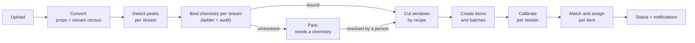
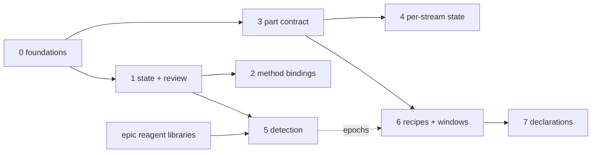

# Automatic ingest: chemistry routing and acquisition splitting - design

Status: **proposal, phase 0 under way** (2026-09-18). Written for issue #2098
("Split files into samples by scan attributes"), which carries the checklist
of pull requests. The decisions in section 12 are open.

## Picking this up

The feature: when a file arrives, Mascope works out on its own

- **which chemistry applies**, per part of the file, without a filename token;
- **how to split it by scan type**: MS order, polarity, scan range, scan mode,
  and the rest of what the instrument was told to measure;
- optionally, **how to split it by time or by a signal trace**.

The design in one paragraph. A physical acquisition (`sample_file`) is
partitioned into **streams**: scans that share a scan signature and a
chemistry epoch. Each stream gets its own peak rows, time axis, instrument
function, m/z calibration and chemistry **binding**. A stream is cut into
**windows** by a per-instrument, versioned **recipe**. Every (stream, window)
**part** becomes one sample item.

Chemistry is bound by a ladder of evidence, strongest rung first (section
5.2):

0. a declaration;
1. an explicit choice;
2. a learned binding on the acquisition method;
3. the filename token;
4. an instrument default;
5. detection from the reagent ions.

Detection also audits every other rung. Anything unresolved is parked as
"needs a chemistry", visibly, instead of failing silently.

Read sections 1 and 2 for the problem and the evidence, 3 for the model, and
10 for the plan and how it lands. Every pull request for this work updates
the table below and ticks its item on #2098.

| Phase | Content | State |
|---|---|---|
| 0 | Stop losing information: method identity, stream census, token-rule and notification fixes | in progress; section 10 marks each item as it ships |
| 1 | Per-file processing state, persistent notifications, "needs a chemistry" | in progress; section 10 marks each item as it ships |
| 2 | Method bindings: routing without tokens | open |
| 3 | The part contract: stream and window honoured by every consumer | open |
| 4 | Per-stream state: calibration, instrument function, one item per stream, MS2 | open |
| 5 | Chemistry detection: audit first, then provisional binding | open |
| 6 | Recipes: time and trace windows, preview and apply | open |
| 7 | Declarations from the instrument side, MS2-only parts | open |

Related designs, and how this one relates to them (section 13):

- `ionization_method_config.md`: method identity and routing order.
- `chemistry_profiles.md`: on `epic/assignment-quality`; the profiles
  themselves.
- `multi_sample_items_per_file.md`: on
  `claude/multi-sample-file-generation-31b141`; windows.
- The setup-simplification proposal of 2026-09-03: a private design page.
  Its agent and upload steps shipped as #2044, #2046 and #2070.

---

## 1. The problem

### 1.1 What happens to a file today

1. The upload lands in `filestreams`. The converter reads the file's
   properties (`SampleFileProps`), fits one instrument function on the whole
   summed signal, and detects peaks once per polarity. Detection pools every
   MS1 scan of that polarity into one peak store, on one time axis made of
   the MS1 scans of both polarities. The converter then posts the
   `sample_file` row (`BaseFileProcessor._process_file`).
2. `_auto_process_sample_file` gets or creates the instrument's acquisition
   workspace and year dataset. It then calls `create_acquisition_batches_and_items`.
3. Routing is `resolve_ionization_modes_by_tokens`: a mode applies when its
   token is a substring of the stored file name and its polarity occurs in
   the file. There must be exactly as many matches as the file has
   polarities.
4. Each matched mode yields one whole-file ACQUISITION sample item, filed in
   the daily batch `"<date> <mode name> acquisition"`. Each item is then
   calibrated (if the mode names a calibrant collection), matched and,
   when enabled, assigned. A blank file skips all three (#2170), and a TOF
   file with no fit is refused at matching (section 1.2).

### 1.2 What is wrong with that

| Problem | Where | Effect |
|---|---|---|
| Routing is a substring of the file name | `resolve_ionization_modes_by_tokens` | Configuration has to be written into file names. Tokens from different sites cannot be merged. A `+-` file that matched two `+` tokens was accepted until #2158. `resolve_ionization_modes_by_peaks` is a `NotImplementedError` stub. |
| An unrouted file is a row with no samples | `_auto_process_sample_file` | The failure notification went only to the uploading account's room. For agent uploads that is the machine account, so nobody saw it (#1910). Since #2159 it also reaches the instrument room, and a paired agent's errors go to the device sponsor. Since #2166 it is also kept until read for the sponsor or uploader and the instrument workspace's owners. |
| Scans are selected by polarity, MS order and time only | `OpenTFRawBackend._selected`, `ScanSelector` | Two same-polarity streams with different scan ranges or scan modes are pooled into one averaged spectrum, one peak list, one time axis and one instrument fit. Averages divide by every selected scan, so an ion seen by only one range is diluted. |
| An item's window is stored and then ignored | `compute_match_isotopes`, `extract_peaks`, peak-assignment peak loading, calibration, `create_sample_items` TIC | A windowed item is matched and assigned as if it were the whole polarity. |
| Calibration and the instrument function are per file | `calibration_mz_fit` `_apply_sync`, `calibration_mz_apply` | Two items of one file share one m/z factor. Applying a new fit rescales every peak row in the file and removes the matches of every item in the file. #2153 contains the damage: every sample of a file is calibrated before any is matched, and a file with two calibrating modes is not calibrated at all. |
| A TOF file with no fit is never matched | `create_sample_file`, the verified gate in `match_compute_sample` | Registration stores a TOF file's converter coefficients as a record marked `unfitted` and not verified, and the gate refuses it. A TOF file whose mode names no calibrant collection is therefore never matched. Every run used to end on the gate's warning to calibrate the file, though the pipeline has no calibrants to calibrate it against; since phase 0 item 8 the pipeline holds the file back and records why. |
| MS2-only acquisitions are refused; MS2 is reachable only through an item's polarity and window | `RawProcessor._get_sample_file_props`, `api/new/ms2` | #2068 |
| The method identity was lost | `RawProcessor.method_file` returned `""` | Orbitrap files ingested from July 2026 carry no method name, and it is the routing key section 2.4 argues for. #2155 reads it again, and its `populate_orbitrap_method_file` script restores it on the files already ingested. |
| Nothing recorded how far a file got | `sample_file` | The File Agent only learns that its bytes arrived. Phase 1 records a processing status on each file. |

---

## 2. What the data says

All numbers are aggregates, measured 2026-09-17. Nothing in this section
names a site.

### 2.1 Fleet shape

Read-only counts over every production server:

| | |
|---|---|
| Sample files | 698,512. Orbitrap 691,159 (98.9%), TOF 7,353 |
| Orbitrap length | up to 2 min: 94.2%; 2-10 min: 3.4%; 10-60 min: 2.3%; 1-6 h: 574 files; over 6 h: 19 |
| TOF length | 20-minute files at one site; 1-2 h at another; minutes elsewhere |
| Dual-polarity files | 2,235 (0.32%). All but 10 are on one server |
| Files with no acquisition sample | 1,429 of all files (0.20%), but 196 of the dual-polarity files (8.8%). All 10 dual-polarity files at the second site have none |
| Ionization modes configured | 212 across all servers |
| Orbitrap `method_file` populated | On the two servers checked: 98% and 100% of files in the first half of 2026, and **none since July 2026** (0 of 72,715 and 0 of 18,745) |

Most sites already split in time at the instrument: one file per sample, tens
of seconds long. Long files come from a minority of sites and from
experiments. The internal server holds MS2 acquisitions; the fleet-wide
counts above do not separate them.

A defect surfaced here. On the internal server, 10 dual-polarity files have a
calibrant collection on both modes. In 4 of them, the first-processed sample
has no matches; in none of them is the second sample missing its matches. That
is what section 1.2's per-file calibration predicts: the second item's
calibration removes the first item's matches. The other 2,025 dual-polarity
files on that server have no calibrating mode at all, and none has exactly
one. #2153 fixed the ordering: its tests fail on the code before it.

### 2.2 Scan streams in the regression corpus

The internal fleet regression corpus is 201 de-identified files from every
production site, internal only. It holds 185 Orbitrap files, of which OpenTFRaw
reads 182. The other 3 are single-scan files that fail in OpenTFRaw's search
for the trailer's layout
([Sigilweaver/OpenTFRaw#54](https://github.com/Sigilweaver/OpenTFRaw/pull/54));
the Thermo library reads them. A read-only census grouped
every file's scans by Thermo filter string:

- **180 files hold a single scan stream.**
- **2 files hold several**, and both switch polarity.
  - One alternates two streams, one scan range per polarity, in 4 blocks.
  - The other has **four** streams, two scan ranges per polarity, in 8
    blocks of 13-41 scans. Today each polarity's two ranges are pooled into
    one spectrum.
- No file in this corpus has MS2 scans; the corpus was picked for small
  specimens. 6 streams are SIM.
- Trailer values that vary *within* a stream: maximum injection time (15
  streams), lock-mass-found count (10), scan event number (4), microscan
  count (1). The FT resolution never varied within a filter.
- The analog inputs A and B are recorded and constant at 0 V in 166 files,
  and absent in 16. The reader returned no status log for the first, middle
  or last scan of any file.
- An MS1 stream has a median of 8 scans (p10 3, p90 43, max 1,486), with a
  median spacing of 3.9 s.

Multi-stream files are rare. When they occur, today's pooling is wrong
rather than merely coarse.

### 2.3 Can a spectrum name its own chemistry?

The probe:

- **Labels.** Each corpus file routed by its token has a known chemistry:
  the mechanisms of the mode it resolves to.
- **Scoring.** A deliberately naive detector took each MS1 stream's top 30
  summed centroids and matched them, within 10 ppm on the uncalibrated axis,
  against reagent libraries for bromide, nitrate, 15N-nitrate, iodide,
  uronium, charge transfer, hydronium and an amine reagent. A profile was
  called when:
  - a primary reagent ion ranked in the top five;
  - the library explained at least 20% of the top-30 intensity;
  - the call won by a factor of two over the runner-up.

| Outcome over 155 labelled MS1 streams | Streams |
|---|---|
| Correct | 64 (41%) |
| No call | 84 (54%). In 34 of them, no anchor ion of the true chemistry is inside the scan range |
| Wrong | 3. A 15N-nitrate stream called nitrate; an ambient negative-ion stream called nitrate; one labelling artefact of the probe |
| Ambient-ion streams called nitrate | 3. Natural NO3- dominates negative ambient spectra |
| Ambiguous | 1 |

Many methods deliberately start the scan range above the reagent ions
(`mz122-600` under uronium, `mz128-600` under 15N-nitrate, `mz82-750` under
bromide), so a reagent fingerprint cannot see what the instrument never
recorded. **Detection can suggest and audit. It cannot be the primary router,
and it must abstain rather than guess.**

The detector did call 17 of the 31 streams whose files matched no token.
These are files routing drops today, but the calls are unlabelled, so their
accuracy is unknown.

### 2.4 Is the acquisition method a routing key?

| Key | Keys | Keys carrying more than one chemistry |
|---|---|---|
| (instrument, method file name) | 119 | **0** |
| method file name, fleet-wide | 109 | 0 |
| (instrument, polarity, scan range) | 71 | 9 (47 files) |
| (instrument, polarity) | 33 | **13** (120 of 152 files) |

145 of the 152 labelled files carry a method file name.

Most methods have a single file in the corpus (19 keys have more than one),
so this is "no counterexample found", not a proof. A reagent bottle changed
under an unchanged method would break it, and that case is exactly what the
detection audit exists for.

It still settles two questions:

- The implicit "one mode per instrument and polarity" rule, proposed as a
  default in the setup-simplification proposal, would misroute most files on
  multi-source instruments.
- Of the keys a server could learn, the method name is consistent where the
  scan range is not.

### 2.5 A trace example

A 4.6 h negative-mode nitrate acquisition in the corpus (1,486 scans, one
stream) contains two SO2 exposure periods.

- NO3- stays at 1.2-1.5 million counts throughout.
- SO2- and SO4- step by two to three orders of magnitude.
- Classifying each scan by the larger of NO3- and SO2- yields five clean
  blocks: 73, 681, 197, 486 and 49 scans.

Nothing about the chemistry changes. The sample condition does, and a
threshold on one ion's trace finds it.

### 2.6 What this means for the design

- **Scan-type splitting is a correctness guard for a small population plus
  the way into MS2.** It must be invisible for the 99% of single-stream
  files: identical stores, identical items.
- **Routing should be learned on the acquisition method.** Detection audits
  every binding and suggests one on first contact; it never binds silently.
- **Instrument plus polarity is not a safe implicit key.** It stays available
  only as an explicit, admin-set default.
- **Time and trace splitting serve two different needs:**
  - chemistry epochs, where a control program switches reagents inside one
    file;
  - condition windows, where the reagent is steady and an analyte or valve
    trace changes, as in 2.5.

---

## 3. The model

### 3.1 Terms

- **Acquisition.** The physical file: one `sample_file` row, one filestore
  directory, one upload. Unchanged.
- **Scan signature.** What the instrument was told to measure in a scan:
  analyzer, polarity, ionization source, scan mode, MS order, scan ranges,
  source fragmentation, FAIMS CV and resolution setting, with the precursor
  and activation for MSn (section 4.1).
- **Chemistry epoch.** An interval with one chemistry. A stream has exactly
  one epoch unless a recipe cuts epochs (section 6.5).
- **Stream.** The scans of one acquisition that share a signature and an
  epoch. A stream owns:
  - its peak rows and time axis;
  - its instrument function and m/z calibration;
  - its chemistry binding.
- **Window.** An interval [t0, t1] inside a stream.
- **Part.** A (stream, window) pair. **One part is one sample item.**
- **Binding.** The link from a stream to the ionization mode that interprets
  it, with its source, state and evidence (section 5).
- **Recipe.** Versioned, per-instrument rules that decide:
  - which signature fields split streams;
  - how epochs and windows are cut;
  - the chemistry ladder;
  - how parts are batched (section 7).

### 3.2 The part contract

> A sample item's signal is the aggregate of the scans of its stream that
> fall inside [t0, t1].

Every consumer honours this: peak listing, spectrum, matching, assignment,
calibration candidates, TIC, exports and MS2.

Today the contract is "the scans of the item's polarity", with the window
ignored by most consumers. That is the degenerate case where the stream is
the polarity and the window is the whole file. That case must keep producing
byte-identical results.

### 3.3 Pipeline



Each stage writes the file's processing state (section 5.6). A stream that
cannot be bound stops at "park". The rest of the file continues.

### 3.4 Why parts are not sample files

The 2025 brainstorm in #749 proposed chunking acquisitions into several
`sample_file` rows. This design keeps one row per physical file:

- `sample_file.filename` is unique.
- The instrument and date are read off that name in more than forty places,
  including the filestore layout.
- The physical file is the unit of upload, deduplication, conversion and
  deletion.

Parts are logical. Streams get their own table (section 4.4) and items point
at them.

---

## 4. Streams: splitting by scan type

### 4.1 The scan signature

| Field | Source | In the default key | Note |
|---|---|---|---|
| Analyzer | filter (`FTMS`, `ITMS`, `ASTMS`) | yes | |
| Polarity | filter | yes | today's only split |
| Scan data type | filter (`p` / `c`) | yes | centroid-only scans cannot join a profile average |
| Ionization source | filter (`NSI`, `ESI`, `APCI`, ...) | yes | a different source is a different chemistry |
| Source fragmentation | filter (`sid=`) | yes | |
| FAIMS CV | filter (`cv=`) | yes | |
| Scan mode | filter (`Full`, `SIM`, `SRM`, ...) | yes | |
| MS order | filter (`ms`, `ms2`, ...) | yes | |
| Scan ranges | filter (`[lo-hi]`, several for multiplexed SIM) | yes | |
| Precursor and activation | filter (`123.4567@hcd30.00`) | for targeted MSn only | data-dependent scans fold into one family per parent; this matches today's MS2 grouping key |
| FT resolution | trailer (`FT Resolution:`) | yes | not in the filter; constant within a filter across the corpus |
| Microscans, AGC target, injection time, lock-mass state, scan event and segment numbers | trailer | no | recorded on the stream as attributes, with their variation |

The signature needs **one** filter-string parser, written and tested in
`mascope_thermo`. It serves both backends:

- OpenTFRaw exposes only the string (`scan_filter`, and `filter_string` on
  every scan dict).
- The DLL backend could use `IScanFilter`, but parsing the same canonical
  string on both keeps them in parity.

A Tofwerk file is one stream: a single `IonMode` and one mass axis. TOF parts
come only from epochs and windows.

The stream key is a stable, normalised rendering of the key fields. For a
single-polarity file whose scans all share one signature, the key reduces to
the polarity, so stores written today read as streams without a rebuild
(section 9).

### 4.2 MS2 and above

- **Data-dependent MS2.** One family stream per parent. The parent is the MS1
  stream with the same polarity, source and CV that brackets the MS2 scans in
  time.
- **Targeted or manual MS2.** One stream per (precursor, activation), as
  today's grouping already does. The parent is the MS1 stream of the same
  polarity that precedes the block. Manual acquisitions record MS1 first and
  MS2 after, so the brackets rule would find nothing.
- **Default.** MS2 streams create no sample items. They are reached from
  their parent's item, and the MS2 routes gain a stream parameter next to
  `t0`/`t1`/`polarity`.
- **MS2-only acquisitions.** An MS2 stream with no parent becomes an MS2-only
  part (#2068) once the item contract can build a TIC and time axis from MS2
  scans (phase 7).

### 4.3 Storage and computation

- **One peak store per file stays.**
  - Today's per-peak `polarity` variable generalises to a per-peak `stream`
    label.
  - The time axis gains a per-scan `stream` label.
  - Sum signals become per stream.
- **Peak detection loops over MS1 streams instead of polarities.**
  - Today's loop is `_extract_peaks_for_polarity`.
  - Scan selection gains a stream predicate, next to polarity, time and MS
    order, in `OpenTFRawBackend._selected` and `ScanSelector`.
- **Per-peak timeseries are filled with a per-scan stream mask.** This also
  removes today's normalisation of a polarity's rows over the axis of both
  polarities in `load_peak_timeseries`.
- **The first-scan outlier rule stays evaluated as it is today for
  single-stream files.** Any change to what the default selection returns
  makes every existing store stale (`check_stored_scan_axis`), so per-stream
  evaluation applies only to multi-stream files. Those are rebuilt anyway.
- **The instrument function is fitted per stream** when streams differ in
  analyzer or resolution. Otherwise one shared fit stands, as today.
- **m/z calibration moves to the stream.**
  - The Orbitrap apply scales only that stream's peak rows and sum signals.
  - `sample_file.mz_calibration` keeps a copy of the primary stream's fit
    until every reader has moved.
  - This removes the per-file hazard in section 2.1.
- **Existing multi-stream files** are listed and rebuilt by a maintenance
  script. It has a dry-run mode and touches ACQUISITION items only, the same
  shape as `fix_acquisition_window`.

### 4.4 `acquisition_stream`

| Column | Meaning |
|---|---|
| `stream_id`, `sample_file_id` | identity |
| `stream_key`, `epoch` | unique per file |
| `signature` (JSON) | the parsed key fields, plus the attributes of section 4.1 with their variation |
| `parent_stream_id` | MSn to its MS1 parent |
| `scan_count`, `blocks`, `t_first`, `t_last` | census |
| `instrument_function_id` | per-stream fit |
| `mz_calibration` (JSON) | per-stream calibration |
| `ionization_mode_id`, `binding_source`, `binding_state`, `binding_evidence` (JSON) | the chemistry binding (section 5) |
| `state`, `state_detail`, `state_updated_utc` | processing state (section 5.6) |

`sample_item` gains a nullable `stream_id`. NULL means today's semantics, so
every existing item keeps its meaning. Copy and move carry it.

---

## 5. Chemistry binding

### 5.1 What a binding points at

A binding points at an **ionization mode**, because every downstream
consumer reads one: mechanisms, calibrant collection, diagnostic collection
and, on the epic, the resolved profile.

A fresh instance needs something to bind to, so the chemistry presets ship
as **seeded, system-owned modes**. That is step 3 of the setup-simplification
proposal. It uses the `mascope_tools.composition.profiles` presets on
`epic/assignment-quality` (BR, UR, NO3, NO3_15N, IODIDE, ESI_POS, ESI_NEG)
together with their cluster libraries.

When versioned `reagent_profile` rows (assignment quality plan step 3.5) or
`IonizationSetup` (`ionization_method_config.md` Phase 1) exist, bindings
migrate to them. Nothing here depends on that.

### 5.2 The ladder

Rungs are tried per stream, strongest first. The first rung that yields
exactly one mode binds.

| Rung | Source | Writes | Teaches rung 2? |
|---|---|---|---|
| 0. Declared | The acquisition's own record: a control-program journal, an agent-uploaded sidecar, a mapped analog input (phase 7) | `declared`, confirmed | yes |
| 1. Explicit | A person: manual processing, re-routing, a review decision | `explicit`, confirmed | yes |
| 2. Method binding | `method_binding` on (instrument, method identity, signature class) | `method`, with the binding's own state | - |
| 3. Filename token | Today's rule, evaluated per stream polarity and requiring one mode per polarity | `token`, learned | yes |
| 4. Instrument default | An admin-set default for (instrument, polarity) (#1463) | `default`, confirmed | no |
| 5. Detected | Section 5.4, only when its guards pass | `detected`, **provisional** | only after review |
| none | - | stream parked as `needs_chemistry` | - |

**Detection runs on every MS1 stream, whatever rung bound it.** It stores its
evidence on the stream. A strong disagreement with the binding raises a
review item. Examples: "bound to bromide by method, no Br- or Br2- found"; "a
nitrate method, but the 15N/14N anchor ratio says labelled".

### 5.3 Method bindings

`method_binding` maps (instrument, method key, signature class) to a mode,
and records:

- `state`: learned, confirmed or provisional;
- `source`;
- `first_seen`, `last_seen`, `n_streams`, `n_disagreements`;
- who confirmed it.

**The method key** is the normalised method file name: the basename, case
folded. For Orbitrap this is `sample_info["inst_method"]` (read again since
#2155); for
Tofwerk, the `Configuration File` attribute. A content hash replaces it once
method text can be extracted reliably (`ionization_method_config.md` 6.1).

**The signature class** is polarity, analyzer, source, scan mode and scan
ranges, without precursors. A polarity-switching method can therefore bind
two chemistries, one per polarity.

**Learning:**

- A stream bound by rungs 0, 1 or 3 creates or refreshes its key's binding.
- A binding learned from a token routes later files of the same method
  without the token. Sites wean themselves off tokens without doing
  anything.
- A detected binding becomes a method binding only after someone confirms
  it.

**Conflicts.** A file whose key is bound but whose higher rung or audit says
otherwise:

- never overwrites the binding;
- is processed on the stronger rung;
- raises a review item;
- increments `n_disagreements`.

A key that keeps disagreeing is shown as unreliable. One method used with
several reagent bottles is the expected cause.

**Backfill.** Every existing ACQUISITION item provides (instrument,
`method_file`, polarity, mode):

- Files ingested up to June 2026 carry their method name.
- Later files carry it once `populate_orbitrap_method_file` (#2155) has run
  on the server.

A server that installs phase 2 therefore starts with bindings for every
method it has already routed.

**Without a method name** (some older instruments, generic TOF
configurations), the key falls back to the signature class alone. Such a
binding stays learned, is never confirmed automatically, and yields to a
token.

### 5.4 Detection

Detection builds on the reagent cluster libraries of the epic
(`mascope_tools.composition.reagents`: `REAGENT_CLUSTERS` with anchor flags,
`match_reagent_clusters`, `detect_channels`). The scorer does not exist yet;
it is new work.

- **Input:**
  - the stream's strongest peaks on the uncalibrated axis;
  - the stream's scan ranges;
  - the instrument class window, widened for TOF, whose uncalibrated axis
    can be tens of ppm off.
- **Coverage.** A library whose anchors all fall outside the scan ranges is
  *unobservable*, not absent. Only observable libraries compete.
- **Dominance.** A reagent system is by far the brightest thing in its
  spectrum. The score is the share of the top-N intensity the library
  explains, and a primary anchor must rank near the top. This rule separates
  nitrate CIMS from the natural NO3- of an ambient-ion spectrum.
- **Margin.** The winner must beat the runner-up by a set factor.
- **Label ratio.** The labelled and unlabelled forms of a reagent (15N- and
  14N-nitrate) both show both anchors. The decision rests on their intensity
  ratio, not on presence.
- **Output:**
  - per profile: score, coverage and anchors found;
  - a decision: profile, ambiguous, unobservable or none;
  - the reasons.
  All of it is stored as `binding_evidence`.
- **Authority.**
  - Detection ships **audit-only** for at least one release.
  - It becomes rung 5 only when, on the labelled corpus and on production
    shadow data, wrong calls stay at or below 1% of its decisions.
  - The naive probe in 2.3 got 6 of its 70 calls wrong or doubtful (one of
    them a labelling artefact), 7-9%. The guards above have to close that
    whole gap.
- **Later evidence** for the many methods that exclude their reagent ions:
  - adduct-pair consistency, i.e. the same neutral seen through two channels
    of one profile;
  - Stage A reference-list hits.

### 5.5 Review, don't gate

- **A provisional binding processes immediately.** The review item goes to
  the device's sponsor and the owners of the instrument workspace.
- **A decision** rewrites the stream's binding, teaches the method binding,
  and flags the affected batches through the existing recalibrate and
  rematch states.
- **Only ambiguous and unobservable streams park.** A parked stream has
  converted peaks but no items; resolving it resumes the pipeline from
  binding.
  - Until the ladder has more rungs than the token, every file the token
    binds to nothing parks. Since #2167 that is the whole file, at status
    `needs_chemistry`.

### 5.6 Processing state and notifications

- **State.**
  - `sample_file` gains `processing_status`, `processing_detail` and
    `processing_updated_utc`.
  - The per-stream state lives on `acquisition_stream`.
  - Values: `converting`, `converted`, `bound`, `needs_chemistry`,
    `calibrated`, `calibration_failed`, `matched`, `done`, `failed`.
  - The pipeline writes all but two. `converting` needs a row that exists
    during conversion, and the converter registers the file only after it.
    `matched` needs matching to run as a stage of its own, while today each
    sample is matched and assigned in turn.
  - `queued` marks a file whose processing was asked for again - a
    re-process, or `POST /{id}/process` - before anything of it is
    replaced, so the row never keeps an earlier run's `done` over a file
    being rebuilt.
  - A restart marks the runs it cut short (`converted`, `queued`, `bound`,
    `calibrated`) as `failed`.
  - `sample_file_utc_created` records when the converter registered the file
    (#482). Unlike `processing_updated_utc`, no later stage overwrites it.
- **Notifications** become rows: recipient, kind, severity, payload, read,
  resolved.
  - Processing events for an instrument address the device sponsor and the
    workspace owners.
  - The failure path names its instrument (#1910).
  - A review item is a notification with an action.
  - As built (#2166), a row is a digest.
    - Each `failed`, `needs_chemistry` or `calibration_failed` outcome joins
      the one unread row per person, kind and instrument, which counts its
      files and names the latest.
    - A read row takes no more files; the next one opens a new row.
    - Every file a row took is linked to it (`notification_file`), and the
      row is marked resolved once none of them is left in its state; a
      deleted file leaves its rows with it. The instrument is matched on its
      trimmed lower case, as its workspace is.
    - Adding to and resolving an instrument's rows take one lock on the
      instrument, in the transaction that writes the file's status, so a
      row is never resolved while a file joins it and the status never
      stands without its row.
    - Marking a row read takes the `updated_utc` the reader saw: a row that
      took another file since stays unread. `version` orders the copies of
      a row a browser receives.
    - The uploader is addressed too: for a person's upload the person, for
      an agent's the device sponsor.
- **The file list endpoint** already accepts a device token and returns every
  column. The File Agent's status poller reads the new columns (next agent
  release).

---

## 6. Windows: splitting by time and trace

### 6.1 Rules

| Rule | Cuts | Parameters | Default |
|---|---|---|---|
| `none` | one window per stream | - | **yes** |
| `blocks` | one window per contiguous block of the stream | minimum scans | no |
| `window` | fixed-length windows | length; alignment to acquisition start or to UTC boundaries; minimum scans | no |
| `gaps` | where scan spacing jumps | factor over the median spacing | no |
| `trace` | where a trace crosses thresholds | source, thresholds with hysteresis, minimum dwell, settle trim, state labels | no |
| `changepoint` | candidate cuts on a trace | model, penalty | preview only |
| `epochs` | chemistry epochs (section 6.5) | `declared` or `detected` | no |

Post-processing applies to every rule:

- drop the settle time after each cut;
- drop windows below the minimum scan count;
- merge fragments shorter than the minimum dwell;
- attach labels.

A label maps to a `sample_item_type` (for example `BLANK` or
`INSTRUMENT_BACKGROUND` for a "background" state) and to
`sample_item_attributes`.

### 6.2 Trace sources

| Source | Exists today | Cost |
|---|---|---|
| TIC per scan | `get_tic_per_scan` | cheap |
| Extracted ions (a list of m/z) | `get_peak_timeseries` | on OpenTFRaw, one call decodes every scan's centroids |
| Ratio of two extracted ions | - | as above |
| A trailer value as a series (analog input, FAIMS CV, injection time) | `scan_parameters(n)`, never read as a series | one pass over the scans |
| Instrument status log | `status_log(n)` in OpenTFRaw; returned nothing on the scans probed in the corpus | unverified |
| External CSV (control-program channels) | `mascope_signal.kecu.csv_to_xarr` aligns one onto a store's time axis; nothing calls it | needs the file to arrive (phase 7) |
| Per-scan chemistry scores | section 5.4 run on scan windows | one pass |

Traces are computed during peak detection's own pass over the scans, and
cached on the store's time axis (`trace_<name>`). Preview recomputes a trace
only when its definition changes.

### 6.3 Windows share their stream's peaks

A window does not get its own peak detection. It takes the stream's peak list
and sums the per-peak timeseries inside [t0, t1], which is how
`extract_peaks` already aggregates an explicit window.

For that to be complete, a file that a recipe splits gets **all** its peak
timeseries computed at ingest, not lazily. Today a windowed aggregate leaves
out, with a warning, every peak whose timeseries was never computed.

### 6.4 Volume

A two-hour TOF file cut into one-minute windows yields 120 items. The daily
batch key stays, so a day of such files is a batch of up to 1,440 samples.
That is the scale the batch views were tuned for when #823 was closed. Even
so, the recipe carries a per-file item ceiling and a minimum window, and
preview reports the count before anything is written.

### 6.5 Epochs are streams, windows are not

A cut that changes the chemistry makes a new **stream**. Examples:

- a control program switching reagents inside one file;
- a declared step boundary.

The new stream gets its own detection, instrument function, calibration and
binding, because its spectrum is a different measurement.

A cut that keeps the chemistry makes a **window**. It is cheap and shares the
stream's peaks.

The `epochs` rule is where detection (5.4) is run on time windows rather than
on the whole stream: per-scan scores, a dominant profile per scan, then the
same hysteresis and dwell logic as a trace.

---

## 7. Recipes

- **Scope.** A recipe belongs to an instrument, with a site default above
  it. Instrument names already scope acquisitions by campaign, a
  customer-controlled key that `device_identity_plan.md` keeps.
- **Versioning.** Recipes are append-only and versioned, the same pattern as
  `assignment_calibration`. Every stream and item stamps the recipe version
  that produced it.
- **Body.** A sketch:

```json
{
  "streams": {
    "split_on": ["analyzer", "polarity", "data_type", "source", "sid", "cv",
                 "scan_mode", "ms_order", "ranges", "resolution"],
    "msn": "attach"
  },
  "epochs": {"by": "none"},
  "windows": {"by": "none"},
  "chemistry": {
    "ladder": ["declared", "explicit", "method", "token", "default", "detected"],
    "detection": "audit"
  },
  "batching": {"by": ["day", "binding", "signature_class_if_needed"]},
  "limits": {"max_items_per_file": 500, "min_window_scans": 3}
}
```

- **Default recipe.** Split by signature, no epochs, no windows, the full
  ladder with detection in audit mode. A new site configures nothing.
- **Preview.** `POST /api/sample/files/{id}/split-preview` takes a recipe
  body and returns, without writing anything:
  - the streams and their blocks;
  - the epochs and windows;
  - the bindings with their evidence;
  - the item count;
  - the traces to chart.
- **Apply.** `POST /api/sample/files/{id}/split` requires editor rights on
  the instrument workspace.
  - It replaces the file's ACQUISITION items, the same shape as today's
    reprocess.
  - Items a user copied or created are never touched.
  - "Save as the instrument's recipe" mints a new version. Applying it to
    earlier files is an explicit, previewed bulk action.
- **UI.** The Raw files tab gets a chromatogram per stream with the proposed
  windows overlaid and a small editable window table. This replaces phase 3
  of `multi_sample_items_per_file.md`, where
  `DialogSampleOp` gets `t0`/`t1` fields.

---

## 8. Downstream consequences

- **Daily ACQUISITION batches.**
  - The key today is (dataset, name, polarity).
  - When one instrument produces more than one signature class under one
    binding on one day, the name gains the class ("... Nitrate acquisition
    (m/z 40-160)"). The batch ledger's anchors assume comparable spectra.
  - Single-signature instruments keep today's names.
- **Matching, assignment, calibration candidates, exports and MS2** take a
  scan scope (stream, t0, t1) wherever they take a polarity today.
- **The profile resolved for assignment** still follows the item's mode. The
  mode now comes from the stream's binding.
- **The SDK** gains the stream on items, and the preview and apply routes.
  Existing calls keep their meaning.
- **FAIR.** The stream signature, recipe version and binding source are the
  provenance `ionization_method_config.md` section 7 asks for. Exports should
  carry them.

---

## 9. Compatibility and migration

- **Single-stream files, which are nearly all files:**
  - the stream key is the polarity;
  - stores and items stay byte-identical;
  - no rebuild.
  The demo goldens pin this through every phase: the default recipe splits
  nothing in them.
- **Existing items** keep `stream_id = NULL`, which means today's polarity
  semantics.
- **Multi-stream files** are rebuilt by the maintenance script, dry-run
  first.
- **Tokens keep working** as rung 3, and they teach rung 2.
  - Browser upload stops rejecting token-less names only when the server
    announces the capability. The file then parks rather than being refused,
    the same capability pattern as `files_uploads_under_reported_instrument`.
- **File Agents need no change.** The status poller and sidecar upload are
  later additions, and older agents stay on today's path.
- **The fleet regression corpus manifest** is re-baselined with an expected
  ladder outcome per file.
  - Its rule, "a file that starts resolving is a regression", was right for
    the token model.
  - Under the ladder, some of its 41 non-routing specimens *should* start
    routing by method binding. Each needs a recorded expectation.

---

## 10. Phased plan

Every phase ships on its own and leaves single-stream files unchanged.
Effort is rough.

### Phase 0: stop losing information (about a week of small PRs)

1. **Restore the Orbitrap method identity.** Shipped in #2155:
   `ReaderBackend.method_file()` in both backends. Its values match between
   the two readers on every readable file of the regression corpus. The
   backfill `populate_orbitrap_method_file` reads only the file header; run
   it with `DRY_RUN=1` first. It needed the instrument-config delete fixed
   first, and #2156 did that (ionization doc Phase 0 item 4).
2. **Record the stream census in `.props`** (`scan_streams`: signature,
   counts, time span, blocks) through a filter parser with tests.
   - Sample `acquisition_parameters` per stream instead of over five scans
     mixed across both polarities.
   - Shipped in #2160: `mascope_thermo.scan_filter` parses the filter and
     `mascope_thermo.streams` takes the census. Each MS1 stream carries
     parameters sampled from its own scans; the whole-file sample stays
     beside them. `lock` is left out of the signature, because the Thermo
     library renders it per scan and OpenTFRaw never does. The one remaining
     difference between the backends is source fragmentation, which
     OpenTFRaw sometimes omits (one file of the corpus).
3. **Flag mixed streams** (the INFO line shipped in #2160, the processing
   detail with phase 1's status columns in #2164). A file with more than one
   MS1 stream in a polarity gets a processing detail and an INFO line, until
   phase 4 handles it.
4. **Fix the token rule**: one mode per polarity. Shipped in #2158.
5. **Route the failure notification** to the instrument room and the device
   sponsor. This is the minimal #1910 fix; phase 1 makes it persistent
   (#2166). Shipped in #2159.
6. **Fix the dual-polarity calibration defect of 2.1.** Shipped in #2153.
   - Every sample of a file is calibrated before any is matched.
   - A file with two calibrating modes is not calibrated at all, and is
     matched on whatever record the file already carries.
   - The full fix is per-stream calibration (phase 4).
7. **Operator tool** `mascope file scans <path>`: streams, blocks, ranges,
   top peaks. This is this design's census as a supported command. Shipped
   in #2161; `python -m mascope_thermo.streams <path>` prints the same report
   as JSON wherever the reader is installed.
8. **Hold back files the match gate refuses** (section 1.2). Found in
   #2170, shipped in #2164.
   - The pipeline skips matching and assignment for a file whose record the
     gate would refuse, as it does for a fit below the quality bar, instead
     of letting the run end on the gate's warning. It used to read the
     record only when a calibration ran or was skipped as shared, and even
     then let a TOF converter record through.
   - Such a file ends `calibration_failed`, and the detail names the missing
     calibrant collection.
   - The gate stays as it is. It also serves the per-sample match route, and
     batch matching reads the same `verified` flag, so relaxing it would
     allow manual matching on an uncalibrated TOF axis that batch matching
     still refuses.

### Phase 1: processing state and review (1-2 weeks)

Steps 6 and 7 of the setup-simplification proposal:

- the `sample_file` processing columns. Shipped in #2164: every stage
  writes its status and a detail for a person, and the detail says when a
  polarity pools MS1 streams. Raw files shows and filters the status, and
  `GET /api/sample/files` takes `processing_status`;
- the persistent notification table with addressed recipients. Shipped in
  #2166: a digest per person, kind and instrument, listed under Needs
  attention in the notifications pane;
- the `needs_chemistry` state and a review list in Raw files, with
  one-click resolution that resumes the pipeline. Shipped in #2167:
  - a file no token binds is parked instead of failed;
  - Raw files filters to it, and **Choose chemistry** binds the selected
    files to one mode per polarity through `POST /api/sample/files/bind`;
  - re-processing, and processing a file on request, keep a file's modes
    when no token occurs in its name. This is the explicit rung of section
    5.2, kept on the file's samples until phase 2 gives bindings a table;
    until then a token added later outranks a choice made by hand;
  - a bind claims each file (`queued`) before its run starts, so a second
    choice for the same file cannot start a second run; a file that has
    samples already is rebuilt under the chosen modes;
  - a claim takes over a file whose run has recorded no stage for
    `STALLED_AFTER` (a day): a worker restart leaves such rows, and only a
    full restart marks them failed;
  - a rebuild replaces only the pipeline's own samples, the ACQUISITION
    items of ACQUISITION batches in ACQUISITION datasets of system
    workspaces. A file with a person's sample keeps its calibration when it
    is bound, and re-processing still refuses it;
- the upload capability flag;
- the agent status poller, in the next agent release.

Needed before any rung can be provisional or park.

### Phase 2: method bindings (1-2 weeks)

- **Schema:** `method_binding`, the ladder with rungs 1-4 and parking,
  learning from tokens, conflicts as review items, and the backfill from
  history.
- **Defaults:** the instrument-default rung (#1463), and the seeded
  system-owned profile modes.
- **Gate:** a replay of the fleet corpus. Every token-routed file binds to
  the same mode. Files of known methods route without their token. Each
  outcome matches the re-baselined manifest.
- **Result:** the setup win users see. A file named anything routes if its
  method has been seen once.

### Phase 3: the part contract (2-3 weeks)

- **The scope object.** A scan scope (stream, t0, t1) replaces the bare
  polarity in:
  - reader selection;
  - peak detection and the store labels;
  - timeseries filling;
  - `extract_peaks` (defaults to the item's scope);
  - `compute_match_isotopes`;
  - peak-assignment peak loading;
  - `create_sample_items` (windowed TIC);
  - the exports.
- **Supporting changes:**
  - `acquisition_stream` and `sample_item.stream_id`;
  - eager timeseries for split files.
- **This absorbs** phase 1 of `multi_sample_items_per_file.md`.
- **Gates:**
  - demo goldens byte-identical;
  - two windowed items over one file give different, correct intensities;
  - the four-stream corpus file yields four separate peak lists.

### Phase 4: per-stream state (about 2 weeks)

- **Per-stream fits:** calibration and instrument function per stream.
- **Items and batches:** one ACQUISITION item per MS1 stream; the batch name
  gains the signature class when needed.
- **MSn:** streams attach to their parents; the MS2 routes take the stream.
- **Existing data:** the rebuild script.
- **Gates:**
  - the polarity-switching corpus files get one calibrated item per stream;
  - the internal MS2 acquisitions keep their spectra;
  - the dual-polarity match loss of 2.1 does not reproduce.

### Phase 5: chemistry detection (2-3 weeks, plus a release in audit mode)

- **Dependency:** the epic's reagent libraries on `develop`. That is either
  the epic merge or the pure module landed on its own.
- **Build:** the scorer with its four guards, stored evidence, and
  disagreement review items.
- **Gates:**
  - confusion on the labelled corpus, and a production shadow read per site;
  - rung 5 switched on only at or below 1% wrong calls.
- **Ownership:** this takes over the routing half of assignment quality plan
  step 3.5.

### Phase 6: recipes and windows (3-4 weeks)

- **Rules and sources:** the recipe table, the rules of 6.1, the trace
  sources of 6.2 (the external CSV waits for phase 7), and cached traces.
- **Endpoints and UI:** preview and apply, the Raw files chromatogram, and
  bulk re-split.
- **Epochs:** detected epochs, once phase 5 is on.
- **Gates:**
  - the exposure experiment of 2.5 splits into its five blocks;
  - long TOF files split into aligned windows within the item ceiling;
  - the batch views stay responsive at the resulting sample counts.

### Phase 7: declarations and the long tail (open)

- **Rung 0 and declared epochs:**
  - an agent-uploaded sidecar, aligned by the existing CSV aligner;
  - a control program paired as its own device and posting journal events;
  - an analog-input mapping for sites that wire one.
- **MS2-only parts (#2068).**
- **Adduct-pair evidence** for methods without reagent ions in range.

### Order and parallelism



Phases 1-2 and 3-4 are independent tracks. Phase 2 is the earliest
user-visible win; phase 4 closes the correctness gap.

### How it lands

The work lands straight on `develop`, one small pull request at a time. There
is no epic branch.

**Why no epic.**
- Much of the work is fixes production needs as soon as they exist.
- Ingest runs on every upload at every site. What makes a routing change safe
  is a flag and a measurement on real traffic. A shadow mode only measures
  anything once it ships in a release.

**Rules for each pull request:**
- **Byte-identical single-stream files.** It keeps them unchanged, and the demo
  bundle goldens pin that.
- **Reproducibility run.** One that can move pipeline output (reading, peak
  detection, calibration, matching) is also dispatched through
  `reproducibility.yaml` before it merges.
- **Behaviour changes ship inert.** Each arrives behind a `[backend]` flag, in
  both copies of the runtime toml, and starts in a shadow or check-only mode:
  - **phase 2:** method bindings are learned and compared with the token first;
    routing on them is switched on per site afterwards;
  - **phase 4:** multi-stream splitting stays off until it is complete;
  - **phase 5:** detection runs check-only for a release before it may bind
    anything.

  Phase 6 needs no flag: the default recipe splits nothing.
- **One migration at most** per pull request.
- **Status kept current.** It updates the status table at the top of this note
  and ticks its item on #2098.

**Coordination with `epic/assignment-quality`.**
- Phase 3 changes how peak assignment loads peaks, in the service that epic
  rewrote. So the reader, store and matching layers land first, and the
  assignment consumer follows after the epic merges.
- Phase 5 builds on that epic's reagent cluster libraries, so it starts once
  those are on `develop`.

**The one exception.** If the stream work of phases 3-4 cannot be cut into
steps that each keep single-stream files byte-identical, that part alone goes
through a short-lived stacked branch, merged as one unit.

---

## 11. Validation

- **Demo bundle goldens:** byte-identical through every phase. Single-stream
  files must not notice any of this.
- **Fleet regression corpus:**
  - the re-baselined manifest (routing per file);
  - the two polarity-switching files (streams);
  - the labelled streams (detection confusion);
  - the exposure file (trace windows).
  The corpus is internal. Anything committed as a fixture must be synthetic
  or published.
- **Hermetic tests:**
  - a fake reader with scripted filters and traces for selection, blocks,
    epochs and every guard, one test per gate so that each decision is
    pinned;
  - a mutation pass over the guards.
- **Production shadow:** detection in audit mode for a release, with the
  disagreement rate per site read before rung 5 is enabled.
- **A shareable multi-range and MS2 acquisition** is needed for committed
  fixtures. The corpus files cannot be used.

---

## 12. Decisions needed

1. **Binding target now.** Seeded system-owned modes (recommended), or wait
   for versioned profile rows (plan step 3.5).
2. **Ladder order.** The method binding above the token (recommended, on
   2.4), and the instrument default below the token.
3. **Detection authority.**
   - Audit-only for a release, then provisional above a measured precision
     gate (recommended).
   - Never final without a person.
4. **Default stream key.** The full signature including resolution
   (recommended), or polarity plus scan range only.
5. **Calibration scope.** Per stream (recommended; required for different
   chemistries in one file).
6. **MS2.** Attach to the parent item by default (recommended), or separate
   MS2 items.
7. **Batch naming.** Add the signature class only when needed (recommended),
   or always.
8. **Recipe scope.** Per instrument with a site default (recommended), or
   per workspace.
9. **Token fate.**
   - Keep it as a supported rung and learning source indefinitely
     (recommended).
   - Drop the browser-side requirement once phase 1 lands.
10. **Long-file windows.** Aligned to acquisition start or to UTC boundaries.
    UTC boundaries line up across instruments.
11. **First declaration channel.** An agent sidecar (cheapest; the aligner
    exists), control-program pairing, or analog-input wiring.

---

## 13. Relationship to earlier designs

| Design | What happens to it here |
|---|---|
| #749 chunk model (one `sample_file` per part) | Not adopted (3.4). Parts are streams and items. |
| `multi_sample_items_per_file.md` | Its phase 1 is phase 3 here. Its segment API and chromatogram UI are phase 6. m/z-range splitting is covered by streams, because the scan range is in the signature. |
| `ionization_method_config.md` | Its Phase 0 items 3 (`method_file`, #2155) and 4 (the delete fan-out, #2156) are done. Its routing order (4.5) is revised by 2.4: method identity above the token, instrument plus polarity only as an explicit default. `acquisition_stream` and `method_binding` are the first concrete pieces of its `AcquisitionMethod` and `MethodBinding`. |
| `chemistry_profiles.md` and assignment quality plan step 3.5 | The profiles and their future rows stay there. Routing by detection moves here (phase 5), with the guards 2.3 shows it needs. |
| Setup-simplification proposal (2026-09-03) | Its steps 1, 2 and 4 shipped (#2044, #2046, #2070). Steps 3 and 5 (presets, instrument-scoped modes) are phase 2 here; steps 6 and 7 (notifications, per-file status) are phase 1; step 9 (detection with review) is split between phases 1 and 5. Its routing ladder gains the method rung and loses the implicit instrument-plus-polarity rule. Its calibration anchor tiers (steps 8 and 10) are independent and unchanged. |

---

## 14. Where it lands in the code

Function names are the stable reference; line numbers drift.

| Seam | Path | Phase |
|---|---|---|
| Method identity (shipped, #2155) | `libraries/thermo/src/mascope_thermo/processor.py` `RawProcessor.method_file`; `backend.py` `ReaderBackend.method_file`; `db/scripts/populate_orbitrap_method_file.py` | 0 |
| Filter parsing, stream census, per-stream parameter sampling | `libraries/thermo/src/mascope_thermo/backend.py` (`acquisition_parameters`, `_sample_evenly`, a new signature accessor); `server/backend/src/mascope_backend/file_converter/schema.py` `SampleFileProps` | 0 |
| Scan selection | `backend.py` `OpenTFRawBackend._selected`; `thermo.py` `ScanSelector` | 3 |
| Detection and store layout | `libraries/signal/src/mascope_signal/peak.py` (`_extract_peaks_for_polarity`, `_allocate_peak_timeseries`) | 3 |
| Timeseries fill, stale-axis check, acquisition window | `libraries/signal/src/mascope_signal/compute.py` (`load_peak_timeseries`, `check_stored_scan_axis`, `get_acquisition_window`) | 3 |
| Peak listing | `server/backend/src/mascope_backend/api/controllers/samples/lib/samples_peaks.py` `extract_peaks` | 3 |
| Matching | `libraries/match/src/mascope_match/compute/isotopes.py` `compute_match_isotopes`; `api/controllers/match/lib/match_compute.py` | 3 |
| Assignment peak loading | `api/new/peak_assignments/service.py` | 3 |
| Item creation | `api/controllers/sample/items/sample_items_controller.py` `create_sample_items` | 3 |
| Instrument function | `libraries/signal/src/mascope_signal/instrument_func/fit.py` | 4 |
| Calibration | `api/controllers/calibration/lib/calibration_mz_fit.py` (`_apply_sync`, `_resolve_calibration_isotopes`); `calibration_controller.py` `calibration_mz_apply` | 0 (ordering, shipped in #2153), 4 |
| Pipeline and routing | `api/controllers/sample/files/process/service.py` (`_auto_process_sample_file`, `create_acquisition_batches_and_items`, `calibrate_with_retry`); `api/new/ionization/modes/util.py` (`resolve_ionization_modes_by_tokens`, `resolve_ionization_modes_by_peaks`) | 0, 1, 2, 5 |
| Daily batches | `api/controllers/sample/batches/sample_batches_controller.py` `get_or_create_acquisition_batch` | 4 |
| MS2 | `api/new/ms2/` | 4 |
| Notifications | `socket/notifications/service.py`; the background-task decorator in `api/lib/api_features.py` | 0, 1 |
| Models | `db/models.py` (`SampleFile`, `SampleItem`, `IonizationMode`); new `AcquisitionStream`, `MethodBinding`, `IngestRecipe`, `Notification` | 1-6 |
| Reagent libraries (epic) | `libraries/tools/src/mascope_tools/composition/reagents.py` (`REAGENT_CLUSTERS`, `match_reagent_clusters`, `detect_channels`); `profiles.py` | 5 |
| Changepoints | `libraries/tools/src/mascope_tools/stats/peak.py` (ruptures) | 6 |
| External traces | `libraries/signal/src/mascope_signal/kecu.py` `csv_to_xarr` | 7 |
| Agent | `agents/file/src/mascope_file_agent/main.py`; `libraries/sdk/src/mascope_sdk/_agents.py` | 1, 7 |
| Raw files UI | the Raw files pane and `DialogSampleOp.vue` | 1, 6 |

Paths under `api/`, `socket/` and `db/` are relative to
`server/backend/src/mascope_backend/`.
