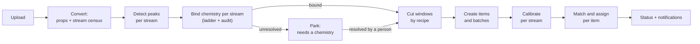
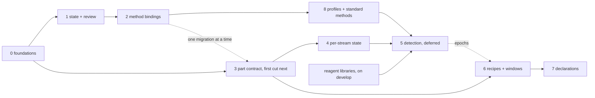

# Automatic ingest: chemistry routing and acquisition splitting - design

Status: **phases 0 and 1 shipped; phase 2's provenance and row-following
shipped, its rung next; the stream work of phases 3 and 4 starts beside
phase 8, which gains the standard-method catalogue; detection deferred**
(2026-10-01). Written for issue #2098 ("Split files into samples by scan
attributes"), which carries the checklist of pull requests. Decisions 1, 2,
3, 4, 5, 9, 12 and 13 in section 12 are settled; the rest are open.

## Picking this up

The feature: when a file arrives, Mascope works out on its own

- **which chemistry applies**, per part of the file, from what the file
  carries - its acquisition method and scan parameters - without a filename
  token or any configuration by the person who uploaded it;
- **how to split it by scan type**: MS order, polarity, scan range, scan mode,
  and the rest of what the instrument was told to measure;
- optionally, **how to split it by time or by a signal trace**.

The unit a person sees is the **chemistry profile**: a shipped, system-owned
description of one chemistry that carries everything the pipeline needs -
the adduct panel, the reagent-ion library that anchors the m/z calibration
and diagnoses the spectrum, and the evidence that recognises it. A regular
user picks a profile once, when a file first arrives from an unseen method,
and never edits one. Ionization modes with filename tokens, hand-typed
mechanisms and hand-built calibrant collections remain, as the advanced path
for exotic chemistries and calibration standards. Section 5.1 says how far
the profile has been built.

Beside the profiles Mascope ships **standard acquisition methods**: a method
file per chemistry and instrument type for the operator to load, and a
catalogue entry naming the profile it runs. A site on a shipped method gets
its chemistry on its first file with no click at all; a site on its own
method gets it after one (5.3). The standard methods are also where files
with several scan ranges of one chemistry come from, and splitting those
into one item per range is the first cut of the stream work (4.5) - the
next thing built (decided 2026-10-05).

The design in one paragraph. A physical acquisition (`sample_file`) is
partitioned into **streams**: scans that share a scan signature and a
chemistry epoch. Each stream gets its own peak rows, time axis, instrument
function, m/z calibration and chemistry **binding**. A stream is cut into
**windows** by a per-instrument, versioned **recipe**. Every (stream, window)
**part** becomes one sample item.

Chemistry is bound by a ladder of evidence, strongest rung first (section
5.2):

0. a declaration;
1. an explicit choice;
2. a method binding a person has confirmed;
3. the filename token, matched within the instrument's own modes;
4. a method binding learned from the files before it;
5. detection from the reagent ions.

The token is the advanced path's override: it outranks what the system has
learned and yields to what a person has confirmed. (Rung 4 once held an
instrument default, since dropped - section 5.2 says why.)

Anything unresolved is parked as "needs a chemistry", visibly, instead of
failing silently. Detection, when it comes, audits every rung and adds a
suggestion to the parked file; it is deferred behind the stream and profile
work (decision 3).

Read sections 1 and 2 for the problem and the evidence, 3 for the model, 4.5
for the first stream cut, 5.1 for the profile, 5.3 for the catalogue, and 10
for the plan and how it lands. Section 9.1 carries
the three rules that keep already-processed files as they are. Every pull
request for this work updates the table below and ticks its item on #2098.

| Phase | Content | State |
|---|---|---|
| 0 | Stop losing information: method identity, stream census, token-rule and notification fixes | shipped |
| 1 | Per-file processing state, persistent notifications, "needs a chemistry" | shipped (#2164, #2166-#2169) |
| 2 | Method bindings: routing without tokens | learned in shadow on every server (#2193, #2196, #2206, #2226), measured (5.7), item provenance (#2254), the row-following learner (#2255), the rung (#2264) and the disagreement report (#2267) shipped; the backfill re-run and the per-site switch remain, section 10 lists them |
| 8 | Chemistry profiles as the unit: complete the seeded profiles, ship the standard methods and their catalogue, list the profiles, a profile-first surface, batches named after the profile | open; follows the stream first cut, or runs beside it when there are hands for both (decided 2026-10-05) |
| 3 | The part contract: stream and window honoured by every consumer | open and **next**: the first cut, for files with more than one MS1 stream in a polarity (4.5), leads the work after phase 2 (decided 2026-10-05) |
| 4 | Per-stream state: calibration, instrument function, one item per stream, MS2 | open; follows 3 on the same track; no rebuild script (4.5, 9.1) |
| 5 | Chemistry detection: audit first, then provisional binding | deferred behind phases 3, 4 and 8 (decision 3); its reagent libraries are on `develop` |
| 6 | Recipes: time and trace windows, preview and apply | open |
| 7 | Declarations from the instrument side, MS2-only parts | open |

Related designs, and how this one relates to them (section 13):

- `ionization_method_config.md`: method identity and routing order.
- `chemistry_profiles.md`: the profiles themselves, and the versioned row a
  seeded profile migrates into (5.1).
- `multi_sample_items_per_file.md`: on
  `claude/multi-sample-file-generation-31b141`; windows.
- The setup-simplification proposal of 2026-09-03: a private design page.
  Its agent and upload steps shipped as #2044, #2046 and #2070.

---

## 1. The problem

### 1.1 What happens to a file today

1. The upload lands in `filestreams`. The converter reads the file's
   properties (`SampleFileProps`), fits one instrument function on the whole
   summed signal, and detects peaks once per polarity. Detection pools every
   MS1 scan of that polarity into one peak store, on one time axis made of
   the MS1 scans of both polarities. The converter then posts the
   `sample_file` row (`BaseFileProcessor._process_file`).
2. `_auto_process_sample_file` gets or creates the instrument's acquisition
   workspace and year dataset. It then calls `create_acquisition_batches_and_items`.
3. Routing is `resolve_ionization_modes_by_tokens`: a mode applies when its
   token is a substring of the stored file name and its polarity occurs in
   the file. There must be exactly as many matches as the file has
   polarities.
4. Each matched mode yields one whole-file ACQUISITION sample item, filed in
   the daily batch `"<date> <mode name> acquisition"`. Each item is then
   calibrated (if the mode names a calibrant collection), matched and,
   when enabled, assigned. A blank file skips all three (#2170), and a TOF
   file with no fit is refused at matching (section 1.2).

### 1.2 What is wrong with that

| Problem | Where | Effect |
|---|---|---|
| Routing is a substring of the file name | `resolve_ionization_modes_by_tokens` | Configuration has to be written into file names. Tokens from different sites cannot be merged. A `+-` file that matched two `+` tokens was accepted until #2158. `resolve_ionization_modes_by_peaks` is a `NotImplementedError` stub. |
| An unrouted file is a row with no samples | `_auto_process_sample_file` | The failure notification went only to the uploading account's room. For agent uploads that is the machine account, so nobody saw it (#1910). Since #2159 it also reaches the instrument room, and a paired agent's errors go to the device sponsor. Since #2166 it is also kept until read for the sponsor or uploader and the instrument workspace's owners. |
| Scans are selected by polarity, MS order and time only | `OpenTFRawBackend._selected`, `ScanSelector` | Two same-polarity streams with different scan ranges or scan modes are pooled into one averaged spectrum, one peak list, one time axis and one instrument fit. Averages divide by every selected scan, so an ion seen by only one range is diluted. |
| An item's window is stored and then ignored | `compute_match_isotopes`, `extract_peaks`, peak-assignment peak loading, calibration, `create_sample_items` TIC | A windowed item is matched and assigned as if it were the whole polarity. |
| Calibration and the instrument function are per file | `calibration_mz_fit` `_apply_sync`, `calibration_mz_apply` | Two items of one file share one m/z factor. Applying a new fit rescales every peak row in the file and removes the matches of every item in the file. #2153 contains the damage: every sample of a file is calibrated before any is matched, and a file with two calibrating modes is not calibrated at all. |
| A TOF file with no fit is never matched | `create_sample_file`, the verified gate in `match_compute_sample` | Registration stores a TOF file's converter coefficients as a record marked `unfitted` and not verified, and the gate refuses it. A TOF file whose mode names no calibrant collection is therefore never matched. Every run used to end on the gate's warning to calibrate the file, though the pipeline has no calibrants to calibrate it against; since phase 0 item 8 the pipeline holds the file back and records why. |
| MS2-only acquisitions are refused; MS2 is reachable only through an item's polarity and window | `RawProcessor._get_sample_file_props`, `api/new/ms2` | #2068 |
| The method identity was lost | `RawProcessor.method_file` returned `""` | Orbitrap files ingested from July 2026 carry no method name, and it is the routing key section 2.4 argues for. #2155 reads it again, and its `populate_orbitrap_method_file` script restores it on the files already ingested. |
| Nothing recorded how far a file got | `sample_file` | The File Agent only learns that its bytes arrived. Phase 1 records a processing status on each file. |

---

## 2. What the data says

All numbers are aggregates, measured 2026-09-17. Nothing in this section
names a site.

### 2.1 Fleet shape

Read-only counts over every production server:

| | |
|---|---|
| Sample files | 698,512. Orbitrap 691,159 (98.9%), TOF 7,353 |
| Orbitrap length | up to 2 min: 94.2%; 2-10 min: 3.4%; 10-60 min: 2.3%; 1-6 h: 574 files; over 6 h: 19 |
| TOF length | 20-minute files at one site; 1-2 h at another; minutes elsewhere |
| Dual-polarity files | 2,235 (0.32%). All but 10 are on one server |
| Files with no acquisition sample | 1,429 of all files (0.20%), but 196 of the dual-polarity files (8.8%). All 10 dual-polarity files at the second site have none |
| Ionization modes configured | 212 across all servers |
| Orbitrap `method_file` populated | On the two servers checked: 98% and 100% of files in the first half of 2026, and **none since July 2026** (0 of 72,715 and 0 of 18,745) |

Most sites already split in time at the instrument: one file per sample, tens
of seconds long. Long files come from a minority of sites and from
experiments. The internal server holds MS2 acquisitions; the fleet-wide
counts above do not separate them.

A defect surfaced here. On the internal server, 10 dual-polarity files have a
calibrant collection on both modes. In 4 of them, the first-processed sample
has no matches; in none of them is the second sample missing its matches. That
is what section 1.2's per-file calibration predicts: the second item's
calibration removes the first item's matches. The other 2,025 dual-polarity
files on that server have no calibrating mode at all, and none has exactly
one. #2153 fixed the ordering: its tests fail on the code before it.

### 2.2 Scan streams in the regression corpus

The internal fleet regression corpus is 201 de-identified files from every
production site, internal only. It holds 185 Orbitrap files, of which OpenTFRaw
reads all 185 at the pinned version. Three of them, each a single scan, failed
in OpenTFRaw's search for the trailer's layout when the census was taken
([Sigilweaver/OpenTFRaw#54](https://github.com/Sigilweaver/OpenTFRaw/pull/54),
fixed upstream in 1.5.0 and carried by the pin since); the numbers below still
describe the 182 the census covered. A read-only census
grouped every file's scans by Thermo filter string:

- **180 files hold a single scan stream.**
- **2 files hold several**, and both switch polarity.
  - One alternates two streams, one scan range per polarity, in 4 blocks.
  - The other has **four** streams, two scan ranges per polarity, in 8
    blocks of 13-41 scans. Today each polarity's two ranges are pooled into
    one spectrum.
- No file in this corpus has MS2 scans; the corpus was picked for small
  specimens. 6 streams are SIM.
- Trailer values that vary *within* a stream: maximum injection time (15
  streams), lock-mass-found count (10), scan event number (4), microscan
  count (1). The FT resolution never varied within a filter.
- The analog inputs A and B are recorded and constant at 0 V in 166 files,
  and absent in 16. The reader returned no status log for the first, middle
  or last scan of any file.
- An MS1 stream has a median of 8 scans (p10 3, p90 43, max 1,486), with a
  median spacing of 3.9 s.

Multi-stream files are rare. When they occur, today's pooling is wrong
rather than merely coarse.

**What a site that wants multi-range files runs today** (one production
Orbitrap, read on 2026-10-05, read-only). Four methods of twenty seconds
each - two scan ranges in each polarity, one that includes the reagent ion
and one that starts above it - cycled as separate files around the clock:
about 2,500 files a day, each a single stream. A cycle takes about 134 s
and records 80 s of it. The rest, two fifths of the cycle, is the gap
between one file and the next, and whatever happened in the sample during
it is context the neighbouring range never sees. Acquiring the ranges in
one file is meant to remove both, and it is the case the first stream cut
is built for (4.5). One of the four methods also turned out to hold two
scan events under one filter, which the census cannot tell apart (4.1).

### 2.3 Can a spectrum name its own chemistry?

The probe:

- **Labels.** Each corpus file routed by its token has a known chemistry:
  the mechanisms of the mode it resolves to.
- **Scoring.** A deliberately naive detector took each MS1 stream's top 30
  summed centroids and matched them, within 10 ppm on the uncalibrated axis,
  against reagent libraries for bromide, nitrate, 15N-nitrate, iodide,
  uronium, charge transfer, hydronium and an amine reagent. A profile was
  called when:
  - a primary reagent ion ranked in the top five;
  - the library explained at least 20% of the top-30 intensity;
  - the call won by a factor of two over the runner-up.

| Outcome over 155 labelled MS1 streams | Streams |
|---|---|
| Correct | 64 (41%) |
| No call | 84 (54%). In 34 of them, no anchor ion of the true chemistry is inside the scan range |
| Wrong | 3. A 15N-nitrate stream called nitrate; an ambient negative-ion stream called nitrate; one labelling artefact of the probe |
| Ambient-ion streams called nitrate | 3. Natural NO3- dominates negative ambient spectra |
| Ambiguous | 1 |

Many methods deliberately start the scan range above the reagent ions
(`mz122-600` under uronium, `mz128-600` under 15N-nitrate, `mz82-750` under
bromide), so a reagent fingerprint cannot see what the instrument never
recorded. **Detection can suggest and audit. It cannot be the primary router,
and it must abstain rather than guess.**

The detector did call 17 of the 31 streams whose files matched no token.
These are files routing drops today, but the calls are unlabelled, so their
accuracy is unknown.

### 2.4 Is the acquisition method a routing key?

| Key | Keys | Keys carrying more than one chemistry |
|---|---|---|
| (instrument, method file name) | 119 | **0** |
| method file name, fleet-wide | 109 | 0 |
| (instrument, polarity, scan range) | 71 | 9 (47 files) |
| (instrument, polarity) | 33 | **13** (120 of 152 files) |

145 of the 152 labelled files carry a method file name.

Most methods have a single file in the corpus (19 keys have more than one),
so this is "no counterexample found", not a proof. A reagent bottle changed
under an unchanged method would break it, and that case is exactly what the
detection audit exists for.

**The counterexample, measured on the fleet.** The same key over 609,383
production files with a method name, chemistry read from the mode's
mechanisms rather than its name, splits by instrument class:

| | Orbitrap | TOF |
|---|---|---|
| Keys | 408 | 295 |
| Keys carrying more than one chemistry | 18 (4%) | 3 (1%) |
| **Files** under such a key | **17,195 (3.0%)** | **34,335 (82.2%)** |

Count keys and TOF looks the safer of the two; count files and it is the
unusable one. One key covers nearly every TOF file: `currentacquisition.ini`
is the Tofwerk default, a constant, and three instruments on two servers all
report it with two to four chemistries under it. A fourth reports it with one
chemistry so far, which is worse than it looks - it would learn a binding and
override a correct token the day the reagent changes. A fifth names its
configuration per acquisition, 285 keys over 5,784 files, so nothing repeats
often enough to learn from.

The Orbitrap conflicts are what the corpus predicted: one method run with
different reagents (bromide against nitrate, ~10,500 files) and labelled
against unlabelled nitrate (~5,100).

Read at the level of mode *records* rather than chemistries, 36% of Orbitrap
files look ambiguous. Almost all of that is several mode rows for one
chemistry - `AutoGenerated1-` beside `Bromide No RI`, `X` beside `X Zero` -
and on two servers the record-level ambiguity runs to five figures while the
chemistry-level ambiguity is zero. Seeded system-owned modes (section 12,
decision 1) are therefore not housekeeping: they are what makes the method
key usable at all.

Two rules follow, and section 5.3 carries them:

- a key routes only once its history agrees on one chemistry;
- a method name that is a constant is treated as no method name.

It still settles two questions:

- The implicit "one mode per instrument and polarity" rule, proposed as a
  default in the setup-simplification proposal, would misroute most files on
  multi-source instruments.
- Of the keys a server could learn, the method name is consistent where the
  scan range is not.

### 2.5 A trace example

A 4.6 h negative-mode nitrate acquisition in the corpus (1,486 scans, one
stream) contains two SO2 exposure periods.

- NO3- stays at 1.2-1.5 million counts throughout.
- SO2- and SO4- step by two to three orders of magnitude.
- Classifying each scan by the larger of NO3- and SO2- yields five clean
  blocks: 73, 681, 197, 486 and 49 scans.

Nothing about the chemistry changes. The sample condition does, and a
threshold on one ion's trace finds it.

### 2.6 What this means for the design

- **Scan-type splitting is a correctness guard for a small population plus
  the way into MS2.** It must be invisible for the 99% of single-stream
  files: identical stores, identical items.
- **Routing should be learned on the acquisition method.** Detection audits
  every binding and suggests one on first contact; it never binds silently.
- **Instrument plus polarity is not a safe implicit key**, and an instrument
  has no default chemistry to fall back on either (5.2).
- **Time and trace splitting serve two different needs:**
  - chemistry epochs, where a control program switches reagents inside one
    file;
  - condition windows, where the reagent is steady and an analyte or valve
    trace changes, as in 2.5.

---

## 3. The model

### 3.1 Terms

- **Acquisition.** The physical file: one `sample_file` row, one filestore
  directory, one upload. Unchanged.
- **Scan signature.** What the instrument was told to measure in a scan:
  analyzer, polarity, ionization source, scan mode, MS order, scan ranges,
  source fragmentation, FAIMS CV and resolution setting, with the precursor
  and activation for MSn (section 4.1).
- **Chemistry epoch.** An interval with one chemistry. A stream has exactly
  one epoch unless a recipe cuts epochs (section 6.5).
- **Stream.** The scans of one acquisition that share a signature and an
  epoch. A stream owns:
  - its peak rows and time axis;
  - its instrument function and m/z calibration;
  - its chemistry binding.
- **Window.** An interval [t0, t1] inside a stream.
- **Part.** A (stream, window) pair. **One part is one sample item.**
- **Binding.** The link from a stream to the ionization mode that interprets
  it, with its source, state and evidence (section 5).
- **Recipe.** Versioned, per-instrument rules that decide:
  - which signature fields split streams;
  - how epochs and windows are cut;
  - the chemistry ladder;
  - how parts are batched (section 7).

### 3.2 The part contract

> A sample item's signal is the aggregate of the scans of its stream that
> fall inside [t0, t1].

Every consumer honours this: peak listing, spectrum, matching, assignment,
calibration candidates, TIC, exports and MS2.

Today the contract is "the scans of the item's polarity", with the window
ignored by most consumers. That is the degenerate case where the stream is
the polarity and the window is the whole file. That case must keep producing
byte-identical results.

### 3.3 Pipeline


```mermaid
graph LR
    U[Upload] --> C["Convert:<br/>props + stream census"]
    C --> D[Detect peaks<br/>per stream]
    D --> B["Bind chemistry per stream<br/>(ladder + audit)"]
    B -->|bound| W[Cut windows<br/>by recipe]
    B -->|unresolved| P[Park:<br/>needs a chemistry]
    P -->|resolved by a person| W
    W --> I[Create items<br/>and batches]
    I --> K[Calibrate<br/>per stream]
    K --> M[Match and assign<br/>per item]
    M --> S[Status + notifications]
```

Each stage writes the file's processing state (section 5.6). A stream that
cannot be bound stops at "park". The rest of the file continues.

### 3.4 Why parts are not sample files

The 2025 brainstorm in #749 proposed chunking acquisitions into several
`sample_file` rows. This design keeps one row per physical file:

- `sample_file.filename` is unique.
- The instrument and date are read off that name in more than forty places,
  including the filestore layout.
- The physical file is the unit of upload, deduplication, conversion and
  deletion.

Parts are logical. Streams get their own table (section 4.4) and items point
at them.

---

## 4. Streams: splitting by scan type

### 4.1 The scan signature

| Field | Source | In the default key | Note |
|---|---|---|---|
| Analyzer | filter (`FTMS`, `ITMS`, `ASTMS`) | yes | |
| Polarity | filter | yes | today's only split |
| Scan data type | filter (`p` / `c`) | yes | centroid-only scans cannot join a profile average |
| Ionization source | filter (`NSI`, `ESI`, `APCI`, ...) | yes | a different source is a different chemistry |
| Source fragmentation | filter (`sid=`) | yes | |
| FAIMS CV | filter (`cv=`) | yes | |
| Scan mode | filter (`Full`, `SIM`, `SRM`, ...) | yes | |
| MS order | filter (`ms`, `ms2`, ...) | yes | |
| Scan ranges | filter (`[lo-hi]`, several for multiplexed SIM) | yes | |
| Precursor and activation | filter (`123.4567@hcd30.00`) | for targeted MSn only | data-dependent scans fold into one family per parent; this matches today's MS2 grouping key |
| FT resolution | trailer (`FT Resolution:`) | yes | not in the filter; constant within a filter across the corpus |
| Microscans, AGC target, injection time, lock-mass state, scan event and segment numbers | trailer | no | recorded on the stream as attributes, with their variation; promoted into the key if one proves to move the peak shape, which then gives it its own fit (4.3); two scan events under one filter are the open case, below |

The signature needs **one** filter-string parser, written and tested in
`mascope_thermo`. It serves both backends:

- OpenTFRaw exposes only the string (`scan_filter`, and `filter_string` on
  every scan dict).
- The DLL backend could use `IScanFilter`, but parsing the same canonical
  string on both keeps them in parity.

A Tofwerk file is one stream: a single `IonMode` and one mass axis, because
the reader exposes no per-scan setting to split on. TOF parts come only from
epochs and windows until it does; a TOF instrument function is therefore a
per-file fit until then, and follows the signature once a setting enters it
(4.3).

The stream key is a stable, normalised rendering of the key fields. For a
single-polarity file whose scans all share one signature, the key reduces to
the polarity, so stores written today read as streams without a rebuild
(section 9).

**Two scan events can share one filter, and the key does not see them.** A
production nitrate method, read scan by scan on 2026-10-05, defines two
scan events with the same analyzer, range and resolution: seven scans of
one microscan at an AGC target of 3e5 in the file's first two seconds, then
seven scans of ten microscans at 1e6 over the eighteen that remain. Their
filter strings are identical. So the census reports one stream in one
block - with the microscan count, the AGC target, the maximum injection
time and the scan event among the trailer values that vary - and the
pipeline averages all fourteen scans as equals. Whatever the first event
was meant for, it is not the measurement the second one is: a tenth of the
transients per scan at a third of the ion population, taken while the
source is still settling (the injection time of its first scans can sit at
a fifth of the rest). In a per-scan average those two seconds weigh as
much as the eighteen that follow. The corpus holds the same shape: four
streams whose scan event number varies, one of them with its microscan
count (2.2).

The rule proposed for it, open as decision 14: **where the scans of one
filter carry more than one scan event number, each event is its own
stream**, and the event number joins the key only then. A file with one
event per filter - every other file the census has described - keeps the
key it has, so no store goes stale and no method binding re-keys; a method
that does gain a stream this way gets a new signature class, and a binding
learned from its next routed file. The event is preferred over comparing
the settings themselves because it is the method's own statement that the
operator defined two experiments, while a setting would have to be judged
for what counts as a difference: the maximum injection time varies within
a stream in fifteen corpus streams without meaning anything. Before the
rule is fixed, the four corpus streams are read scan by scan, to see that
an event boundary is always a block the method set and never something
that flickers from one scan to the next.

### 4.2 MS2 and above

- **Data-dependent MS2.** One family stream per parent. The parent is the MS1
  stream with the same polarity, source and CV that brackets the MS2 scans in
  time.
- **Targeted or manual MS2.** One stream per (precursor, activation), as
  today's grouping already does. The parent is the MS1 stream of the same
  polarity that precedes the block. Manual acquisitions record MS1 first and
  MS2 after, so the brackets rule would find nothing.
- **Default.** MS2 streams create no sample items. They are reached from
  their parent's item, and the MS2 routes gain a stream parameter next to
  `t0`/`t1`/`polarity`.
- **MS2-only acquisitions.** An MS2 stream with no parent becomes an MS2-only
  part (#2068) once the item contract can build a TIC and time axis from MS2
  scans (phase 7).

### 4.3 Storage and computation

- **One peak store per file stays.**
  - Today's per-peak `polarity` variable generalises to a per-peak `stream`
    label.
  - The time axis gains a per-scan `stream` label.
  - Sum signals become per stream.
- **Peak detection loops over MS1 streams instead of polarities.**
  - Today's loop is `_extract_peaks_for_polarity`.
  - Scan selection gains a stream predicate, next to polarity, time and MS
    order, in `OpenTFRawBackend._selected` and `ScanSelector`.
- **Per-peak timeseries are filled with a per-scan stream mask.** This also
  removes today's normalisation of a polarity's rows over the axis of both
  polarities in `load_peak_timeseries`.
- **The first-scan outlier rule stays evaluated as it is today for
  single-stream files.** Any change to what the default selection returns
  makes every existing store stale (`check_stored_scan_axis`), so per-stream
  evaluation applies only to multi-stream files. Those are the files the
  first cut takes on (4.5).
- **The instrument function is fitted per stream, always.** Today's fit is
  one per file, on the file's whole summed signal: up to a hundred of the
  brightest peaks, their width against m/z, an inverse-square-root model for
  Orbitrap and a rational one for TOF, stored as a row keyed by instrument
  and method file that peak detection, matching and calibration read. A
  stream's fit is the same procedure on the stream's own summed signal, the
  signal its peaks are picked from. A single-stream file has one stream and
  one fit, so it stays byte-identical; a split file gets one fit per stream,
  and the signature becomes the one place that declares what changes the
  peak shape - anything that enters it gets its own fit for free. A stream
  with too few peaks to fit takes the fit of a sibling stream with the same
  analyzer and resolution, else the file's, and says so. The row's identity
  gains the stream key beside instrument and method file; the instrument
  config listing and the delete by id (#2156) follow. When phase 4 reaches
  dual-polarity files, each polarity gets its own fit instead of one fit over
  both summed together, which is a correction rather than a cost.
- **m/z calibration moves to the stream.**
  - The Orbitrap apply scales only that stream's peak rows and sum signals.
  - `sample_file.mz_calibration` keeps a copy of the primary stream's fit
    until every reader has moved.
  - This removes the per-file hazard in section 2.1.
- **Existing multi-stream files stay as they were processed.** No rebuild
  script: rule 1 of 9.1 applies, and an explicit re-process of such a file
  splits it under the rules then current. The maintenance script once
  planned here is dropped.

### 4.4 `acquisition_stream`

| Column | Meaning |
|---|---|
| `stream_id`, `sample_file_id` | identity |
| `stream_key`, `epoch` | unique per file |
| `signature` (JSON) | the parsed key fields, plus the attributes of section 4.1 with their variation |
| `parent_stream_id` | MSn to its MS1 parent |
| `scan_count`, `blocks`, `t_first`, `t_last` | census |
| `instrument_function_id` | per-stream fit |
| `mz_calibration` (JSON) | per-stream calibration |
| `ionization_mode_id`, `binding_source`, `binding_state`, `binding_evidence` (JSON) | the chemistry binding (section 5) |
| `state`, `state_detail`, `state_updated_utc` | processing state (section 5.6) |

`sample_item` gains a nullable `stream_id`. NULL means today's semantics, so
every existing item keeps its meaning. Copy and move carry it.

### 4.5 The first cut: several m/z ranges, one chemistry

What sites want first is to acquire several scan ranges of one chemistry in
one file and get one sample item per range. Today each item is one stream
only because the pipeline pools a polarity, so files are acquired one range
at a time. The corpus already holds the case: a file with two ranges per
polarity in eight blocks, pooled into one spectrum per polarity (2.2).

**This cut is the next thing built** (decided 2026-10-05), ahead of phase
8. A site that cycles its ranges as separate files loses two fifths of
every cycle to the gaps between them (2.2), and nothing waits on the
profiles.

The first cut of phases 3 and 4 is scoped to exactly that, and it is a
smaller piece of work than the two phases read as a whole:

- **Only files with more than one MS1 stream in a polarity are split.** A
  single-stream file takes the path it takes today, byte for byte, which the
  demo goldens pin. The census already says which files qualify, and the
  processing detail already names them (phase 0, item 3).
- **Per-stream peak detection, time axis and TIC** (4.3), and the stream
  scope honoured by peak listing, matching, assignment loading and the
  exports (phase 3). This is the part that cannot be skipped: an averaged
  spectrum divides by every selected scan, so an ion seen by one range only
  is diluted in the pooled store.
- **One ACQUISITION item per MS1 stream**, under the one binding the file's
  polarity resolves to, and the batch name gains the range only when one
  binding yields more than one class on a day (decision 7, settled
  2026-10-05). A site that keeps its two ranges in two batches today keeps
  two batches.
- **Calibration per stream** (phase 4). Not optional for this cut: the
  Orbitrap apply rescales every peak row of the file and removes every item's
  matches, so two calibrating items in one file collide. Per-stream apply is
  what makes two ranges in one file safe.
  - **One binding, one calibrant collection.** A site that acquires its
    ranges as separate files usually holds a mode row per range, each with
    a collection that suits it. A file with both ranges resolves to one
    binding per polarity, so both items calibrate against one collection,
    and it has to hold anchors inside every range: the range that starts
    above the reagent ion needs calibrants of its own. An anchor outside a
    stream's range is simply unmatched there, and the minimum the fit
    requires is counted per stream, on what its range can show.
  - **A stream with too few anchors fails visibly** and does not take its
    sibling's fit (decided 2026-10-05). The instrument function may be
    borrowed, because the analyzer and the resolution are the same. The
    mass error may not: the two ranges trap different ion populations -
    leaving the reagent ion out is the whole point of the second one - and
    the space-charge shift goes with the population.
- **One instrument function per stream** (4.3), fitted on the stream's own
  summed signal; a range too narrow to fit borrows its sibling's.
- **Streams that differ only in their scan event** join the cut if decision
  14 goes as proposed (4.1): the same machinery, keyed one field further.
  It is wanted before the cut's reader work is finished, because it decides
  whether a stream is identified by its filter alone.
- **Left for later:** MS2 attachment, polarity-switching files (each polarity
  already gets its own item), and the rebuild of files already ingested,
  which rule 1 of 9.1 replaces with an explicit re-process.

An Orbitrap feature by construction: a TofDaq file is one acquisition on one
mass axis and has nothing to split. The standard methods of 5.3 are where the
multi-range acquisitions will come from, and a catalogue entry carries the
expected signature class, so the split needs no configuration at a site.

---

## 5. Chemistry binding

### 5.1 What a binding points at: the chemistry profile

A binding points at a **chemistry profile**. In storage a profile is an
**ionization mode** row, because every downstream consumer reads one -
mechanisms, calibrant collection, diagnostic collection and, for assignment,
the resolved profile - and a profile is the seeded, system-owned kind of that
row: a fixed identity (`system_key`) that reads the same on every server, a
name, a polarity, its mechanisms and its collections. A site's own modes are
the same row without a `system_key`, and stay bindable. They are the advanced
path, not a second mechanism.

What a regular user needs from a profile, and how far each part is built
(2026-09-30):

| A profile carries | State |
|---|---|
| Its identity, name, polarity and adduct panel (mechanisms) | shipped in #2193: eleven chemistries seeded at every start (`mascope_backend.ionization_catalogue`, `db.admin.ionization.ensure_system_modes`) |
| Its calibrant collection: the reagent-ion library as m/z anchors | not built; a seeded row carries none, and a site adopts one by pointing a hand-built collection at it |
| Its diagnostic collection: the reagent ions to look for | not built |
| Its place in the browser | not built; the listing hides an unadopted profile unless asked (`include_system`), and the frontend never asks, so Choose chemistry cannot offer one |
| Recognition: a fingerprint, and a hint on the method name | phase 5, and a measurement in phase 8 |

The first row is what made the method binding measurable at all: judged on the mode
record, a third of the fleet's Orbitrap files look ambiguous; judged on the
chemistry a profile names, three in a hundred (2.4). The next three rows are
phase 8, which is what makes a profile usable on the day a server is
installed. Until it ships, a fresh server processes its first file only after
someone has built a mode the advanced way.

The versioned `reagent_profile` row of `chemistry_profiles.md` (section 3.1
there) is the same object with an element grid and a matrix context beside
it. The seeded mode's `system_key` is the identity that migrates into it; a
binding then points at the profile row, and nothing in the ladder changes.

### 5.2 The ladder

Rungs are tried per stream, strongest first. The first rung that yields
exactly one mode binds.

| Rung | Source | Writes | Teaches the method binding? |
|---|---|---|---|
| 0. Declared | The acquisition's own record: a control-program journal, an agent-uploaded sidecar, a mapped analog input (phase 7) | `declared`, confirmed | yes |
| 1. Explicit | A person: manual processing, re-routing, a review decision | `explicit`, confirmed | yes |
| 2. Method binding, confirmed | `method_binding` on (instrument, method identity, signature class), once a person has confirmed it | `method`, confirmed | - |
| 3. Filename token | Today's rule, evaluated per stream polarity and requiring one mode per polarity; the advanced path's override | `token`, learned | yes |
| 4. Method binding, learned | The same row while it is only learned: unanimous on one chemistry, keyed on a real method name, its row applicable to the instrument. With no row for the instrument yet, a shipped standard method the file's method matches supplies one (5.3) | `method`, learned; `catalogue` on first contact | - |
| 5. Detected | Section 5.4, only when its guards pass | `detected`, **provisional** | only after review |
| none | - | stream parked as `needs_chemistry` | - |

**Why a learned binding sits below the token, and a confirmed one above.**
The order was first decided the other way round (decision 2), on the strength
of the method key. The first fleet measurement (5.7) showed where each order
would act: every file the binding could gain is a file no token binds, and every
file where the two could disagree is one a token already routes. Above the
token, a learned binding could only re-route what routes today; below it, it
routes what parks today and changes nothing else. A person's confirmation is
a different kind of evidence - it says what the method is, whatever a file
was named - so a confirmed binding outranks the token, as an explicit choice
does. Confirmation does not exist yet. The report of section 10 is the half
of it that reads: for every key it says what confirming would change, which
is why it asks the rung about the files a token already names. The flow that
records a confirmation, with the column naming who made it, follows.

**Rung 4 holds the learned binding. The instrument default once planned
there was dropped, and #1463 is not one.** The default was to be admin-set
per (instrument, polarity): what an instrument runs, for a file nothing else
identifies. Measured on the production fleet
before building it, that is a fiction. On the largest server 13 of its 16
instruments have run more than one chemistry - the busiest has run 55 - and 78
of its 116 modes carry a token. An instrument does not have *a* chemistry; it
switches between them, and a default would bind a file to whichever one was set
last. A default fires precisely when no other evidence exists, so a stale one
would route files wrongly with nobody looking, and it was to be written
`confirmed`, which is not reviewed.

What #1463 asked for instead, and what it became, is a **filter**: an
ionization mode may belong to one instrument, so the same filename token can
mean a different chemistry on each, and a mode only ever run on one instrument
stops competing for every other instrument's names. That is rung 3 getting
sharper rather than a rung below it. It also opens the way to per-instrument
configuration beyond chemistry (`ionization_method_config.md`).

A site that genuinely runs one chemistry per instrument is served by rung 4
once its method has been seen once, which is the same outcome without a
standing setting to go stale.

**Detection, once built, runs on every MS1 stream, whatever rung bound it.**
It stores its evidence on the stream. A strong disagreement with the binding raises a
review item. Examples: "bound to bromide by method, no Br- or Br2- found"; "a
nitrate method, but the 15N/14N anchor ratio says labelled".

### 5.3 Method bindings

`method_binding` maps (instrument, method key, signature class) to a mode,
and records:

- `state`: learned, confirmed or provisional;
- `source`;
- `first_seen`, `last_seen`, `n_streams`, `n_disagreements`;
- who confirmed it.

**Scoped to the instrument.** A mode that belongs to one instrument is matched
against that instrument's file names alone. Where a scoped and an unscoped mode
match one polarity and the instrument's own token covers the shared one - the
same token, or a longer one - the instrument's own wins; a name carrying two
different tokens stays ambiguous and parks, as it did before. A shared token
*more* specific than an instrument's own is refused when it is configured: in one
polarity nothing could resolve it, since it would match the same files and the
instrument could not add its own longer token either. Overlapping tokens are
refused whatever their polarities, as they were before a mode could be scoped,
so a pair that two polarities would have separated is refused with the rest.

A token is therefore unique among the modes that could match one file rather
than unique outright: at most one unscoped mode per token, and at most one per
(token, instrument).

**The method key** is the normalised method file name: the basename, case
folded. For Orbitrap this is `sample_info["inst_method"]` (read again since
#2155); for
Tofwerk, the `Configuration File` attribute. A content hash replaces it once
method text can be extracted reliably (`ionization_method_config.md` 6.1).

**The signature class** is polarity, analyzer, source, scan mode and scan
ranges, without precursors. A polarity-switching method can therefore bind
two chemistries, one per polarity.

**Learning:**

- A stream bound by rungs 0, 1 or 3 creates or refreshes its key's binding.
- A binding learned from a token routes later files of the same method
  without the token. Sites wean themselves off tokens without doing
  anything.
- A detected binding becomes a method binding only after someone confirms
  it.
- **A key routes only while its history agrees on one chemistry.** Learning
  records the set of chemistries a key has been seen with; the binding routes
  only while that set holds exactly one. A key seen with a second chemistry is
  marked `ambiguous` and the binding is skipped for it from then on, so the token
  decides as it did before. This is not the same as the disagreement counting
  below, which acts on a binding that already exists: a key that was never
  unanimous must not become a routing binding in the first place. On the fleet
  as measured in 2.4 this holds back 18 of 408 Orbitrap keys.

**A binding follows what its method runs now.** Unanimity is judged on the
chemistry, so two mode rows for one chemistry - a site's old row and the one
that replaced it, or its own row and the profile it adopted - never make a
key ambiguous, and the row the binding points at is what its files bind to,
batch name and collections included. As first built the row was the first
one seen and never moved (5.7). The binding now also records the row of its
newest observation and re-points to it once the last three observations
agree on it; a single re-bound file does not move it. The backfill folds the
whole history the same way, oldest first, so the row it leaves is the newest.

Built in #2255: `candidate_mode_id` and `n_candidate_streams` on the binding,
and `bindings.follow_row` as the one rule both the learner and the backfill
apply. Any observation agreeing with the row clears the run, so the
threshold counts the last three and not three spread over a year; an
ambiguous key is left alone, since it routes nothing. The backfill's merge
into a row live learning already made takes the history's row when the file
that row last learned from still has items the backfill reads - so the
history held everything the row knew, and more. Not a comparison of
`last_seen`: the row's is the wall clock when a file was processed and the
history's is a file's acquisition time, and a file is always processed after
it is acquired, so comparing them would drop the history for exactly the
rows the re-run exists to move. This is what makes the re-run move the rows
every server has learned in shadow, and what makes a second run free. A
count of files naming another row is deliberately not a disagreement:
`n_disagreements` stays a count of chemistries, so a report of unreliable
keys does not list every site that has renamed a mode. The report of section
10 shows those separately, as a token naming another row of the same
chemistry - the shape nearly every disagreement on the fleet turned out to
have (5.7).

**One path the threshold does not cover.** Observations reach a binding in
the order files are *processed*, while the fold reads them in the order they
were *acquired*, and re-processing a batch of old files is routine. A mode
kept from a file's own items teaches nothing (#2254), which covers most of
it, but a re-processed old file whose filename token still resolves to the
retired row binds on the token and teaches at full strength - so three of
those in a row walk the binding back to the retired row. Whether that can
happen at a site depends on whether its old token still names the old mode:
a token is unique among the modes that could match one file, so the two rows
carry different tokens or the retired one carries none at all. It is left
uncovered deliberately. By the cost argument above it is the cheap
direction - the row is the same chemistry and sits below the token, so a
token-bearing file is unaffected and a token-less one lands on a row of the
right chemistry - and the next three files of the method move it forward
again. Closing it properly needs the newest acquisition time on the binding,
so that an observation older than what the row has already seen is ignored;
that column is worth adding when something measures that this is happening.
`report_method_binding_disagreements` is what would show it: a key whose
token names the row the site moved away from, on files acquired long before
the ones it has just read.

**Why three.** The two ways to be wrong cost different amounts, so the
threshold sits on the cheap side. Moving too eagerly is the expensive error:
one corrected file would drag a whole method's routing with it. Moving too
slowly is nearly free, because this rung is below the token - a file with a
token is unaffected either way, and a file without one routes to another row
of the same chemistry, which is where it would have parked before the rung
existed. Three is the smallest count that no single re-bind, and no pair of
them on one afternoon, can reach. It is also fast in practice: a method in
daily use makes three observations within a day, while a method used twice a
year is held back for a season, which is the right way round. Set it as a
named constant and move it on evidence:
`report_method_binding_disagreements` lists the keys following a move that
has not landed, with how far each run has got, which is what would show a
real change waiting too long.

**The standard-method catalogue.** Mascope ships, beside the profiles, a
method file per chemistry and instrument type for the operator to load on the
instrument, and a catalogue entry for each: the method's file name, a hash of
its text, the profile it runs (`system_key`), its polarity and its expected
signature class. Drafts of the methods exist and are the input to the
entries. A file whose method matches an entry, on an instrument that has no
binding for that key yet, binds to the entry's profile and writes the
instrument's binding with source `catalogue`, so live learning carries on
from there and a site on a shipped method never sees a parked file. Three
rules for the entries:

- **Content first, name second.** The reader can extract the method text, so
  a shipped file's hash is known when the entry is made, a renamed copy still
  matches, and an edited copy does not; the name is the fallback for readers
  that give no text (`ionization_method_config.md` 6.1). An edited copy that
  keeps the name parks once, like any unknown method, and its click teaches
  the instrument's own binding.
- **A mismatched signature class is noted, not refused.** A site that keeps
  the method's name and chemistry but changes its ranges still gets the
  profile; the processing detail says the scans differ from the shipped
  method.
- **Shipped TOF configurations carry a distinct name per chemistry.** The
  constant name is what makes the method key worthless on TOF today, and a
  shipped configuration named for its chemistry removes that for every site
  that adopts it.

The catalogue is consulted in rung 4, below the token: a site's own token
still wins, as it does over any learned binding.

**A method name that is a constant is no method name.** Some instruments
report a fixed configuration name for every acquisition - Tofwerk's
`currentacquisition.ini` is one, and it covers 82% of the fleet's TOF files
across several chemistries. Such a name identifies nothing, so it is treated
as a missing method name and falls through to the signature-class key below,
which yields to the token. Unanimity does not cover this on its own: an
instrument that has run one chemistry so far looks unanimous, learns a
binding from a constant, and then outranks the token when the reagent
changes.

**Conflicts.** A file whose key is bound but whose higher rung or audit says
otherwise:

- never overwrites the binding;
- is processed on the stronger rung;
- raises a review item;
- increments `n_disagreements`.

A key that keeps disagreeing is shown as unreliable. One method used with
several reagent bottles is the expected cause.

**Backfill.** Every existing ACQUISITION item provides (instrument,
`method_file`, polarity, mode):

- Files ingested up to June 2026 carry their method name.
- Later files carry it once `populate_orbitrap_method_file` (#2155) has run
  on the server, which it has: measured in September 2026, every production
  server had a method name on all but a handful of its Orbitrap files.
- A file of a census-bearing instrument also needs its scan-stream census,
  because the signature class comes from the census and nothing may be
  substituted for it. The census is recorded when a file is converted, and
  never afterwards, so a file converted before it shipped carries none and is
  skipped. `backfill_scan_stream_census` reopens those files and records one
  from the raw data kept beside each converted sample. Measured on the
  production fleet in September 2026 that was every Orbitrap file a server
  held, so the census backfill runs first or the method backfill learns
  nothing on the side where the method key discriminates at all.

A server that installs phase 2 and runs both backfills therefore starts with
bindings for every method it has already routed.

**Without a method name** (some older instruments, generic TOF
configurations), the key falls back to the signature class alone. Such a
binding stays learned, is never confirmed automatically, and yields to a
token.

### 5.4 Detection

Detection builds on the reagent cluster libraries of the epic
(`mascope_tools.composition.reagents`: `REAGENT_CLUSTERS` with anchor flags,
`match_reagent_clusters`, `detect_channels`). The scorer does not exist yet;
it is new work.

- **Input:**
  - the stream's strongest peaks on the uncalibrated axis;
  - the stream's scan ranges;
  - the instrument class window, widened for TOF, whose uncalibrated axis
    can be tens of ppm off.
- **Coverage.** A library whose anchors all fall outside the scan ranges is
  *unobservable*, not absent. Only observable libraries compete.
- **Dominance.** A reagent system is by far the brightest thing in its
  spectrum. The score is the share of the top-N intensity the library
  explains, and a primary anchor must rank near the top. This rule separates
  nitrate CIMS from the natural NO3- of an ambient-ion spectrum.
- **Margin.** The winner must beat the runner-up by a set factor.
- **Label ratio.** The labelled and unlabelled forms of a reagent (15N- and
  14N-nitrate) both show both anchors. The decision rests on their intensity
  ratio, not on presence.
- **Output:**
  - per profile: score, coverage and anchors found;
  - a decision: profile, ambiguous, unobservable or none;
  - the reasons.
  All of it is stored as `binding_evidence`.
- **Authority.**
  - Detection ships **audit-only** for at least one release.
  - It becomes rung 5 only when, on the labelled corpus and on production
    shadow data, wrong calls stay at or below 1% of its decisions.
  - The naive probe in 2.3 got 6 of its 70 calls wrong or doubtful (one of
    them a labelling artefact), 7-9%. The guards above have to close that
    whole gap.
- **Later evidence** for the many methods that exclude their reagent ions:
  - adduct-pair consistency, i.e. the same neutral seen through two channels
    of one profile;
  - Stage A reference-list hits.

### 5.5 Review, don't gate

- **A provisional binding processes immediately.** The review item goes to
  the device's sponsor and the owners of the instrument workspace.
- **A decision** rewrites the stream's binding, teaches the method binding,
  and flags the affected batches through the existing recalibrate and
  rematch states.
- **Only ambiguous and unobservable streams park.** A parked stream has
  converted peaks but no items; resolving it resumes the pipeline from
  binding.
  - Until rung 4 routes, every file the token binds to nothing parks. Since
    #2167 that is the whole file, at status `needs_chemistry`.

### 5.6 Processing state and notifications

- **State.**
  - `sample_file` gains `processing_status`, `processing_detail` and
    `processing_updated_utc`.
  - The per-stream state lives on `acquisition_stream`.
  - Values: `converting`, `converted`, `bound`, `needs_chemistry`,
    `calibrated`, `calibration_failed`, `matched`, `done`, `failed`.
  - The pipeline writes all but two. `converting` needs a row that exists
    during conversion, and the converter registers the file only after it.
    `matched` needs matching to run as a stage of its own, while today each
    sample is matched and assigned in turn.
  - `queued` marks a file whose processing was asked for again - a
    re-process, or `POST /{id}/process` - before anything of it is
    replaced, so the row never keeps an earlier run's `done` over a file
    being rebuilt.
  - A restart marks the runs it cut short (`converted`, `queued`, `bound`,
    `calibrated`) as `failed`.
  - `sample_file_utc_created` records when the converter registered the file
    (#482). Unlike `processing_updated_utc`, no later stage overwrites it.
  - Every ACQUISITION item the pipeline makes records **how it was bound**:
    `bound_by` (`declared`, `explicit`, `token` or `method`) and, for a
    method, the binding row. NULL on an item made before this existed, and on
    one a person built by hand, where no rung decided anything; neither is
    ever filled in afterwards, by 9.1. Phase 4 carries both to the stream. The
    first fleet measurement (5.7) had to rebuild the token rule in SQL and
    validate it on a sample because nothing recorded it. Shipped in #2254:
    auto-processing is the only writer, the binding column waits for the rung
    that reads one, and `method_binding_id` is indexed because the query that
    reads it reads by binding - which items a binding bound, and whether it
    still names their mode.
  - **A hand edit clears it.** Changing an item's `ionization_mode_id`
    through the item API sets both columns back to NULL: what they answer is
    how automatic processing routed a file, and an edited item is not that.
    Leaving them would credit a token with a mode somebody typed, and on a
    method item the binding would then name a different mode from the item -
    the same shape a re-pointed binding (5.3) leaves behind, so a hand edit
    would read as one.
  - **A kept mode keeps its rung.** A file no token binds is re-processed
    under the modes its own items held, and that path is not only the file
    somebody chose a chemistry for: a file a token bound months ago reaches
    it once that token has been renamed or deleted. So each kept mode carries
    the rung its item recorded, NULL included, and the file's method learns
    nothing from the run. Copying a decision forward is nobody's decision -
    calling it `explicit` would say a person vouched for a chemistry nobody
    was asked about, and teaching from it would both claim a strength nobody
    gave and let a re-processed batch build a run (5.3) back toward the row
    those files were bound under.
  - The rung is a closed vocabulary (`mascope_backend.binding_rungs`): a
    `Literal` the item models validate and a check constraint on the column.
    The column is only ever read by counting, so a misspelled rung would be
    written and then be missing from every count, which is the one way a
    column like this fails without anything failing. Adding a rung takes a
    migration, and the schema-drift test does not compare check constraints.
- **Notifications** become rows: recipient, kind, severity, payload, read,
  resolved.
  - Processing events for an instrument address the device sponsor and the
    workspace owners.
  - The failure path names its instrument (#1910).
  - A review item is a notification with an action.
  - As built (#2166), a row is a digest.
    - Each `failed`, `needs_chemistry` or `calibration_failed` outcome joins
      the one unread row per person, kind and instrument, which counts its
      files and names the latest.
    - A read row takes no more files; the next one opens a new row.
    - Every file a row took is linked to it (`notification_file`), and the
      row is marked resolved once none of them is left in its state; a
      deleted file leaves its rows with it. The instrument is matched on its
      trimmed lower case, as its workspace is.
    - Adding to and resolving an instrument's rows take one lock on the
      instrument, in the transaction that writes the file's status, so a
      row is never resolved while a file joins it and the status never
      stands without its row.
    - Marking a row read takes the `updated_utc` the reader saw: a row that
      took another file since stays unread. `version` orders the copies of
      a row a browser receives.
    - The uploader is addressed too: for a person's upload the person, for
      an agent's the device sponsor.
- **The file list endpoint** already accepts a device token and returns every
  column. The File Agent's status poller reads the new columns (#2169).

### 5.7 What the first fleet measurement showed

Measured once v1.10.0 was deployed and both backfills had run. Read-only SQL
per site, reproducing the token rule as the code applies it - the token a
substring of the file name, the mode's polarity among the file's, the
instrument scope compared folded - and the method key as 5.3 defines it.

**The reconstruction was checked before any result was read.** Against
`sample_item.ionization_mode_id`, which records what each file actually bound
to, it agreed on 19,999 of 19,999 comparable files in a 20,000-file sample,
with no mismatch. What follows therefore describes the rules as they ran, not
an approximation of them.

**The case for the rung holds, and it is concentrated in one place.** At every
site but one, a filename token already routes at or near 100% of files, so
the method rung would change nothing there. At the exception, 31,842 files carry no
usable token, and 29,161 of those sit on a method whose binding is
unambiguous - about 16% of that server, every one of them a file that parks
for a person today.

**Where a token and a binding both answer, they disagree more often than
expected, and the disagreements are old.** At one site 56% of files over all
time, against 3 files in the last ninety days; at another, several hundred
falling to none. Two sites still disagree on recent files.

**Those disagreements are model churn, not conflicting chemistry.** Each of
the two has a single disagreeing pair in its newest 20,000 files, and in both
the two modes are the same chemistry under two rows - the second created
later, because until recently an existing mode row could not be edited and any
change meant a new row. Older files bound to the older row; the token now
matches the newer one. Read as a signal about routing, the percentage above
mostly measures how much the model has moved.

**The finding that matters is in the design, not the data.** For every
disagreeing file, a binding for that file's own instrument and method key does
exist, points at the older row, and is in state `learned`. Not one is
`ambiguous` - and that is the rule working, not failing. Agreement is judged
on the chemistry (5.3), both rows name the same one, so there was no
disagreement to record and the key is correctly still routable.

What no rule covered is the row. A binding is written once and, while the
chemistry holds, nothing moves it: the mode it points at is the first one its
method was seen with. Seeded from the whole history by
`backfill_method_bindings`, it is therefore anchored to the oldest row of a
chemistry whose rows have since been replaced - so the method rung as built
would route a future file to a row its site has stopped using, while every
state on the binding reads healthy, because by the measure those states use
it is.

**Limits, since they bound what may be concluded.** `signature_class` comes
from the scan-stream census in `.props` on disk, so SQL cannot select the exact
binding row for a given file: the coverage figure is an upper bound, and the
disagreement check joins on the file's own instrument and method key across
every signature class recorded for that pair. The comparison is of mode-row
identity, not of chemistry - which is precisely why the churn reading above
matters rather than being a detail.

**What follows from it** is decision 12, and it is settled: a learned binding
routes below the token (5.2), follows its method's newest row (5.3), and the
table is neither emptied nor windowed. The disagreement the measurement found
becomes a report a person reads before confirming a binding, and the
confirmed binding is the one that outranks the token.

---

## 6. Windows: splitting by time and trace

### 6.1 Rules

| Rule | Cuts | Parameters | Default |
|---|---|---|---|
| `none` | one window per stream | - | **yes** |
| `blocks` | one window per contiguous block of the stream | minimum scans | no |
| `window` | fixed-length windows | length; alignment to acquisition start or to UTC boundaries; minimum scans | no |
| `gaps` | where scan spacing jumps | factor over the median spacing | no |
| `trace` | where a trace crosses thresholds | source, thresholds with hysteresis, minimum dwell, settle trim, state labels | no |
| `changepoint` | candidate cuts on a trace | model, penalty | preview only |
| `epochs` | chemistry epochs (section 6.5) | `declared` or `detected` | no |

Post-processing applies to every rule:

- drop the settle time after each cut;
- drop windows below the minimum scan count;
- merge fragments shorter than the minimum dwell;
- attach labels.

A label maps to a `sample_item_type` (for example `BLANK` or
`INSTRUMENT_BACKGROUND` for a "background" state) and to
`sample_item_attributes`.

### 6.2 Trace sources

| Source | Exists today | Cost |
|---|---|---|
| TIC per scan | `get_tic_per_scan` | cheap |
| Extracted ions (a list of m/z) | `get_peak_timeseries` | on OpenTFRaw, one call decodes every scan's centroids |
| Ratio of two extracted ions | - | as above |
| A trailer value as a series (analog input, FAIMS CV, injection time) | `scan_parameters(n)`, never read as a series | one pass over the scans |
| Instrument status log | `status_log(n)` in OpenTFRaw; returned nothing on the scans probed in the corpus | unverified |
| External CSV (control-program channels) | `mascope_signal.kecu.csv_to_xarr` aligns one onto a store's time axis; nothing calls it | needs the file to arrive (phase 7) |
| Per-scan chemistry scores | section 5.4 run on scan windows | one pass |

Traces are computed during peak detection's own pass over the scans, and
cached on the store's time axis (`trace_<name>`). Preview recomputes a trace
only when its definition changes.

### 6.3 Windows share their stream's peaks

A window does not get its own peak detection. It takes the stream's peak list
and sums the per-peak timeseries inside [t0, t1], which is how
`extract_peaks` already aggregates an explicit window.

For that to be complete, a file that a recipe splits gets **all** its peak
timeseries computed at ingest, not lazily. Today a windowed aggregate leaves
out, with a warning, every peak whose timeseries was never computed.

### 6.4 Volume

A two-hour TOF file cut into one-minute windows yields 120 items. The daily
batch key stays, so a day of such files is a batch of up to 1,440 samples.
That is the scale the batch views were tuned for when #823 was closed. Even
so, the recipe carries a per-file item ceiling and a minimum window, and
preview reports the count before anything is written.

### 6.5 Epochs are streams, windows are not

A cut that changes the chemistry makes a new **stream**. Examples:

- a control program switching reagents inside one file;
- a declared step boundary.

The new stream gets its own detection, instrument function, calibration and
binding, because its spectrum is a different measurement.

A cut that keeps the chemistry makes a **window**. It is cheap and shares the
stream's peaks.

The `epochs` rule is where detection (5.4) is run on time windows rather than
on the whole stream: per-scan scores, a dominant profile per scan, then the
same hysteresis and dwell logic as a trace.

---

## 7. Recipes

- **Scope.** A recipe belongs to an instrument, with a site default above
  it. Instrument names already scope acquisitions by campaign, a
  customer-controlled key that `device_identity_plan.md` keeps.
- **Versioning.** Recipes are append-only and versioned, the same pattern as
  `assignment_calibration`. Every stream and item stamps the recipe version
  that produced it.
- **Body.** A sketch:

```json
{
  "streams": {
    "split_on": ["analyzer", "polarity", "data_type", "source", "sid", "cv",
                 "scan_mode", "ms_order", "ranges", "resolution"],
    "msn": "attach"
  },
  "epochs": {"by": "none"},
  "windows": {"by": "none"},
  "chemistry": {
    "ladder": ["declared", "explicit", "method", "token", "default", "detected"],
    "detection": "audit"
  },
  "batching": {"by": ["day", "binding", "signature_class_if_needed"]},
  "limits": {"max_items_per_file": 500, "min_window_scans": 3}
}
```

- **Default recipe.** Split by signature, no epochs, no windows, the full
  ladder with detection in audit mode. A new site configures nothing.
- **Preview.** `POST /api/sample/files/{id}/split-preview` takes a recipe
  body and returns, without writing anything:
  - the streams and their blocks;
  - the epochs and windows;
  - the bindings with their evidence;
  - the item count;
  - the traces to chart.
- **Apply.** `POST /api/sample/files/{id}/split` requires editor rights on
  the instrument workspace.
  - It replaces the file's ACQUISITION items, the same shape as today's
    reprocess.
  - Items a user copied or created are never touched.
  - "Save as the instrument's recipe" mints a new version. Applying it to
    earlier files is an explicit, previewed bulk action.
- **UI.** The Raw files tab gets a chromatogram per stream with the proposed
  windows overlaid and a small editable window table. This replaces phase 3
  of `multi_sample_items_per_file.md`, where
  `DialogSampleOp` gets `t0`/`t1` fields.

---

## 8. Downstream consequences

- **Daily ACQUISITION batches.**
  - The key today is (dataset, name, polarity).
  - When one instrument produces more than one signature class under one
    binding on one day, the name gains the class ("... Nitrate acquisition
    (m/z 40-160)"). The batch ledger's anchors assume comparable spectra.
  - Single-signature instruments keep today's names.
- **Matching, assignment, calibration candidates, exports and MS2** take a
  scan scope (stream, t0, t1) wherever they take a polarity today.
- **The profile resolved for assignment** still follows the item's mode. The
  mode now comes from the stream's binding.
- **The SDK** gains the stream on items, and the preview and apply routes.
  Existing calls keep their meaning.
- **FAIR.** The stream signature, recipe version and binding source are the
  provenance `ionization_method_config.md` section 7 asks for. Exports should
  carry them.

---

## 9. Compatibility and migration

- **Single-stream files, which are nearly all files:**
  - the stream key is the polarity;
  - stores and items stay byte-identical;
  - no rebuild.
  The demo goldens pin this through every phase: the default recipe splits
  nothing in them.
- **Existing items** keep `stream_id = NULL`, which means today's polarity
  semantics.
- **Multi-stream files already ingested** stay as they were processed until
  someone re-processes them; there is no rebuild script (4.5, 9.1).
- **Tokens keep working** as rung 3, and they teach rung 4.
  - Browser upload stops rejecting token-less names only when the server
    announces the capability. The file then parks rather than being refused,
    the same capability pattern as `files_uploads_under_reported_instrument`.
    Shipped in #2168 as `files_uploads_without_ionization_token`.
- **File Agents need no change.** The status poller and sidecar upload are
  later additions, and older agents stay on today's path.
- **The fleet regression corpus manifest** is re-baselined with an expected
  ladder outcome per file.
  - Its rule, "a file that starts resolving is a regression", was right for
    the token model.
  - Under the ladder, some of its 41 non-routing specimens *should* start
    routing by method binding. Each needs a recorded expectation.

### 9.1 Files already processed stay as they are

Three rules, because the fleet's history was acquired under every state of
this work and must not be reinterpreted by it:

1. **A rule change applies to files processed after it ships.** A file's
   items are rewritten only by an explicit re-process or bind, which run the
   rules current at that moment. Switching a site to the ladder re-binds
   nothing.
2. **Backfill facts the raw file holds, never decisions.** The method name,
   the scan census and the instrument type were facts, and they have been
   restored fleet-wide. A processing status, a registration time, a binding
   rung or a provenance that was never recorded stays NULL, and NULL means
   "before this existed" - the meaning `sample_item.stream_id` already has.
   `backfill_method_bindings` looks like an exception and is not one: it
   reads decisions, but it writes none. What it folds is what the items
   already record, into a table that is a summary of them rather than part
   of any file's own record, and no item is touched. A summary built that
   way decides nothing about the files it was built from - only about files
   that arrive later, which is rule 1. The test to apply to the next
   backfill is not "is the source a fact" but **"does anything a processed
   file says come out different."**
3. **Every file processed from now on records how it was bound** (5.6), so
   the next measurement is a query rather than a reconstruction.

What that leaves in place, and what happens to it:

| Legacy | Treatment |
|---|---|
| Orbitrap files ingested between the reader switch and #2155, with no method name | restored from the file header by `populate_orbitrap_method_file`, run on every server |
| Files converted before the census existed | restored from the retained raw data by `backfill_scan_stream_census`; a few dozen files fleet-wide had no raw data left or could not be read, and stay without one |
| Files processed before phase 1, with no status or registration time | NULL, shown as no status |
| Items bound under the token rule before #2158, or calibrated in the order before #2153 | as bound; a re-process applies the current rules |
| Items bound to one of several mode rows for a chemistry | as bound; the binding follows the newest row for the files that arrive later, and a retired mode keeps its batches |
| Multi-stream files processed before the split: two polarities as two items, several ranges pooled into one | as processed; an explicit re-process splits them under the rules then current |
| Bindings the backfill read from history (`source = history`) | kept; they carry no per-file rung, and provenance starts with the item columns |
| Files with no acquisition sample | parked, or older than the parked state; an explicit bind routes them under the current rules |

---

## 10. Phased plan

Every phase ships on its own and leaves single-stream files unchanged.
Effort is rough.

### Phase 0: stop losing information (about a week of small PRs)

1. **Restore the Orbitrap method identity.** Shipped in #2155:
   `ReaderBackend.method_file()` in both backends. Its values match between
   the two readers on every readable file of the regression corpus. The
   backfill `populate_orbitrap_method_file` reads only the file header; run
   it with `DRY_RUN=1` first. It needed the instrument-config delete fixed
   first, and #2156 did that (ionization doc Phase 0 item 4).
2. **Record the stream census in `.props`** (`scan_streams`: signature,
   counts, time span, blocks) through a filter parser with tests.
   - Sample `acquisition_parameters` per stream instead of over five scans
     mixed across both polarities.
   - Shipped in #2160: `mascope_thermo.scan_filter` parses the filter and
     `mascope_thermo.streams` takes the census. Each MS1 stream carries
     parameters sampled from its own scans; the whole-file sample stays
     beside them. `lock` is left out of the signature, because the Thermo
     library renders it per scan and OpenTFRaw never does. The one remaining
     difference between the backends is source fragmentation, which
     OpenTFRaw sometimes omits (one file of the corpus).
3. **Flag mixed streams** (the INFO line shipped in #2160, the processing
   detail with phase 1's status columns in #2164). A file with more than one
   MS1 stream in a polarity gets a processing detail and an INFO line, until
   phase 4 handles it.
4. **Fix the token rule**: one mode per polarity. Shipped in #2158.
5. **Route the failure notification** to the instrument room and the device
   sponsor. This is the minimal #1910 fix; phase 1 makes it persistent
   (#2166). Shipped in #2159.
6. **Fix the dual-polarity calibration defect of 2.1.** Shipped in #2153.
   - Every sample of a file is calibrated before any is matched.
   - A file with two calibrating modes is not calibrated at all, and is
     matched on whatever record the file already carries.
   - The full fix is per-stream calibration (phase 4).
7. **Operator tool** `mascope file scans <path>`: streams, blocks, ranges,
   top peaks. This is this design's census as a supported command. Shipped
   in #2161; `python -m mascope_thermo.streams <path>` prints the same report
   as JSON wherever the reader is installed.
8. **Hold back files the match gate refuses** (section 1.2). Found in
   #2170, shipped in #2164.
   - The pipeline skips matching and assignment for a file whose record the
     gate would refuse, as it does for a fit below the quality bar, instead
     of letting the run end on the gate's warning. It used to read the
     record only when a calibration ran or was skipped as shared, and even
     then let a TOF converter record through.
   - Such a file ends `calibration_failed`, and the detail names the missing
     calibrant collection.
   - The gate stays as it is. It also serves the per-sample match route, and
     batch matching reads the same `verified` flag, so relaxing it would
     allow manual matching on an uncalibrated TOF axis that batch matching
     still refuses.

### Phase 1: processing state and review (1-2 weeks)

Steps 6 and 7 of the setup-simplification proposal:

- the `sample_file` processing columns. Shipped in #2164: every stage
  writes its status and a detail for a person, and the detail says when a
  polarity pools MS1 streams. Raw files shows and filters the status, and
  `GET /api/sample/files` takes `processing_status`;
- the persistent notification table with addressed recipients. Shipped in
  #2166: a digest per person, kind and instrument, listed under Needs
  attention in the notifications pane;
- the `needs_chemistry` state and a review list in Raw files, with
  one-click resolution that resumes the pipeline. Shipped in #2167:
  - a file no token binds is parked instead of failed;
  - Raw files filters to it, and **Choose chemistry** binds the selected
    files to one mode per polarity through `POST /api/sample/files/bind`;
  - re-processing, and processing a file on request, keep a file's modes
    when no token occurs in its name. This is the explicit rung of section
    5.2, kept on the file's samples until phase 2 gives bindings a table;
    until then a token added later outranks a choice made by hand;
  - a bind claims each file (`queued`) before its run starts, so a second
    choice for the same file cannot start a second run; a file that has
    samples already is rebuilt under the chosen modes;
  - a claim takes over a file whose run has recorded no stage for
    `STALLED_AFTER` (a day): a worker restart leaves such rows, and only a
    full restart marks them failed;
  - a rebuild replaces only the pipeline's own samples, the ACQUISITION
    items of ACQUISITION batches in ACQUISITION datasets of system
    workspaces. A file with a person's sample keeps its calibration when it
    is bound, and re-processing still refuses it;
- the upload capability flag. Shipped in #2168: `GET /api/version`
  and the pairing start response carry the server's capabilities
  (`mascope_backend/capabilities.py`), and the browser lets a token-less name
  through when `files_uploads_without_ionization_token` is announced;
- the agent status poller, in the next agent release. Shipped in
  #2169: after each upload the agent reads its file's row from
  `GET /api/sample/files`, by the name the file had on its machine
  (`source_filename`) among the files its device uploaded (`uploaded_by_me`)
  and the server registered since the upload (`registered_within`, on the
  server's clock), at a widening interval for
  up to three hours, and logs a line for each status it sees. It asks only a
  server that announces `files_listed_by_source_filename`, which it reads
  from `GET /api/version` with its device token.

Needed before any rung can be provisional or park.

### Phase 2: method bindings (1-2 weeks)

- **Schema:** `method_binding`, the ladder with rungs 1-4 and parking,
  learning from tokens, conflicts as review items, and the backfill from
  history. The table and the learning have shipped: every file that binds on
  a declaration, a person's choice or its token records what its method was
  seen running, keyed on (instrument, method key, signature class) as section
  5.3 defines them, with both riders in force - unanimity to route, and a
  constant configuration name treated as no method name. `backend.method_binding`
  is `"shadow"` by default, which learns the rows and reads none of them
  back - `"route"` adds the rung of item 3. The backfills are
  `mascope prod db script run backfill_scan_stream_census`, which gives the
  Orbitrap history a signature class to be keyed on, and then
  `mascope prod db script run backfill_method_bindings`. Both have run on
  every production server, and the first fleet measurement is in 5.7. What
  remains, in order:
  1. ~~provenance on every ACQUISITION item (5.6), one migration~~ - done
     in #2254;
  2. ~~the learner and the backfill follow the newest row (5.3)~~ - done in
     #2255; the backfill is still to be re-run on every server, which it
     merges into what shadow learning has made since v1.10.0;
  3. ~~the rung, behind `backend.method_binding = "route"` per site~~ - built
     in #2264: `bindings.resolve_modes_by_method_binding`, tried only after
     `NoTokenMatchError`, so an ambiguous name still falls through to the
     configuration it is. One binding per polarity and every polarity must
     answer, with six guards - a constant method name, an unknown signature
     class, a key seen with more than one chemistry, a deleted mode, a mode
     scoped to another instrument, and a mode whose polarity was edited after
     the binding learned it - each returning both the sentence the file's
     `needs_chemistry` detail carries beside the token's AND the remedy for
     that guard, which differs: one choice is enough for a method never seen
     before, several for a binding whose mode no longer applies, and a token
     is the only answer for an instrument that reports one method name for
     every acquisition. Bulk re-processing
     reaches the rung too: a parked file with no samples to keep goes through
     to the pipeline rather than being refused on its name, which is what
     selecting the parked files and pressing Re-process does. A file bound
     this way teaches its binding nothing, and its items record
     `method_binding_id`, which is checked against the table as the item is
     created rather than trusted from the earlier read: `ON DELETE SET NULL`
     only rewrites rows that already exist, so a binding deleted between the
     read and the insert would otherwise fail that file's processing on the
     foreign key. A vanished id is dropped and the rung kept;
  4. ~~a disagreement report, a db script listing the keys whose binding row
     differs from what the token maps to today~~ - built in #2267 as
     `report_method_binding_disagreements`: for every binding, what the files
     of that method bind to by their token and what they would bind to by
     their method, over a bounded number of the newest files. It writes
     nothing, and declares that to the script runner, which then takes no
     pre-script dump for it - a report is read before and after every change,
     and a restore point for a change it cannot make would be paid for per
     reading. Both answers come from the code the pipeline
     uses - the token rule, which gained a parameter so that asking it about
     many files is not a query per file, and the rung itself with its six
     guards - because a report that re-implemented either would eventually
     name a disagreement production does not have. It asks the rung about
     every file read, including the ones a token names, which the pipeline
     never does: those are exactly the files a confirmation would move, since
     a confirmed binding sits above the token. Beside the disagreements it
     reports what only the binding answers (the files `route` would bind and
     `shadow` parks), the keys following a move that has not landed, the keys
     a guard holds back and why, and the files whose name matches two
     chemistries, which park whatever the bindings hold. It is the seed of
     the confirm flow that fills rung 2;
  5. the switch, on the internal server first, the one site with token-less
     files to gain; then the rest, where it changes nothing today and primes
     every new method.
- **Per-instrument modes (#1463):** an ionization mode may belong to one
  instrument, which filters what its file names are matched against. Not the
  instrument-default rung this item once named - section 5.2 records why that
  was dropped.
- **Defaults:** the seeded
  system-owned modes. The modes have shipped: eleven chemistries, drawn from
  what the fleet actually runs, each with a `system_key` that reads the same
  on every server. They arrive inert - no token, no target collections, left
  out of the ionization listing until a deployment adopts one - and a
  deployment owns only the collections it points them at.
  `mascope_backend.ionization_catalogue` holds the catalogue and
  `db.admin.ionization.ensure_system_modes` creates it at each start: first
  the ionization mechanisms Mascope ships, the modes' own and every channel
  an assignment profile can open, each built with the target ions of the
  compounds already in the library (assignment quality plan, step 3.3e and
  decision 28), and then the modes, so a fresh server holds all eleven from
  its first start. A mechanism's identity across servers is its standard
  notation; its id is the server's own, and a mechanism a server already
  held keeps its row.
- **Gate:** a replay of the fleet corpus. Every token-routed file binds to
  the same mode. Files of known methods route without their token. Each
  outcome matches the re-baselined manifest.
- **Result:** a file named anything routes if its method has been seen
  once, and a file whose method is new parks for one click. The rest of the
  setup win is phase 8.

### Phase 8: chemistry profiles as the unit (2-3 weeks, beside phases 3 and 4)

Numbered after the phases it follows in this note. Built after the stream
first cut, or beside it when there are hands for both (decided 2026-10-05:
the cut leads, because sites are waiting to acquire several ranges in one
file and nothing waits on the profiles). It is where the setup win of the
original proposal is delivered. Every item keeps a site's own modes working
unchanged.

- **Complete the profiles.** Each seeded chemistry gets a system-owned
  calibrant collection and a diagnostic collection, seeded at start beside
  its mechanisms from the reagent-ion library
  (`mascope_tools.composition.reagents`), in the system workspace the
  acquisition datasets already live in. The calibration fit reads its anchors
  through one function (`_resolve_calibration_isotopes`), so a profile's
  collection needs no pipeline change. Orbitrap wants one anchor and TOF
  three spread across the range, and a reagent cluster series spans it. The
  further tiers of the original proposal - background ions, self-consistency
  - come later, if the reagent ions prove insufficient for a chemistry.
- **Ship the standard methods and their catalogue.** A method file per
  chemistry and instrument type, and `mascope_backend.method_catalogue`
  beside the ionization catalogue, with the rules of 5.3: content hash first,
  name as the fallback, a noted rather than refused signature mismatch,
  distinct TOF names. The existing drafts are the input; each entry needs
  the file name, the chemistry, the polarity, the scan events with their
  ranges and resolution, and the instrument type. The pipeline consults the
  catalogue in rung 4 when the instrument has no binding for the key yet,
  and writes the binding with source `catalogue`.
- **A complete profile is listed from the start**, marked as shipped, and
  "adopted" stops being a state: adopting a profile is choosing it for a
  file. The `include_system` switch goes with it.
- **A Chemistry surface for regular users, Advanced for the rest.** Profiles
  first, each with what it has routed. The site's own modes, tokens,
  mechanisms and collection overrides move under Advanced. Choose chemistry
  lists the profiles. Storage keeps its names and tables; only what the
  browser calls things changes.
- **Cold start without the advanced path.** The catalogue covers a site on
  a shipped method; a site on its own method parks once and clicks once. One
  read-only measurement decides whether more is worth doing: how many of the
  fleet's method names contain a reagent word. If most do, a profile carries
  recognition hints matched against the method name, and a first contact
  becomes a confirmation rather than a choice; a hint binds provisionally,
  and a person's click confirms. Detection (phase 5) adds its suggestion
  later, when it comes.
- **Batches are named after the profile**, not after the site's mode, for
  batches created after the change; existing batches keep their names. A
  site retires a custom mode with a profile as its successor: its items and
  batches stay, and only files processed afterwards follow the profile.
  Renaming a mode in use is refused today because the batch carries the
  name, so succession is the cheaper fix than renaming.
- **Gates:**
  - a fresh install processes its first file end to end after one click:
    routed to the profile, calibrated on its anchors, matched, with no mode,
    token or collection created by hand;
  - the demo goldens are unchanged, and the demo's own modes and batches keep
    their names;
  - a site with tokens sees no change in routing.

### Phase 3: the part contract (2-3 weeks, beside phase 8)

- **First cut:** section 4.5. Files with more than one MS1 stream in a
  polarity are split, behind the phase 4 flag; every other file is
  byte-identical. Two ranges of one chemistry in one file is the case it is
  built for. **Built next** (decided 2026-10-05), in this order: the reader
  and the store; the stream table and one item per stream; the consumers;
  calibration and instrument function per stream; batch naming. The flag
  stays off until all of it is in, so the cut delivers at its end, not
  step by step.
- **The scope object.** A scan scope (stream, t0, t1) replaces the bare
  polarity in:
  - reader selection;
  - peak detection and the store labels;
  - timeseries filling;
  - `extract_peaks` (defaults to the item's scope);
  - `compute_match_isotopes`;
  - peak-assignment peak loading;
  - `create_sample_items` (windowed TIC);
  - the exports.
- **Supporting changes:**
  - `acquisition_stream` and `sample_item.stream_id`;
  - eager timeseries for split files.
- **This absorbs** phase 1 of `multi_sample_items_per_file.md`.
- **Gates:**
  - demo goldens byte-identical;
  - two windowed items over one file give different, correct intensities;
  - the four-stream corpus file yields four separate peak lists.

### Phase 4: per-stream state (about 2 weeks)

- **Per-stream fits:** calibration and instrument function per stream.
- **Items and batches:** one ACQUISITION item per MS1 stream; the batch name
  gains the signature class when needed.
- **MSn:** streams attach to their parents; the MS2 routes take the stream.
- **Existing data:** nothing rebuilt; an explicit re-process splits a file
  already ingested (4.5, 9.1).
- **Gates:**
  - two ranges of one chemistry in one file give two calibrated items with
    separate peak lists, and a re-process of a pooled file splits it;
  - the polarity-switching corpus files get one calibrated item per stream;
  - the internal MS2 acquisitions keep their spectra;
  - the dual-polarity match loss of 2.1 does not reproduce.

### Phase 5: chemistry detection (deferred; 2-3 weeks, plus a release in audit mode)

- **Deferred (decision 3):** the catalogue and the one-click park cover the
  cold start, so detection follows phases 3, 4 and 8 and ships as an audit
  first. Its value then is a reagent changed under an unchanged method, and
  the suggestion on a parked file.
- **Dependency:** the epic's reagent libraries, on `develop` since the
  assignment plan's stage 3 merged.
- **Build:** the scorer with its four guards, stored evidence, and
  disagreement review items.
- **Gates:**
  - confusion on the labelled corpus, and a production shadow read per site;
  - rung 5 switched on only at or below 1% wrong calls.
- **Ownership:** this takes over the routing half of assignment quality plan
  step 3.5.

### Phase 6: recipes and windows (3-4 weeks)

- **Rules and sources:** the recipe table, the rules of 6.1, the trace
  sources of 6.2 (the external CSV waits for phase 7), and cached traces.
- **Endpoints and UI:** preview and apply, the Raw files chromatogram, and
  bulk re-split.
- **Epochs:** detected epochs, once phase 5 is on.
- **Gates:**
  - the exposure experiment of 2.5 splits into its five blocks;
  - long TOF files split into aligned windows within the item ceiling;
  - the batch views stay responsive at the resulting sample counts.

### Phase 7: declarations and the long tail (open)

- **Rung 0 and declared epochs:**
  - an agent-uploaded sidecar, aligned by the existing CSV aligner;
  - a control program paired as its own device and posting journal events;
  - an analog-input mapping for sites that wire one.
- **MS2-only parts (#2068).**
- **Adduct-pair evidence** for methods without reagent ions in range.

### Order and parallelism


```mermaid
graph LR
    P0[0 foundations] --> P1[1 state + review]
    P0 --> P3[3 part contract, first cut next]
    P1 --> P2[2 method bindings]
    P2 --> P8[8 profiles + standard methods]
    P2 -.one migration at a time.-> P3
    P3 --> P4[4 per-stream state]
    P8 --> P5[5 detection, deferred]
    P4 --> P5
    E[reagent libraries, on develop] --> P5
    P3 --> P6[6 recipes + windows]
    P5 -.epochs.-> P6
    P6 --> P7[7 declarations]
```

After phase 2's rung there are two tracks: phases 3-4 (streams, first for
multi-range files) and phase 8 (the profiles and the standard methods).
**The stream first cut leads** (decided 2026-10-05). Sites are waiting to
acquire several ranges in one file; the cut needs nothing from phase 8,
since a split file binds as a file does today, once per polarity, and its
items inherit that; and what remains of phase 2 is operations work gated
on a release. Phase 8 follows the cut, or runs beside it when there are
hands for both. Phase 5 is deferred until both are in, and then ships as
an audit.
The two tracks touch different layers - seeding, calibration anchors and the
browser on one side; the reader, the store and matching on the other - and
meet only at `sample_item`, where each adds a column: one migration per PR,
sequenced, never opened side by side.

### How it lands

The work lands straight on `develop`, one small pull request at a time. There
is no epic branch.

**Why no epic.**
- Much of the work is fixes production needs as soon as they exist.
- Ingest runs on every upload at every site. What makes a routing change safe
  is a flag and a measurement on real traffic. A shadow mode only measures
  anything once it ships in a release.

**Rules for each pull request:**
- **Byte-identical single-stream files.** It keeps them unchanged, and the demo
  bundle goldens pin that.
- **Reproducibility run.** One that can move pipeline output (reading, peak
  detection, calibration, matching) is also dispatched through
  `reproducibility.yaml` before it merges.
- **Behaviour changes ship inert.** Each arrives behind a `[backend]` flag, in
  both copies of the runtime toml, and starts in a shadow or check-only mode:
  - **phase 2:** method bindings are learned and compared with the token first;
    routing on them is switched on per site afterwards;
  - **phases 3-4:** multi-stream splitting sits behind one flag from the
    first cut on, off by default until the cut is complete;
  - **phase 5:** detection runs check-only for a release before it may bind
    anything.

  Phases 6 and 8 need no flag: the default recipe splits nothing, a
  profile's seeded rows are inert until a file is bound to one, and naming
  batches after the profile applies to new batches only.
- **One migration at most** per pull request.
- **Status kept current.** It updates the status table at the top of this note
  and ticks its item on #2098.

**Coordination with `epic/assignment-quality`.**
- Phase 3 changes how peak assignment loads peaks, in the service that epic
  rewrote. So the reader, store and matching layers land first, and the
  assignment consumer follows after the epic merges.
- Phase 5 builds on that epic's reagent cluster libraries, which are on
  `develop` since the assignment plan's stage 3 merged; it is deferred behind
  phases 3, 4 and 8 (decision 3).

**The one exception.** If the stream work of phases 3-4 cannot be cut into
steps that each keep single-stream files byte-identical, that part alone goes
through a short-lived stacked branch, merged as one unit.

---

## 11. Validation

- **Demo bundle goldens:** byte-identical through every phase. Single-stream
  files must not notice any of this.
- **Fleet regression corpus:**
  - the re-baselined manifest (routing per file);
  - the two polarity-switching files (streams);
  - the labelled streams (detection confusion);
  - the exposure file (trace windows).
  The corpus is internal. Anything committed as a fixture must be synthetic
  or published.
- **Hermetic tests:**
  - a fake reader with scripted filters and traces for selection, blocks,
    epochs and every guard, one test per gate so that each decision is
    pinned;
  - a mutation pass over the guards.
- **Production shadow:** detection in audit mode for a release, with the
  disagreement rate per site read before rung 5 is enabled.
- **A fresh install:** phase 8's first-file gate, run against a database that
  holds nothing but the catalogue.
- **A shareable multi-range and MS2 acquisition** is needed for committed
  fixtures. The corpus files cannot be used; a standard method of 5.3 run on
  the internal instrument is the way to make one.

---

## 12. Decisions needed

1. **Binding target now.** ~~Seeded system-owned modes (recommended), or wait
   for versioned profile rows (plan step 3.5).~~ **Decided 2026-09-24:**
   seeded system-owned modes, shipped as eleven chemistries.
2. **Ladder order.** ~~The method binding above the token (recommended, on
   2.4), and the instrument default below the token.~~ **Decided 2026-09-24:**
   as recommended, with the two rules 2.4 and 5.3 now carry - a key routes
   only while its history agrees on one chemistry, and a constant method name
   counts as none. Without them the order is unsafe on TOF, where one constant
   key covers 82% of files. **Revised 2026-09-30** on the first fleet
   measurement (5.7): a *learned* binding sits below the token, as rung 4,
   and a *confirmed* one above it, as rung 2. The two rules stand.
3. **Detection authority.**
   - Audit-only for a release, then provisional above a measured precision
     gate (recommended).
   - Never final without a person.
   **Decided 2026-10-01:** deferred. The standard-method catalogue and the
   one-click park cover the cold start, so detection follows phases 3, 4 and
   8 and ships audit-only first, as recommended; never final without a
   person.
4. **Default stream key.** ~~The full signature including resolution
   (recommended), or polarity plus scan range only.~~ **Decided 2026-09-24:**
   the full signature, resolution included, though resolution is not expected
   to vary within a file.
5. **Calibration scope.** ~~Per stream (recommended; required for different
   chemistries in one file).~~ **Decided 2026-10-01:** per stream, and
   required already by the first cut of 4.5, where two ranges of one
   chemistry calibrate in one file. **And the instrument function, decided
   2026-10-02:** per stream always, not only where streams differ in analyzer
   or resolution (4.3); a stream too thin to fit borrows a sibling's fit.
   **And a stream that cannot be calibrated, decided 2026-10-05:** it fails
   visibly and borrows nothing, because two ranges of one file trap
   different ion populations (4.5). Both items of a split file calibrate
   against the one collection their binding carries, counted per stream.
6. **MS2.** Attach to the parent item by default (recommended), or separate
   MS2 items.
7. **Batch naming.** ~~Add the signature class only when needed
   (recommended), or always.~~ **Decided 2026-10-05:** only when needed.
   The range joins the batch name when one binding yields more than one
   class on a day, which keeps a site's two ranges in the two batches it
   has today (4.5).
8. **Recipe scope.** Per instrument with a site default (recommended), or
   per workspace.
9. **Token fate.** ~~Keep it as a supported rung and learning source
   indefinitely (recommended), or drop the browser-side requirement once
   phase 1 lands.~~ **Decided 2026-09-24:** keep it indefinitely. The two
   rules in 5.3 lean on it - a key that is ambiguous or constant falls back
   to the token, so it stays the floor the ladder rests on.
10. **Long-file windows.** Aligned to acquisition start or to UTC boundaries.
    UTC boundaries line up across instruments.
11. **First declaration channel.** An agent sidecar (cheapest; the aligner
    exists), control-program pairing, or analog-input wiring.
12. **What a binding learns from, and whether it may change its mind.**
    Raised by 5.7, and it gates the per-site switch. The design so far reads
    a method's whole history and fixes a binding on the first answer. The
    measurement argues for the opposite emphasis: what a method runs *now* is
    what a future file should route by, and a model that has been changing -
    new mode rows standing in for edits that were not possible - makes distant
    history an unreliable teacher. Three moves, the first two complementary:
    (a) empty `method_binding` and let live learning refill it, which costs
    nothing today because the table is `shadow` everywhere and has no readers,
    and leaves it holding current practice only; (b) let a consistent run of
    newer observations re-point a binding, keeping `ambiguous` for genuine
    concurrent conflict rather than for drift across years; (c) bound what the
    backfill folds to a recent window, or drop the backfill. Recommended: (a)
    now, (b) before rung 2 routes anything, and (c) decided along with (b),
    since a backfill that seeds from a window is nearly the same mechanism.
    Whichever is chosen, **already-bound samples are not re-bound**: the
    ladder applies to files arriving after it is switched on, so the
    historical rows never have to be reconciled.
    **Decided 2026-09-30:** a fourth move the list lacked, (d) - a learned
    binding routes only where no token binds, so the disagreement the
    measurement found cannot re-route a file - together with (b) in its
    simplest form, the row of the newest three agreeing observations. Not
    (a): the history is what lets an explicitly re-processed parked file
    route. (c) is moot once the backfill leaves the newest row. Section 9.1
    carries the rules for files already processed.
13. **Standard methods as a routing source.** **Decided 2026-10-01:** shipped
    beside the profiles with a catalogue, consulted in rung 4 when an
    instrument has no binding for the key yet, keyed on the method text's
    hash with the name as the fallback (5.3). Settled inside it: an edited
    copy that keeps a shipped name parks once rather than routing by name;
    a changed signature class is noted, not refused; shipped TOF
    configurations are named per chemistry.
14. **Scan events that share a filter.** Raised by a production method read
    on 2026-10-05 (4.1), whose two events differ in microscans and AGC
    target and in nothing the filter shows. Open, and wanted before the
    first cut's reader work is finished:
    - each event is its own stream wherever one filter carries more than
      one, and the event number joins the key only then (recommended);
    - promote the settings that differ into the signature;
    - leave such files pooled.
15. **What is built after phase 2.** **Decided 2026-10-05:** the stream
    first cut (4.5), ahead of phase 8, which follows it or runs beside it.

---

## 13. Relationship to earlier designs

| Design | What happens to it here |
|---|---|
| #749 chunk model (one `sample_file` per part) | Not adopted (3.4). Parts are streams and items. |
| `multi_sample_items_per_file.md` | Its phase 1 is phase 3 here. Its segment API and chromatogram UI are phase 6. m/z-range splitting is covered by streams, because the scan range is in the signature. |
| `ionization_method_config.md` | Its Phase 0 items 3 (`method_file`, #2155) and 4 (the delete fan-out, #2156) are done. Its routing order (4.5) is revised by 2.4 and 5.7: a confirmed method identity above the token, a learned one below it, and no instrument-plus-polarity default. `acquisition_stream` and `method_binding` are the first concrete pieces of its `AcquisitionMethod` and `MethodBinding`. |
| `chemistry_profiles.md` and assignment quality plan step 3.5 | The profiles and their future rows stay there; the seeded profile of 5.1 is the interim form of its `reagent_profile` row, and `system_key` is the identity that migrates. Routing by detection moves here (phase 5), with the guards 2.3 shows it needs. |
| Setup-simplification proposal (2026-09-03) | Its steps 1, 2 and 4 shipped (#2044, #2046, #2070). Step 3 (presets) shipped half in phase 2 - mechanisms and modes - and completes in phase 8 with the collections; step 5 (instrument-scoped modes) is phase 2; steps 6 and 7 (notifications, per-file status) are phase 1; step 8 (the profile's reagent ions as calibration anchors) is phase 8, its further tiers later; step 9 (detection with review) is split between phases 1 and 5. Its routing ladder gains the method rung and loses the implicit instrument-plus-polarity rule. Its "profiles as shipped data" is section 5.1 here. |

---

## 14. Where it lands in the code

Function names are the stable reference; line numbers drift.

| Seam | Path | Phase |
|---|---|---|
| Method identity (shipped, #2155) | `libraries/thermo/src/mascope_thermo/processor.py` `RawProcessor.method_file`; `backend.py` `ReaderBackend.method_file`; `db/scripts/populate_orbitrap_method_file.py` | 0 |
| Filter parsing, stream census, per-stream parameter sampling | `libraries/thermo/src/mascope_thermo/backend.py` (`acquisition_parameters`, `_sample_evenly`, a new signature accessor); `server/backend/src/mascope_backend/file_converter/schema.py` `SampleFileProps` | 0 |
| Scan selection | `backend.py` `OpenTFRawBackend._selected`; `thermo.py` `ScanSelector` | 3 |
| Detection and store layout | `libraries/signal/src/mascope_signal/peak.py` (`_extract_peaks_for_polarity`, `_allocate_peak_timeseries`) | 3 |
| Timeseries fill, stale-axis check, acquisition window | `libraries/signal/src/mascope_signal/compute.py` (`load_peak_timeseries`, `check_stored_scan_axis`, `get_acquisition_window`) | 3 |
| Peak listing | `server/backend/src/mascope_backend/api/controllers/samples/lib/samples_peaks.py` `extract_peaks` | 3 |
| Matching | `libraries/match/src/mascope_match/compute/isotopes.py` `compute_match_isotopes`; `api/controllers/match/lib/match_compute.py` | 3 |
| Assignment peak loading | `api/new/peak_assignments/service.py` | 3 |
| Item creation | `api/controllers/sample/items/sample_items_controller.py` `create_sample_items` | 3 |
| Instrument function | `libraries/signal/src/mascope_signal/instrument_func/fit.py` (`fit_instrument_functions`, on the stream's summed signal); `file_converter/base_processor.py`; `db/models.py` `InstrumentFunction` (identity gains the stream key) | 3, 4 |
| Calibration | `api/controllers/calibration/lib/calibration_mz_fit.py` (`_apply_sync`, `_resolve_calibration_isotopes`); `calibration_controller.py` `calibration_mz_apply` | 0 (ordering, shipped in #2153), 4 |
| Pipeline and routing | `api/controllers/sample/files/process/service.py` (`_auto_process_sample_file`, `create_acquisition_batches_and_items`, `calibrate_with_retry`); `api/new/ionization/modes/util.py` (`resolve_ionization_modes_by_tokens`, `resolve_ionization_modes_by_peaks`) | 0, 1, 2, 5 |
| Provenance on items | `create_acquisition_batches_and_items` above; `db/models.py` `SampleItem` | 2 |
| Binding learner, backfill and report | `api/controllers/sample/files/process/bindings.py` (`_observe`, `resolve_modes_by_method_binding`); `db/scripts/backfill_method_bindings.py` (`_fold`, `_merge`); `db/scripts/report_method_binding_disagreements.py`; `mascope_backend/method_keys.py` | 2 |
| Profile seeding | `db/admin/ionization/ensure_system_modes.py`; `mascope_backend/ionization_catalogue.py` | 2, 8 |
| Standard-method catalogue | `mascope_backend/method_catalogue.py` (new), beside the ionization catalogue; consulted from `process/bindings.py`; the method text through `ReaderBackend` (`ionization_method_config.md` 6.1) | 8 |
| Calibration anchors | `api/controllers/calibration/lib/calibration_mz_fit.py` `_resolve_calibration_isotopes` | 8 |
| Chemistry surface | `server/frontend/src/lib/panes/PaneIonizationMode.vue`, `lib/dialogs/DialogChooseChemistry.vue`, `stores/data/modules/ionization/mode.js` | 8 |
| Daily batches | `api/controllers/sample/batches/sample_batches_controller.py` `get_or_create_acquisition_batch` | 4 |
| MS2 | `api/new/ms2/` | 4 |
| Notifications | `socket/notifications/service.py`; the background-task decorator in `api/lib/api_features.py` | 0, 1 |
| Models | `db/models.py` (`SampleFile`, `SampleItem`, `IonizationMode`); new `AcquisitionStream`, `MethodBinding`, `IngestRecipe`, `Notification` | 1-6 |
| Reagent libraries (on `develop`) | `libraries/tools/src/mascope_tools/composition/reagents.py` (`REAGENT_CLUSTERS`, `match_reagent_clusters`, `detect_channels`); `profiles.py` | 5, 8 |
| Changepoints | `libraries/tools/src/mascope_tools/stats/peak.py` (ruptures) | 6 |
| External traces | `libraries/signal/src/mascope_signal/kecu.py` `csv_to_xarr` | 7 |
| Agent | `agents/file/src/mascope_file_agent/main.py`; `libraries/sdk/src/mascope_sdk/_agents.py` | 1, 7 |
| Raw files UI | the Raw files pane and `DialogSampleOp.vue` | 1, 6 |

Paths under `api/`, `socket/` and `db/` are relative to
`server/backend/src/mascope_backend/`.
