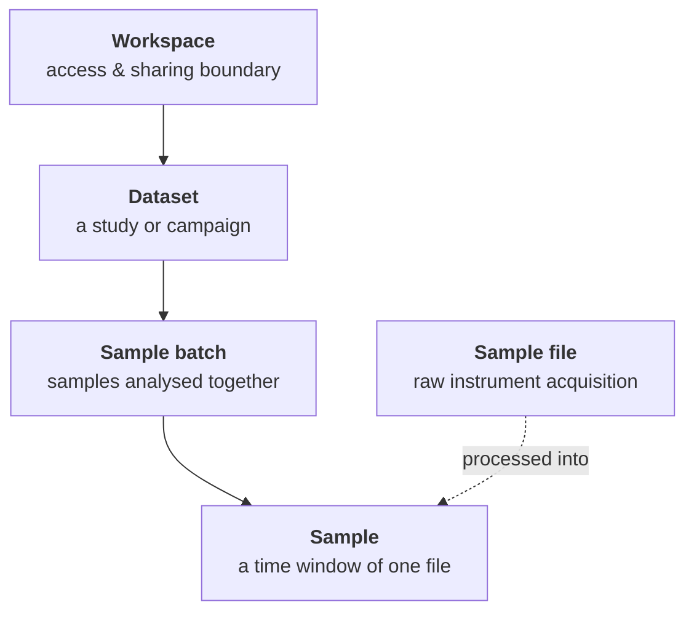
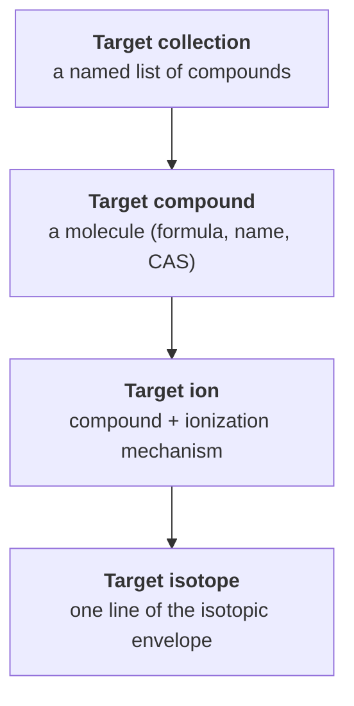

# Concepts

This page explains the Mascope domain model: how your data is organised, and
the objects you work with when you import files and run matching.
Guides and the rest of the docs link here instead of re-explaining these terms.

For the algorithms that turn raw spectra into assignments (aggregation, peak
detection, calibration, matching), see [How it works](../how-it-works/index.md).

## The data hierarchy

Measurement data in Mascope is organised in four nested levels. A **workspace**
contains **datasets**, a dataset contains **sample batches**, and a batch
contains **samples**. Each sample is derived from a raw instrument file (a
**sample file**), which is stored separately and shared.

| Level | What it is | Contains |
| --- | --- | --- |
| **Workspace** | The access-control and sharing boundary. Every piece of measurement data lives in one. | Datasets, members |
| **Dataset** | A study or campaign — a named grouping of related batches. | Sample batches |
| **Sample batch** | A set of samples you analyse and visualise together. Matching, calibration, and comparison all happen at the batch level. | Samples |
| **Sample** | One analysed measurement: a time window of a sample file, matched against your targets. | Peaks, spectra, match results |
| **Sample file** | The raw file an instrument produced (`.raw` or `.h5`). Sits outside the workspace tree and is shared; samples reference it. | Raw spectra |

Deleting flows down the tree: removing a dataset removes its batches, their
samples, and all results. Sample files are not deleted with them — they are
managed separately (see [Instruments & acquisition](../instruments/index.md)).

## Workspaces and sharing

A **workspace** is the unit of access control. Each workspace has its own member
list, and a member's **workspace role** (guest, editor, admin, or owner)
determines what they can do with the data inside it — from read-only viewing
(guest) up to deleting the workspace (owner). This is separate from your
account's **global role**, which governs application-wide things like logging in
and editing shared reference data.

Mascope keeps two kinds of workspace:

- **Instrument workspaces** are created automatically, one per instrument, named
  `Acquisitions <instrument>`. Uploaded raw files land here. They hold the
  read-only record of what each instrument produced.
- **User workspaces** are ones you create for your own analysis. They contain
  the datasets, batches, and samples you build from those raw files.

The full permission model — every role, the instrument-workspace rules, and
access tokens for the SDK — is documented in
[Authorization](https://github.com/ultra-trace-systems/mascope/blob/master/docs/authorization.md).

## Sample files vs. samples

This distinction is central to Mascope, so it is worth stating plainly:

- A **sample file** is the raw, unmodified file an instrument wrote — one Orbitrap
  `.raw` or one Tofwerk `.h5`. It can span minutes or hours of acquisition and is
  stored once, shared across workspaces.
- A **sample** is the result of *processing* a sample file: a chosen time window
  (`t0`–`t1`) of that file whose spectra are summed, peak-detected, calibrated,
  and matched against your targets. One sample file can yield many samples — for
  example one per injection in an autosampler run, or one background window and
  one signal window.

Importing therefore has two steps: **upload** the raw file — Mascope processes
it automatically into read-only samples in the instrument's acquisition
workspace — then **copy** the acquisition batch (or selected samples) into a
workspace of your own to analyse it. See the
[Import data files](../guides/import-files.md) guide.

## Acquisition and analysis

Datasets and batches come in two flavours, and knowing which is which explains a
lot of the UI:

- **Acquisition** datasets and batches are system-managed. Mascope creates them
  when raw files are uploaded, groups the files by instrument, day, and
  ionization mode, and locks them so the ingested record cannot be edited by
  hand.
- **Analysis** datasets and batches are the ones *you* create to do science. They
  are the default, they are editable, and they can combine both polarities. This
  is where you assemble samples, attach target collections, and run matching.

## Targeted analysis

Mascope's core analysis is **targeted**: you define what you are looking for, and
Mascope finds and scores it in every sample. Targets are organised in their own
four-level hierarchy, independent of the sample hierarchy:

- A **target collection** is a named list of compounds. You attach a collection to
  a batch to analyse that batch against it. Collections come in three types:
  **targets** (the compounds you want to detect and be alarmed about),
  **calibrants** (reference compounds used to calibrate the mass axis), and
  **diagnostics** (compounds used to monitor instrument health).
- A **target compound** is a molecule, defined by its formula (plus an optional
  name and CAS number). Compounds are shared reference data — the same compound
  can appear in many collections.
- A **target ion** is a compound as it actually appears in the spectrum: the
  neutral molecule combined with a specific **ionization mechanism** (for example
  a protonated form or an adduct). One compound can produce several ions.
- A **target isotope** is a single line of an ion's theoretical isotopic pattern,
  with its exact *m/z* and relative abundance. Matching works line by line at this
  level, then rolls the results back up.

## Ionization: modes and mechanisms

Two related concepts describe how neutral molecules become the ions you measure:

- An **ionization mechanism** is a single charge-forming reaction — the addition
  or abstraction of a charged species (protonation, deprotonation, adduct
  formation, or electron transfer). Each target ion is tied to one mechanism.
- An **ionization mode** is the higher-level scheme you select for a measurement.
  It bundles a set of mechanisms together with a designated **calibrant
  collection** and **diagnostic collection**, and carries a short **token** used
  to recognise it in filenames. Each sample records the ionization mode it was
  processed under.

Because an ionization mode names its calibrant and diagnostic collections,
changing a mode's collections flags the affected batches for **re-calibration**
or **re-matching**. Ionization modes are shared reference data; editors and above
can manage them.

## Matching and match scores

**Matching** links the targets attached to a batch to the peaks detected in each
sample, and scores every assignment. It is deliberately *constrained*: it only
considers the compounds in your collections, using each ion's ionization and
predicted isotopic envelope — it is not an open-ended search across all possible
formulas.

Every assignment gets a **match score** between 0 and 1, built from three
measurements: how close the peak's *m/z* is to theory, how well the measured
isotope abundances match the predicted pattern, and the peak intensity. Scores
aggregate bottom-up — isotopes into ions, ions into compounds, compounds into
collections, and finally into a single score per sample — so you can judge a
whole sample at a glance or drill into one isotope line.

Each assignment also gets a **match category**: *no match*, *possible*, or
*probable*, based on configurable score thresholds. You can filter and sort by
category, and record your own **rating** of a match to capture expert judgement.

The scoring formulas and matching rules are in
[How it works → Matching](../how-it-works/matching.md).

## Calibration

Instruments drift, so measured *m/z* values carry a small systematic error.
**Calibration** corrects the mass axis by aligning the peaks of known calibrant
compounds to their exact theoretical masses. Mascope uses the calibrant
collection named by the sample's ionization mode, and the correction is
instrument-specific — a single-point scaling for Orbitrap, a multi-point
regression for Tofwerk TOF. Accurate calibration is what makes the *m/z* errors
in matching meaningful.

Calibration runs automatically when a file is processed into samples — as a
user you never trigger it. Re-calibration only becomes necessary when a mode's
calibrant collection changes, and that is an administrative operation.

Some files will never be calibrated — a blank, or a file measured in an
ionization mode with no calibrant collection. Their calibration badge would
otherwise stay on an ambiguous blank that reads the same as "nobody has got
round to it". An instrument-workspace admin can mark such a file **skipped**
from the calibration dialog, with a short reason; the badge then shows that
reason and who recorded it. Skipping changes nothing about the analysis —
matching runs exactly as it does for any uncalibrated sample — and it can be
undone by calibrating the file or by clearing the marker. Re-processing the
file leaves the marker standing.

A file that has already been calibrated cannot be marked skipped: the fit is
written onto the file's m/z axis, so the marker would be claiming something
untrue. Re-processing an Orbitrap file restores its acquisition axis and clears
the calibration, after which it can be marked; a calibrated TOF file stays
calibrated.

See [How it works → Calibration](../how-it-works/calibration.md) for the method.

## Where to go next

- [Import data files](../guides/import-files.md) — get your own files into Mascope.
- [Build a target collection and run matching](../guides/target-collections.md) —
  put targeted analysis to work.
- [How it works](../how-it-works/index.md) — the processing pipeline behind samples.
- [Guides](../guides/index.md) — task-by-task how-tos.
