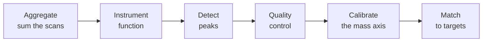

# How it works: the processing pipeline

When you [process a sample file](../guides/import-files.md) into a
[sample](../concepts/index.md#sample-files-vs-samples), Mascope runs it through a
fixed sequence of stages that turn raw spectra into scored assignments. This page
is an overview of that pipeline; each stage links to a page with the detail.

The pipeline is instrument-agnostic in shape but branches where the physics
differs, so Orbitrap and Tofwerk TOF data each get the treatment suited to their
detector. This separation of raw signal handling from compound identification is
what lets Mascope support new instrument types without changing the matching
logic.

## Processing Stages and Data Flow

### Signal Aggregation and Summation
The processing begins by loading the continuous profile spectra from vendor files (such as Orbitrap RAW or Tofwerk H5 formats).
To maximize the signal-to-noise ratio for peak detection, the scans are aggregated by summing the spectra across all temporal scans to construct a single sum signal.

### Empirical Instrument Function Estimation
To account for instrument characteristics, empirical peak shapes and resolution profiles are extracted directly from the experimental spectrum rather than relying on idealized mathematical assumptions.
Detailed methodologies for these calculations are provided in [instrument function documentation](instrument-functions.md).

### Peak Detection
Following instrument characterization, the pipeline executes specialized peak detection routines to extract discrete ion signals (peaks) from the sum signal.
The mathematical implementation of these routines is documented in [peak detection documentation](peak-detection.md).

### Quality Control and Artifact Filtering
To safeguard downstream calibration steps against false or distorted signals, the resolved peak candidates undergo multi-layered quality control filtering.
The exact filters are described in [quality control documentation](peak-detection.md#quality-control-filtering).

### Mass Calibration
The mass calibration corrects systematic mass errors by using known peaks as anchor points to adjust the mass axis.
The calibration process is detailed in [calibration documentation](calibration.md).

### Isotopic Matching
Detected peaks are matched to candidate elemental compositions by comparing measured m/z values and observed isotopic distributions with theoretical patterns.
The foundational matching rules and assignment criteria are expanded in [matching documentation](matching.md).

### Peak Assignment & Confidence
Taking the peak-first view, every detected peak is assigned its most likely composition — from the known target library first, then via untargeted composition search — each with a reproducible **fit score**, a graded **chemical plausibility**, and a **confidence tier**.
The scoring, the Seven Golden Rules plausibility, candidate arbitration and the confidence tiers (with literature references) are described in [peak assignment documentation](peak-assignment.md).
